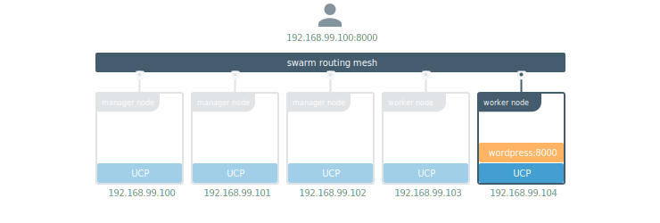



Docker Enterprise Edition has a routing mesh that allows you to make your
services available to the outside world using a domain name. This is also
known as a layer 7 load balancer.

In this example, the WordPress service is being served on port 8000.
Users can access WordPress using the IP address of any node in the cluster
and port 8000. If WordPress is not running in that node, the
request is redirected to a node that is.

Docker EE extends this and provides a routing mesh for application-layer
load balancing. This allows you to access services with HTTP and HTTPS
endpoints using a domain name instead of an IP.

In this example, the WordPress service listens on port 8000, but it is made
available to the outside world as `wordpress.example.org`.

When users access `wordpress.example.org`, the HTTP routing mesh routes
the request to the service running WordPress in a way that is transparent to
them.

## Enable the routing mesh

To enable the HTTP routing mesh, Log in as an administrator, go to the
UCP web UI, navigate to the **Admin Settings** page, and click the
**Routing Mesh** option. Check the **Enable routing mesh** option.

{: .with-border}

By default, the routing mesh service listens on port 80 for HTTP and port
8443 for HTTPS. Change the ports if you already have services that are using
them.


