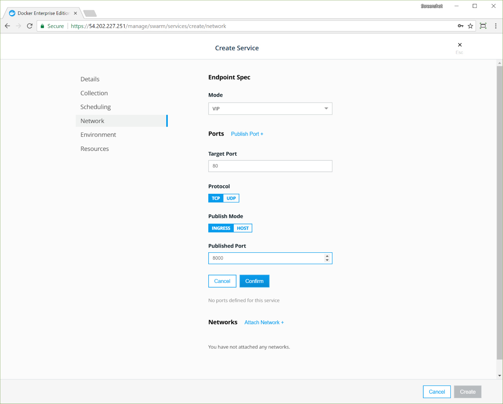

You can deploy and monitor your services from the UCP web UI. In this example
we'll deploy an [NGINX](https://www.nginx.com/) web server and make it
accessible on port `8000`.

In your browser, navigate to the UCP web UI and click **Services**. On the
**Create a Service** page, click **Create Service** to configure the
NGINX service.

Fill in the following fields:

| Field        | Value        |
|:-------------|:-------------|
| Service name | nginx        |
| Image name   | nginx:latest |

{: .with-border}

In the left pane, click **Network**. In the **Ports** section,
click **Publish Port** and fill in the following fields:

| Field          | Value   |
|:---------------|:--------|
| Target port    | 80      |
| Protocol       | tcp     |
| Publish mode   | Ingress |
| Published port | 8000    |

{: .with-border}

Click **Confirm** to map the ports for the NGINX service.

Once you've specified the service image and ports, click **Create** to
deploy the service into the UCP cluster.

{: .with-border}

Once the service is up and running, you'll be able to see the default NGINX
page, by going to `http://<node-ip>:8000`. In the **Services** list, click the
**nginx** service, and in the details pane, click the link under
**Published Endpoints**. 

{: .with-border}

Clicking the link opens a new tab that shows the default NGINX home page. 

{: .with-border}

## Use the CLI to deploy the service

You can also deploy the same service from the CLI. Once you've set up your
[UCP client bundle](../user-access/cli.md), run:

```bash
docker service create --name nginx \
  --publish mode=ingress,target=80,published=8000 \
  --label com.docker.ucp.access.owner=<your-username> \
  nginx
```

