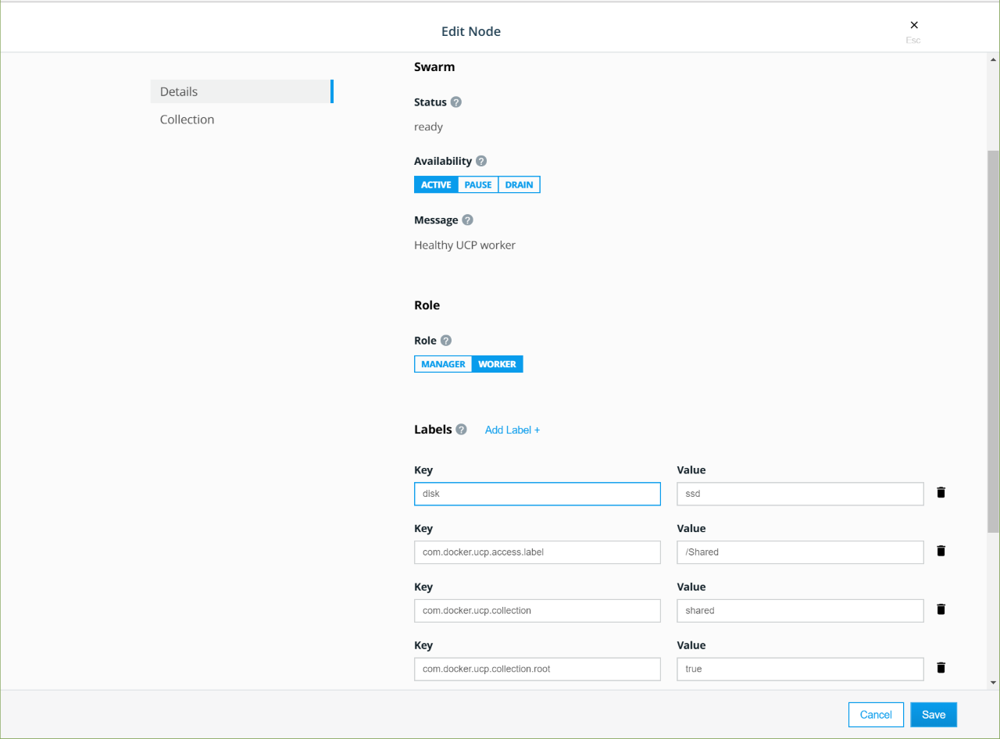
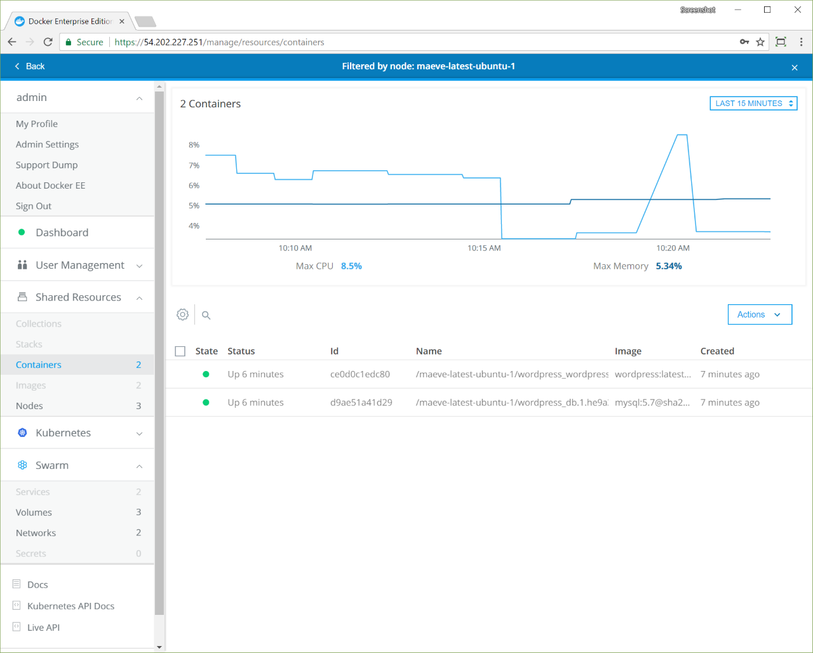
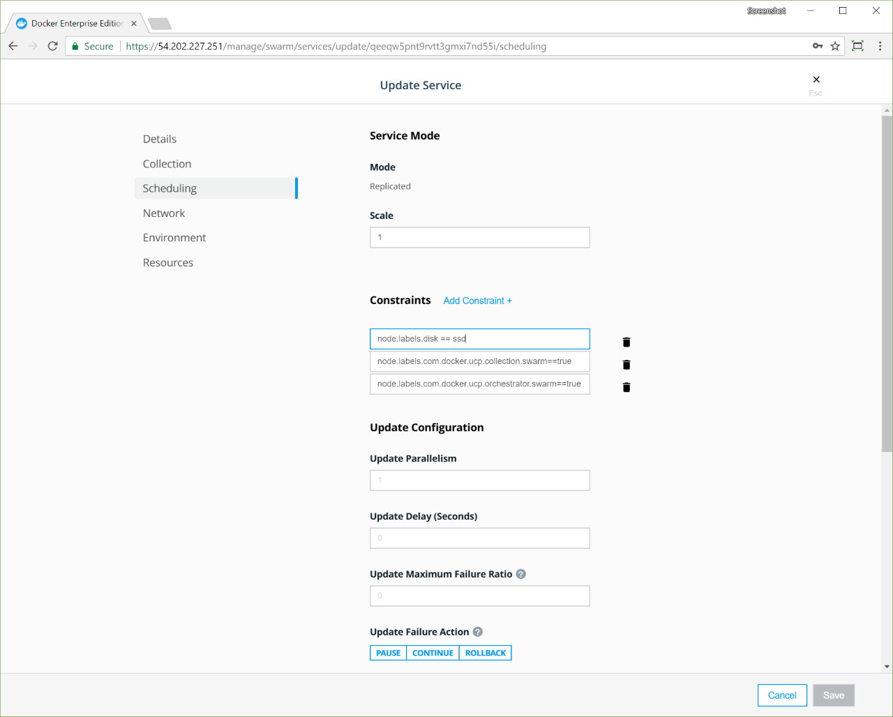

With Docker UCP, you can add labels to your nodes. Labels are metadata that
describe the node, like its role (development, QA, production), its region
(US, EU, APAC), or the kind of disk (hdd, ssd). Once you have labeled your
nodes, you can add deployment constraints to your services, to ensure they
are scheduled on a node with a specific label.

For example, you can apply labels based on their role in the development
lifecycle, or the hardware resources they have.

{: .with-border}

Don't create labels for authorization and permissions to resources.
Instead, use resource sets, either UCP collections or Kubernetes namespaces,
to organize access to your cluster.
[Learn about managing access with resource sets](../../authorization/group-resources.md).

## Apply labels to a node

In this example we'll apply the `ssd` label to a node. Then we'll deploy
a service with a deployment constraint to make sure the service is always
scheduled to run on a node that has the `ssd` label.

1. Log in with administrator credentials in the UCP web interface.
2. Select **Nodes** in the left-hand navigation menu.
3. In the nodes list, select the node to which you want to apply labels.
4. In the details pane, select the edit node icon in the upper-right corner to edit the node.
    

5. In the **Edit Node** page, scroll down to the **Labels** section.
6. Select **Add Label**.
7. Add a label with the key `disk` and a value of `ssd`.

{: .with-border}

8. Click **Save** then dismiss the **Edit Node** page.
9. In the node's details pane, select **Labels** to view the labels that are applied to the node.

You can also do this from the CLI by running:

```bash
docker node update --label-add <key>=<value> <node-id>
```

## Deploy a service with constraints

When deploying a service, you can specify constraints, so that the service gets
scheduled only on a node that has a label that fulfills all of the constraints
you specify.

In this example, when users deploy a service, they can add a constraint for the
service to be scheduled only on nodes that have SSD storage:
`node.labels.disk == ssd`.

1. Navigate to the **Stacks** page.
2. Name the new stack "wordpress".
3. Under **Orchestrator Mode**, select **Swarm Services**.

4. In the **docker-compose.yml** editor, paste the following stack file.

```
version: "3.1"

services:
  db:
    image: mysql:5.7
    deploy:
      placement:
        constraints:
          - node.labels.disk == ssd
      restart_policy:
        condition: on-failure
    networks:
      - wordpress-net
    environment:
      MYSQL_ROOT_PASSWORD: wordpress
      MYSQL_DATABASE: wordpress
      MYSQL_USER: wordpress
      MYSQL_PASSWORD: wordpress
  wordpress:
    depends_on:
      - db
    image: wordpress:latest
    deploy:
      replicas: 1
      placement:
        constraints:
          - node.labels.disk == ssd
      restart_policy:
        condition: on-failure
        max_attempts: 3
    networks:
      - wordpress-net
    ports:
      - "8000:80"
    environment:
      WORDPRESS_DB_HOST: db:3306
      WORDPRESS_DB_PASSWORD: wordpress

networks:
  wordpress-net:
```

5. Click **Create** to deploy the stack, and when the stack deploys,
click **Done**.


6. Navigate to the **Nodes** page, and click the node that has the
`disk` label. In the details pane, click the **Inspect Resource**
dropdown and select **Containers**.



Dismiss the filter and navigate to the **Nodes** page. Click a node that
doesn't have the `disk` label. In the details pane, click the
**Inspect Resource** dropdown and select **Containers**. There are no
WordPress containers scheduled on the node. Dismiss the filter.

## Add a constraint to a service by using the UCP web UI

You can declare the deployment constraints in your docker-compose.yml file or
when you're creating a stack. Also, you can apply them when you're creating
a service.

To check if a service has deployment constraints, navigate to the
**Services** page and choose the service that you want to check.
In the details pane, click **Constraints** to list the constraint labels.

To edit the constraints on the service, click **Configure** and select
**Details** to open the **Update Service** page. Click **Scheduling** to
view the constraints.



You can add or remove deployment constraints on this page.

## Where to go next

- [Collect UCP Cluster Metrics with Prometheus](collect-cluster-metrics.md)
- [Configure UCP Audit Logging](create-audit-logs.md)