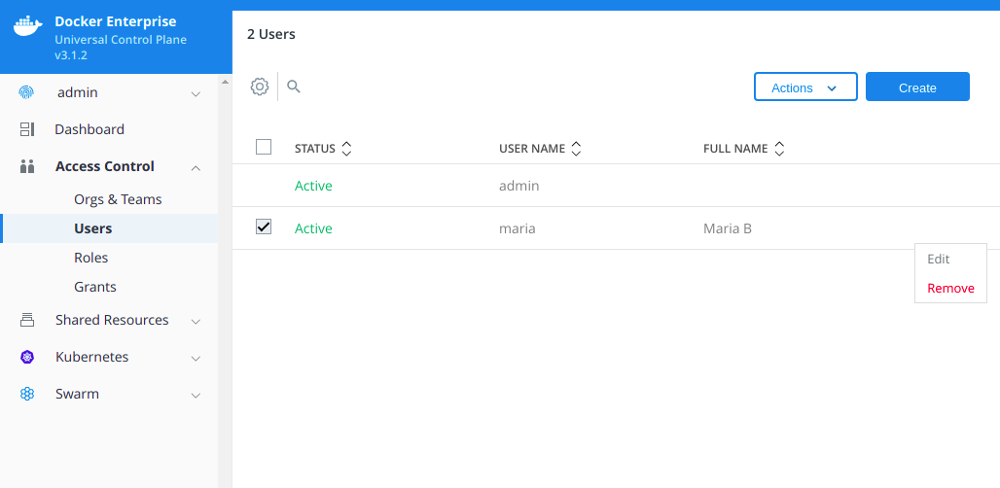

## Change user passwords

### Managed in UCP

Docker EE administrators can reset user passwords managed in UCP:

1. Log in to UCP with administrator credentials.
2. Navigate to **Access Control > Users**.
3. Select the user whose password you want to change.
   {: .with-border}
4. Click **Edit**. Once on the "Update User" view, select **Security** from the left navigation.
5. Enter the new password, confirm, and click **Update Password**.

{: .with-border}

### Managed through LDAP

User passwords managed with an LDAP service must be changed on the LDAP server.

## Change administrator passwords

Administrators who need to update their passwords can ask another administrator for help
or SSH into a Docker Enterprise [manager node](/engine/swarm/how-swarm-mode-works/nodes/#manager-nodes) and run:


```bash
docker run --net=host -v ucp-auth-api-certs:/tls -it "$(docker inspect --format '{{ .Spec.TaskTemplate.ContainerSpec.Image }}' ucp-auth-api)" "$(docker inspect --format '{{ index .Spec.TaskTemplate.ContainerSpec.Args 0 }}' ucp-auth-api)" passwd -i
```


### With DEBUG Global Log Level

If you have DEBUG set as your global log level within UCP, running `$(docker inspect --format '{{ index .Spec.TaskTemplate.ContainerSpec.Args 0 }}` returns `--debug` instead of `--db-addr`. Pass `Args 1` to `$docker inspect` instead to reset your admin password.


```bash
docker run --net=host -v ucp-auth-api-certs:/tls -it "$(docker inspect --format '{{ .Spec.TaskTemplate.ContainerSpec.Image }}' ucp-auth-api)" "$(docker inspect --format '{{ index .Spec.TaskTemplate.ContainerSpec.Args 1 }}' ucp-auth-api)" passwd -i
```

