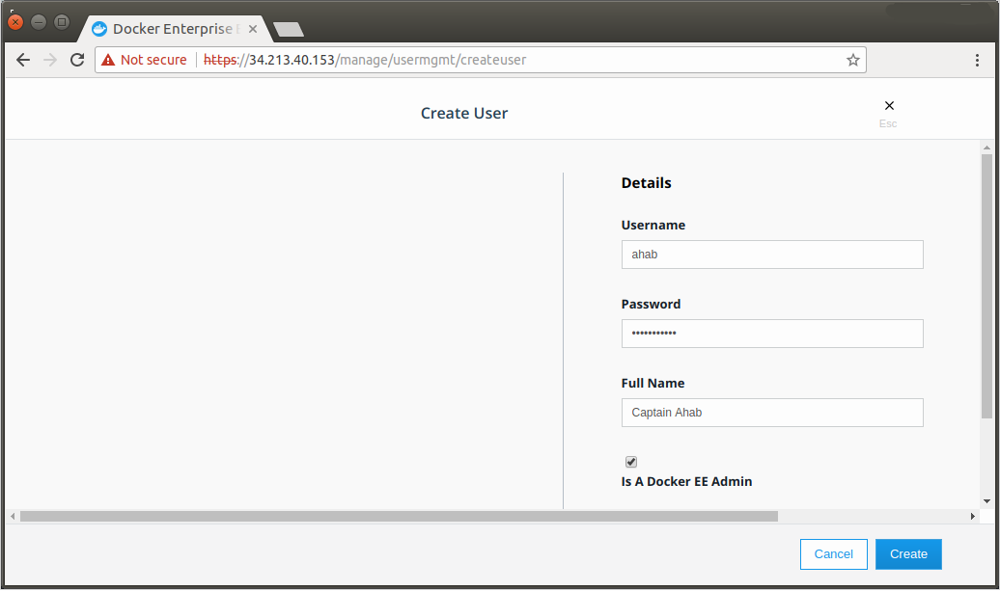



Users, teams, and organizations are referred to as subjects in Docker Universal
Control Plane (UCP).

Individual users can belong to one or more teams but each team can only be in
one ogranziation. At the fictional startup, Acme Company, some users are on
multiple teams; but all teams are necessarily unique:

```
Acme Organization
├── DevOps Team
│   ├── *User Alex*
│   └── User Bart
├── Infra Team
│   ├── *User Alex*
│   └── User Chen
└── Apps Team
    ├── User Deva
    └── User Emma
```

## Authentication

All users are authenticated on the backend. UCP provides built-in authentication
and also integrates with LDAP directory services.

> To enable LDAP and authenticate and synchronize UCP users and teams with your
> organization's LDAP directory, see:
> - [Synchronize users and teams with LDAP in the UI](usermgmt-sync-with-ldap.md)
> - [Integrate with an LDAP Directory](../../datacenter/ucp/2.2/guides/admin/configure/external-auth/index.md).

To use UCP built-in authentication, you must manually create users.

## Build an organization architecture

The general flow of designing an organization of teams in UCP is:

1. Create an organization
2. Add users or configure UCP to sync with LDAP (in the UI or programmatically)
3. Create teams under the organization
4. Add users to teams manually or sync with LDAP

### Create an organization with teams

To create an organzation in UCP:

1. Click **Organization & Teams** under **User Management**.
2. Click **Create Organization**.
3. Input the organization name.
4. Click **Create**.

To create teams in the organization:

1. Click through the organization name.
2. Click **Create Team**.
3. Input a team name (and description).
4. Click **Create**.
5. Add existing users to the team. If they don't exist, see [Create users manually](#Create-users-manually).
   - Click the team name and select **Actions** > **Add Users**.
   - Check the users to include and click **Add Users**.

> **Note**: To sync teams with groups in an LDAP server, see [Sync Teams with LDAP](./usermgmt-sync-with-ldap).




### Create users manually

New users are assigned a default permission level so that they can access the
cluster. You can optionally grant them UCP administrator permissions.

You can extend the user's default permissions by granting them fine-grained
permissions over resources. You do this by adding the user to a team.

To manally create users in UCP:

1. Click **Users** under **User Management**.
2. Click **Create User**.
3. Input username, password, and full name.
4. Click **Create**.
5. [optional] Check "Is a Docker EE Admin".

> A `Docker EE Admin` can grant users permission to change the cluster
> configuration and manage grants, roles, and collections.

{: .with-border}
{: .with-border}




### Create users manuallly

New users are assigned a default permission level so that they can access the
cluster. You can optionally grant them UCP administrator permissions.

You can extend the user's default permissions by granting them fine-grained
permissions over resources. You do this by adding the user to a team.

To manally create users in UCP:

1. Navigate to the **Users** page.
2. Click **Create User**.
3. Input username, password, and full name.
4. Click **Create**.
5. [optional] Check "Is a UCP admin?".

> A `UCP Admin` can grant users permission to change the cluster configuration
> and manage grants, roles, and collections.

{: .with-border}
{: .with-border}


## Where to go next

- [Synchronize users and teams with LDAP](./usermgmt-sync-with-ldap.md)
- [Create grants and authorize access to users and teams](usermgmt-grant-permissions.md).

