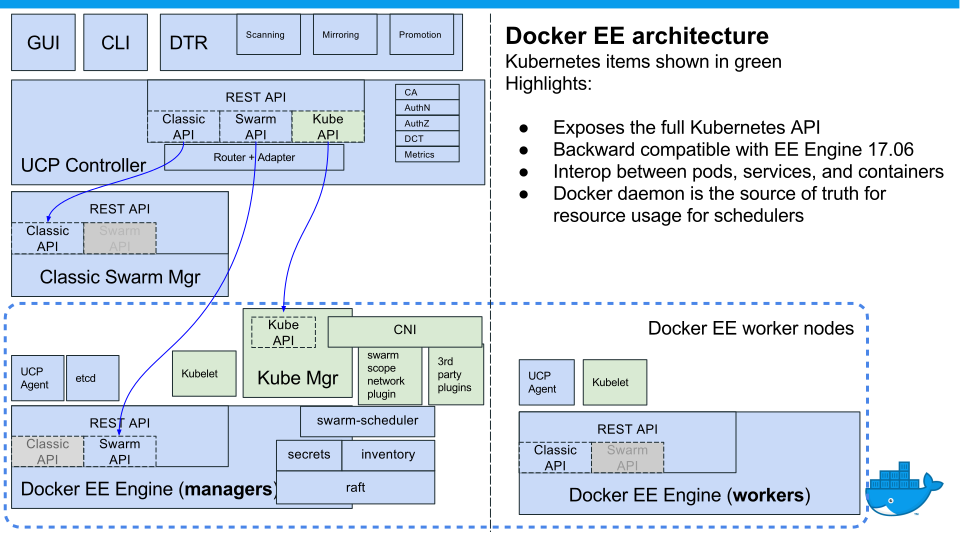
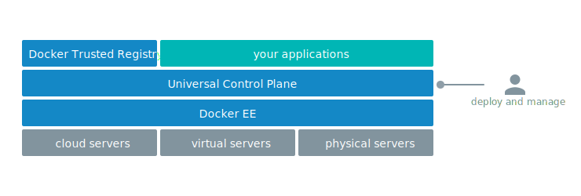
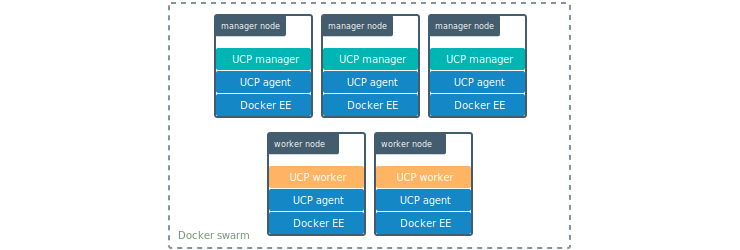

Docker Enterprise Edition (EE) enables deploying your workloads for high
availability (HA) onto the orchestrator of your choice. Docker EE system
components run on multiple manager nodes in the cluster, and if one manager
node fails, another takes its place automatically, without impact to the
cluster.

## Choose your orchestrator

Docker EE provides access to the full API sets of three popular orchestrators:

- Kubernetes 
- SwarmKit (Compose file version 3) 
- "Classic" Swarm (Compose file version 2)

{: .with-border}

Docker EE proxies the underlying API of each orchestrator, giving you access
to all of the capabilities of each orchestrator, along with the benefits of
Docker EE, like role-baseed access control and Docker Content Trust. 

## Docker EE components

Docker EE has three major components, which together enable a full software
supply chain, from image creation, to image storage, to image deployment.

- Docker EE Engine: The commercially supported Docker engine for creating
  images and running them in Docker containers.
- Docker Trusted Registry (DTR): The production-grade image storage solution
  from Docker.
- Universal Control Plane (UCP): Deploys high-availability applications from
  images by managing orchestrators, like Kubernetes and Swarm.

Docker Universal Control Plane is designed for high availability (HA). You can
join multiple UCP manager nodes to the cluster, and if one manager node fails,
another takes its place automatically without impact to the cluster. Changes to 
the configuration of one UCP manager node are propagated automatically to other
nodes.

Docker Trusted Registry is designed to scale horizontally as your usage
increases. You can add more replicas to make DTR scale to your demand and for
high availability. All DTR replicas run the same set of services, and changes
to their configuration are propagated automatically to other replicas.

{: .with-border}

### Universal Control Plane (UCP)

Universal Control Plane (UCP) is a containerized application that runs on
[Docker EE Engine](../index.md) and extends its functionality to make it
easier to deploy, configure, and monitor your applications at scale.

Docker UCP provides a web UI and a CLI for deploying images from Kubernetes
YAML or Compose files. Once your workload is deployed, UCP enables monitoring
containers and pods across your Docker cluster.

UCP also secures Docker with role-based access control so that only authorized
users can make changes and deploy applications to your cluster.

{: .with-border}

Once a UCP instance is deployed, you don't interact with Docker EE Engine
directly. Instead, you interact with UCP. Since UCP exposes the standard
Docker API and the full Kubernetes API, and this is all done transparently,
so that you can use the tools you already know and love, like `kubectl`,
the Docker CLI client, and Docker Compose.
[Learn about UCP architecture](ucp-architecture.md).

{: .with-border}

### Docker Trusted Registry (DTR)

Docker Trusted Registry (DTR) is a containerized application that runs on a
Docker Universal Control Plane cluster.

{: .with-border}

Once you have DTR deployed, you use your Docker CLI client to login, push, and
pull images.

For high-availability, you can deploy multiple DTR replicas, one on each UCP
worker node.

{: .with-border}

All DTR replicas run the same set of services, and changes to their configuration
are automatically propagated to other replicas.
[Learn about DTR architecture](dtr-architecture.md).

    