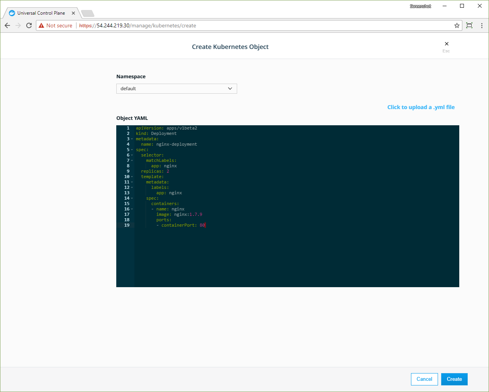
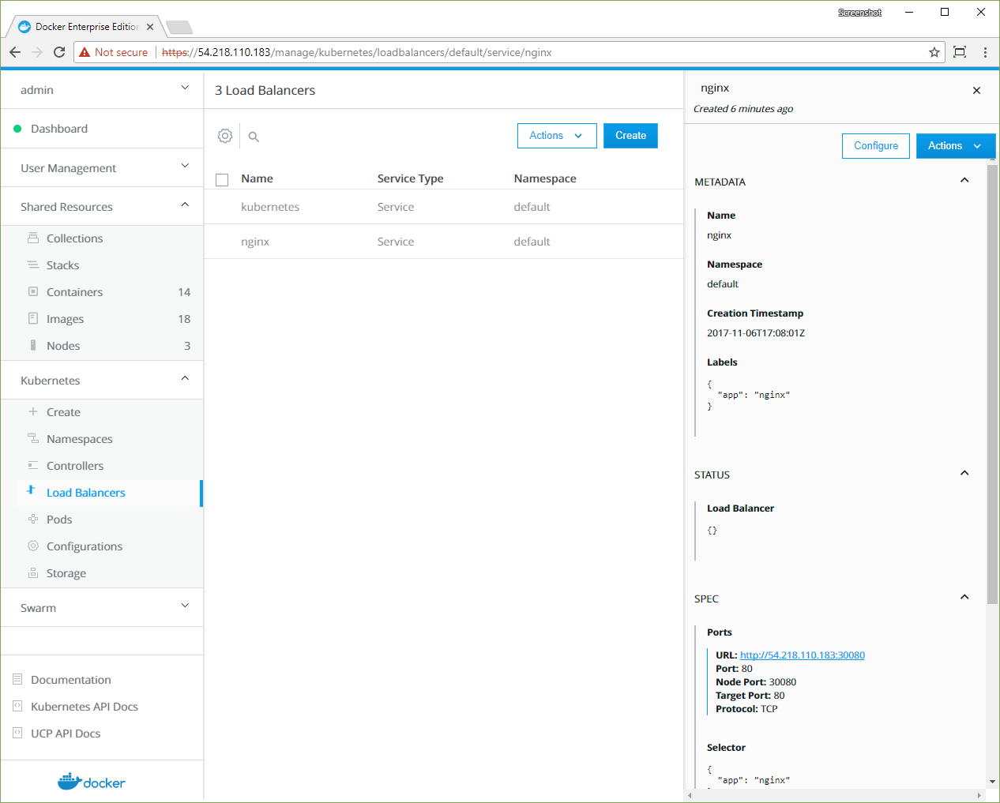


The Docker EE web UI enables deploying your Kubernetes YAML files. In most
cases, no modifications are necessary to deploy on a cluster that's managed by
Docker EE.

## Deploy an NGINX server

In this example, a simple Kubernetes Deployment object for an NGINX server is
defined in YAML:

```yaml
apiVersion: apps/v1beta2
kind: Deployment
metadata:
  name: nginx-deployment
spec:
  selector:
    matchLabels:
      app: nginx
  replicas: 2
  template:
    metadata:
      labels:
        app: nginx
    spec:
      containers:
      - name: nginx
        image: nginx:1.7.9
        ports:
        - containerPort: 80
```

The YAML specifies an earlier version of NGINX, which will be updated in a
later section.

1. Open the Docker EE web UI, and in the left pane, click **Kubernetes**.
2. Click **Create** to open the **Create Kubernetes Object** page.
3. In the **Namespace** dropdown, select **default**.
4. In the **Object YAML** editor, paste the previous YAML.
5. Click **Create**.

{: .with-border}

## Inspect the deployment

The Docker EE web UI shows the status of your deployment when you click the 
links in the **Kubernetes** section of the left pane.

1.  In the left pane. click **Controllers** to see the resource controllers
    that Docker EE created for the NGINX server.
2.  Click the **nginx-deployment** controller, and in the details pane, scroll
    to the **Template** section. This shows the values that Docker EE used to 
    create the deployment.
3.  In the left pane, click **Pods** to see the pods that are provisioned for
    the NGINX server. Click one of the pods, and in the details pane, scroll to
    the **Status** section to see that pod's phase, IP address, and other 
    properties.

{: .with-border}

## Expose the server

The NGINX server is up and running, but it's not accessble from outside of the
cluster. Add a `NodePort` service to expose the server on a specified port:

```yaml
apiVersion: v1
kind: Service
metadata:
  name: nginx
  labels:
    app: nginx
spec:
  type: NodePort
  ports:
    - port: 80
      nodePort: 30080
  selector:
    app: nginx 
```

The service connects the cluster's internal port 80 to the external port
30080.

1.  Repeat the previous steps and copy-paste the YAML that defines the `nginx`
    service into the **Object YAML** editor on the
    **Create Kubernetes Object** page. When you click **Create**, the 
    **Load Balancers** page opens.
2.  Click the **nginx** service, and in the details pane, find the **Ports**
    section.
3.  Click the link that's labeled **URL** to 

{: .with-border}

The YAML definition connects the service to the NGINX server by using the
app label `nginx` and a corresponding label selector.
[Learn about using a service to expose your app](https://kubernetes.io/docs/tutorials/kubernetes-basics/expose-intro/).

## Update the deployment

Update an existing deployment by applying an updated YAML file. In this
example, the server is scaled up to four replicas and updated to a later
version of NGINX. 

```yaml
...
spec:
  progressDeadlineSeconds: 600
  replicas: 4
  revisionHistoryLimit: 10
  selector:
    matchLabels:
      app: nginx
  strategy:
    rollingUpdate:
      maxSurge: 25%
      maxUnavailable: 25%
    type: RollingUpdate
  template:
    metadata:
      creationTimestamp: null
      labels:
        app: nginx
    spec:
      containers:
      - image: nginx:1.8
...
```

1.  In the left pane, click **Controllers** and select the **nginx-deployment**
    controller.
2.  In the details pane, click **Configure**, and in the **Edit Deployment**
    page, find the **replicas: 2** entry.
3.  Change the number of replicas to 4, so the line reads **replicas: 4**.
4.  Find the **image: nginx:1.7.9** entry and change it to **image: nginx:1.8**.
5.  Click **Edit** to update the deployment with the new YAML.




With Docker EE, you deploy your Kubernetes objects on the command line by using
`kubectl`. [Install and set up kubectl](https://kubernetes.io/docs/tasks/tools/install-kubectl/).

Docker EE ensures that communication with the cluster is secure. When you run
`kubectl` commands on a Docker EE node, you need to authenticate your request
with a client certificate bundle. [Get your client bundle by using the Docker EE web UI or the command line](/datacenter/ucp/2.2/guides/user/access-ucp/cli-based-access.md).
If you don't have the client bundle set up, you'll see an error when you run
`kubectl` commands:

```none
The connection to the server localhost:8080 was refused - did you specify the right host or port?
```

When you have `kubectl` and the client bundle installed, you can deploy a
Kubernetes object from YAML.

```yaml
apiVersion: apps/v1beta2
kind: Deployment
metadata:
  name: nginx-deployment
spec:
  selector:
    matchLabels:
      app: nginx
  replicas: 2
  template:
    metadata:
      labels:
        app: nginx
    spec:
      containers:
      - name: nginx
        image: nginx:1.7.9
        ports:
        - containerPort: 80
---
apiVersion: v1
kind: Service
metadata:
  name: nginx
  labels:
    app: nginx
spec:
  type: NodePort
  ports:
    - port: 80
      nodePort: 30080
  selector:
    app: nginx
```

Save the previous YAML to a file named "deployment.yaml", and use the following
command to deploy the NGINX server: 

```bash
kubectl apply -f deployment.yaml
```

## Inspect the deployment

Use the `describe deployment` option to inspect the deployment: 

```bash
kubectl describe deployment nginx-deployment
```

Also, you can use the Docker EE web UI to see the deployment's pods and
controllers.

## Update the deployment

Update an existing deployment by applying an updated YAML file. 

Edit deployment.yaml and change the following lines:

- Increase the number of replicas to 4, so the line reads **replicas: 4**.
- Update the NGINX version by specifying **image: nginx:1.8**.

Save the edited YAML to a file named "update.yaml", and use the following
command to deploy the NGINX server: 

```bash
kubectl apply -f update.yaml
```

Check that the deployment was scaled out by listing the pods in the cluster:

```bash
 kubectl get pods
```

You should see four pods listed:

```bash
NAME                               READY     STATUS    RESTARTS   AGE
nginx-deployment-f95b7b6b8-74dfp   1/1       Running   0          21m
nginx-deployment-f95b7b6b8-hd2bt   1/1       Running   0          21m
nginx-deployment-f95b7b6b8-mz925   1/1       Running   0          21m
nginx-deployment-f95b7b6b8-qgrzm   1/1       Running   0          21m
```

Check that the pods are running the updated image:

```bash
kubectl describe po/nginx-deployment-f95b7b6b8-74dfp | grep -i image
```

> kubectl tip
>
> Remember to prepend `po/` to the pod's name.

You should see the running image and messages about pulling the updated image:

```bash
    Image:          nginx:1.8
    Image ID:       docker-pullable://nginx@sha256:c97ee70c4048fe79765f7c2ec0931957c2898f47400128f4f3640d0ae5d60d10
  Normal  Pulling                26m   kubelet, vs9gg6dhn5pklhqfk9fgzawuu  pulling image "nginx:1.8"
  Normal  Pulled                 26m   kubelet, vs9gg6dhn5pklhqfk9fgzawuu  Successfully pulled image "nginx:1.8"
```





