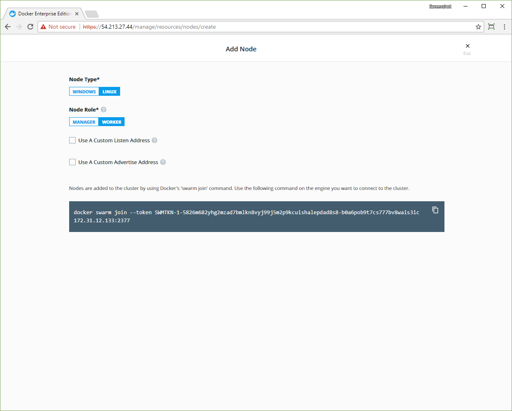



Docker EE is designed for scaling horizontally as your applications grow in
size and usage. You can add or remove nodes from the cluster to scale it
to your needs.

Because Docker EE leverages the clustering functionality provided by Docker
Engine, you use the [docker swarm join](/engine/swarm/swarm-tutorial/add-nodes.md)
command to add more nodes to your cluster. When you join a new node, Docker EE
services start running on the node automatically.

## Choose the orchestrator for new nodes

When you add nodes to the cluster, you can choose if you want them to be
Kubernetes or Swarm nodes. Mixed nodes that run both orchestrators aren't
supported.

To choose the orchestrator for new nodes:

1.  Log in to the Docker EE web UI with an administrator account.
2.  Open the **Admin Settings** page, and in the left pane, click **Scheduler**.
3.  In the **Set orchestrator type for new nodes** section, click **Swarm**
    or **Kubernetes**.
4.  Click **Save**.
    
    {: .with-border}

Your cluster can run under Kubernetes or Swarm, or it can be a mixed cluster,
running both orchestrators. If you choose to run a mixed cluster, it's
important to understand that Docker EE doesn't migrate workloads from one
orchestrator to another automatically. For example, if you deploy WordPress
on a Swarm node and then change the **Scheduler** setting to Kubernetes,
Docker EE doesn't migrate the Swarm workload, and WordPress continues running
on Swarm. In this case, you must migrate your workload manually to another node
that's running under Kubernetes.

We recommend that you make the decision about orchestration when you set up the
cluster. Commit to Kubernetes or Swarm on all nodes, or assign each node to a
specific orchestrator. Once you start deploying workloads, avoid changing the
orchestrator setting. If you change the orchestrator for a cluster, you should
evict your workloads and deploy them again.

## Node roles

When you join a node to a cluster, you specify its role: manager or worker.

* **Manager nodes**

    Manager nodes are responsible for cluster management functionality and
    dispatching tasks to worker nodes. Having multiple manager nodes allows
    your swarm to be highly available and tolerant of node failures.

    Manager nodes also run all Docker EE components in a replicated way, so
    by adding additional manager nodes, you're also making the cluster highly
    available.
    [Learn more about the Docker EE architecture.](../architecture/how-docker-ee-delivers-ha.md)

* **Worker nodes**

    Worker nodes receive and execute your services and applications. Having
    multiple worker nodes allows you to scale the computing capacity of your
    cluster.

    When deploying Docker Trusted Registry in your cluster, you deploy it to a
    worker node.

## Join nodes to the cluster

You can join Windows and Linux nodes to the cluster, but only Linux nodes can
be managers.

To join nodes to the cluster, go to the Docker EE web UI and navigate to the
**Nodes** page.

1.  Click **Add Node** to add a new node.
2.  Select the type of node to add, **Windows** or **Linux**.
2.  Click **Manager** if you want to add the node as a manager. 
3.  Check the **Use a custom listen address** option to specify the address
    and port where new node listens for inbound cluster management traffic.
4.  Check the **Use a custom listen address** option to specify the
    IP address that's advertised to all members of the cluster for API access.

{: .with-border}

Copy the displayed command, use SSH to log in to the host that you want to
join to the cluster, and run the `docker swarm join` command on the host.

To add a Windows node, click **Windows** and follow the instructions in
[Join Windows worker nodes to a cluster](join-windows-nodes-to-cluster.md). 

After you run the join command in the node, the node is displayed in the UCP
web UI.

## Remove nodes from the cluster

If the target node is a manager, you need to demote the node to a worker
before proceeding with the removal. You can use the web UI or the CLI.

In the Docker EE web UI:

1.  Navigate to the **Nodes** page.
2.  Select the node that you want to remove and switch its role to **Worker**.
3.  Wait until the operation completes, and confirm that the node is no longer
    a manager.

From the CLI:

1.  Log in to a manager node by using SSH.
2.  Run `docker node ls` and identify the `nodeID` or `hostname` of the target
    node.
3.  Run `docker node demote <nodeID or hostname>`.

If the status of the worker node is `Ready`, you need to force the node to leave
the cluster manually. To do this, connect to the target node through SSH and
run `docker swarm leave --force` directly against the local Docker EE Engine. 
   
   > Loss of quorum
   > 
   > Do not perform this step if the node is still a manager, as
   > this may cause loss of quorum.

When the status of the node is reported as `Down`, you can remove the node from
the cluster. You can use the web UI or the CLI.

From the Docker EE web UI:

1.  Navigate to the **Nodes** page and select the node.
2.  In the details pane, click **Actions** and select **Remove**.
3.  Click **Confirm** when you're prompted.

From the CLI:

1.  Log in to a manager node by using SSH.
2.  Run `docker node rm <nodeID or hostname>`.

## Pause and drain nodes

Once a node is part of the cluster you can change its role making a manager
node into a worker and *vice versa*. You can also configure the node availability
so that it is:

* Active: the node can receive and execute tasks.
* Paused: the node continues running existing tasks, but doesn't receive new ones.
* Drained: the node won't receive new tasks. Existing tasks are stopped and
  replica tasks are launched in active nodes.

In the Docker EE web UI, browse to the **Nodes** page and select the node.
In the details pane, click the **Configure** to open the **Edit Node** page.

{: .with-border}

If you're load-balancing user requests to UCP across multiple manager nodes,
when demoting those nodes into workers, don't forget to remove them from your
load-balancing pool.






## Scale your cluster from the CLI

You can also use the command line to do all of the above operations. To get the
join token, run the following command on a manager node:


```bash
docker swarm join-token worker
```

If you want to add a new manager node instead of a worker node, use
`docker swarm join-token manager` instead. If you want to use a custom listen
address, add the `--listen-addr` arg:

```bash
$ docker swarm join \
    --token SWMTKN-1-2o5ra9t7022neymg4u15f3jjfh0qh3yof817nunoioxa9i7lsp-dkmt01ebwp2m0wce1u31h6lmj \
    --listen-addr 234.234.234.234 \
    192.168.99.100:2377
```

Once your node is added, you can see it by running `docker node ls` on a manager:

```bash
$ docker node ls
```

To change the node's availability, use:

```bash
$ docker node update --availability drain node2
```

You can set the availability to `active`, `pause`, or `drain`.

To remove the node, use:

```bash
$ docker node rm <node-hostname>
```




