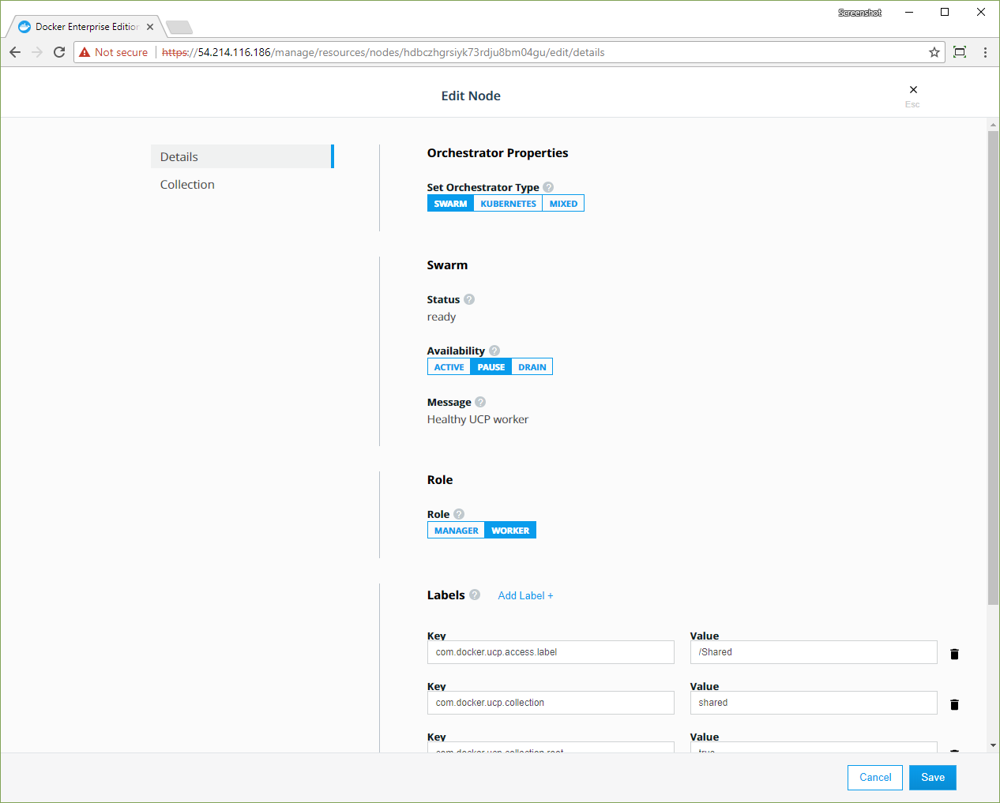




Docker EE is designed for scaling horizontally as your applications grow in
size and usage. You can add or remove nodes from the cluster to scale it
to your needs. You can join Windows Server 2016, IBM z System, and Linux nodes
to the cluster.

Because Docker EE leverages the clustering functionality provided by Docker
Engine, you use the [docker swarm join](/engine/swarm/swarm-tutorial/add-nodes.md)
command to add more nodes to your cluster. When you join a new node, Docker EE
services start running on the node automatically.

## Node roles

When you join a node to a cluster, you specify its role: manager or worker.

- **Manager**: Manager nodes are responsible for cluster management
  functionality and dispatching tasks to worker nodes. Having multiple
  manager nodes allows your swarm to be highly available and tolerant of
  node failures.

  Manager nodes also run all Docker EE components in a replicated way, so
  by adding additional manager nodes, you're also making the cluster highly
  available.
  [Learn more about the Docker EE architecture.](../architecture/how-docker-ee-delivers-ha.md)

- **Worker**: Worker nodes receive and execute your services and applications.
  Having multiple worker nodes allows you to scale the computing capacity of
  your cluster.

  When deploying Docker Trusted Registry in your cluster, you deploy it to a
  worker node.

## Join a node to the cluster

You can join Windows Server 2016, IBM z System, and Linux nodes to the cluster,
but only Linux nodes can be managers.

To join nodes to the cluster, go to the Docker EE web UI and navigate to the
**Nodes** page.

1.  Click **Add Node** to add a new node.
2.  Select the type of node to add, **Windows** or **Linux**.
2.  Click **Manager** if you want to add the node as a manager. 
3.  Check the **Use a custom listen address** option to specify the address
    and port where new node listens for inbound cluster management traffic.
4.  Check the **Use a custom listen address** option to specify the
    IP address that's advertised to all members of the cluster for API access.

{: .with-border}

Copy the displayed command, use SSH to log in to the host that you want to
join to the cluster, and run the `docker swarm join` command on the host.

To add a Windows node, click **Windows** and follow the instructions in
[Join Windows worker nodes to a cluster](join-windows-nodes-to-cluster.md). 

After you run the join command in the node, the node is displayed on the
**Nodes** page in the Docker EE web UI. From there, you can change the node's
cluster configuration, including its assigned orchestrator type.
[Learn how to change the orchestrator for a node](set-orchestrator-type.md).    

## Pause or drain a node

Once a node is part of the cluster, you can configure the node's availability
so that it is:

- **Active**: the node can receive and execute tasks.
- **Paused**: the node continues running existing tasks, but doesn't receive
  new tasks.
- **Drained**: the node won't receive new tasks. Existing tasks are stopped and
  replica tasks are launched in active nodes.

Pause or drain a node from the **Edit Node** page:

1.  In the Docker EE web UI, browse to the **Nodes** page and select the node.
2.  In the details pane, click **Configure** and select **Details** to open
    the **Edit Node** page.
3.  In the **Availability** section, click **Active**, **Pause**, or **Drain**.  
4.  Click **Save** to change the availability of the node.

{: .with-border}

## Promote or demote a node

As your cluster architecture changes, you may need to promote worker nodes to
managers or demote manger nodes to workers. Change the current role of node on
the **Edit node** page. 

If you remove a manager node from the cluster, always demote the node
before removing it.

> Load balancing
> 
> If you're load-balancing user requests to Docker EE across multiple manager
> nodes, don't forget to remove these nodes from your load-balancing pool when
> you demote them to workers.
{: .important}

To promote or demote a manager node:

1.  Navigate to the **Nodes** page, and click the node that you want to demote.
2.  In the details pane, click **Configure** and select **Details** to open
    the **Edit Node** page.
3.  In the **Role** section, click **Manager** or **Worker**.
4.  Click **Save** and wait until the operation completes.
5.  Navigate to the **Nodes** page, and confirm that the node role has changed.

## Remove a node from the cluster

Before you remove a node from the cluster, ensure that it's not a manager node.
If it is, [demote it to a worker](#promote-or-demote-a-node) before you remove
it from the cluster. 

To remove a node: 

1.  Navigate to the **Nodes** page and select the node.
2.  In the details pane, click **Actions** and select **Remove**.
3.  Click **Confirm** when you're prompted.

If the status of the worker node is `Ready`, you need to force the node to leave
the cluster manually. To do this, connect to the target node through SSH and
run `docker swarm leave --force` directly against the local Docker EE Engine. 
   
> Loss of quorum
> 
> Don't perform this step if the node is still a manager, as this may cause
> loss of quorum.
{: .important}

When the status of the node is reported as `Down`, you can remove the node from
the cluster.

If you want to join the removed node to the cluster again, you need to force
the node to leave the cluster manually. To do this, connect to the target node
through SSH and run `docker swarm leave --force` directly against the local
Docker EE Engine.



[Learn how to scale your cluster](/datacenter/ucp/2.2/guides/admin/configure/scale-your-cluster.md).






You can use the command line to join a node to a Docker EE cluster.
To get the join token, run the following command on a manager node:



```bash
docker swarm join-token worker
```

If you want to add a new manager node instead of a worker node, use
`docker swarm join-token manager` instead. If you want to use a custom listen
address, add the `--listen-addr` arg:

```bash
$ docker swarm join \
    --token SWMTKN-1-2o5ra9t7022neymg4u15f3jjfh0qh3yof817nunoioxa9i7lsp-dkmt01ebwp2m0wce1u31h6lmj \
    --listen-addr 234.234.234.234 \
    192.168.99.100:2377
```

Once your node is added, you can see it by running `docker node ls` on a manager:

```bash
docker node ls
```

To change the node's availability, use:

```bash
docker node update --availability drain node2
```

You can set the availability to `active`, `pause`, or `drain`.

## Remove nodes from the cluster

If the target node is a manager, you need to demote the node to a worker
before proceeding with the removal.

1.  Log in to a manager node, other than the one you'll be demoting, by using
    SSH.
2.  Run `docker node ls` and identify the `nodeID` or `hostname` of the target
    node.
3.  Run `docker node demote <nodeID or hostname>`.

When the status of the node is reported as `Down`, you can remove the node from
the cluster.

```bash
docker node rm <nodeID or hostname>
```




