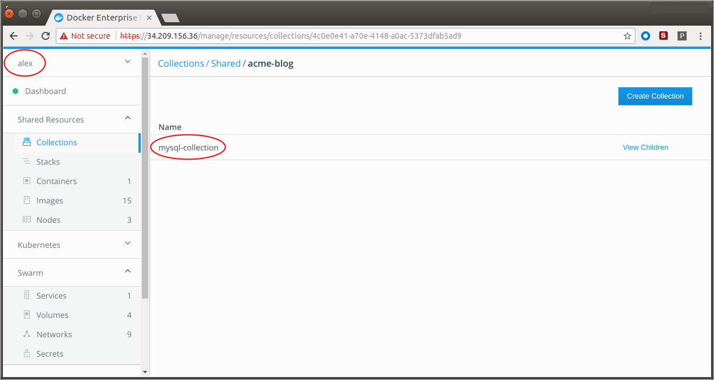



This tutorial explains how to create a simple web application with multiple
components and how to separate access to each component with role-based access
control (RBAC).




## Swarm Stack

In this section, we deploy `acme-blog` as a Swarm stack of two services. See
[Kubernetes Deployment](#kubernetes-deployment) for the same exersice with
Kubernetes.

You are the UCP admin at Acme Company and need to secure access to `acme-blog`
and its component services,  Wordpress and MySQL. The best way to do this is to:

- Add teams and users
- Create collections (directories) for storing the resources of each component.
- Create grants that specify which team can do what operations on which collection.
- Give the all-clear for the ops team to deploy the blog.

### Build the organization

Add the organization, `acme-datacenter`, and create three teams according to the
following structure:

```
acme-datacenter
├── dba
│   └── Alex Alutin
├── dev
│   └── Bett Bhatia
└── ops
    └── Chad Chavez
```
See [Create and configure users and teams](./usermgmt-create-subjects.md)

### Create collection paths

Create three nested Swarm collections. First, create a collection for `acme-blog` in
the `Shared` collection and then nest collections for wordpress and mysql resources:

```
/
├── System
└── Shared
    └── acme-blog
        ├── wordpress-collection
        └── mysql-collection
```

> **Tip**: To drill into a collection, click **View Children**.

See [Group and isolate cluster resources](./resources-group-resources.md)

### Grant roles

Create three grants with built-in roles:

- acme-datacenter/ops + Full Control + /Shared/acme-blog
- acme-datacenter/dev + Full Control + /Shared/acme-blog/wordpress-collection
- acme-datacenter/dba + Full Control + /Shared/acme-blog/mysql-collection

> In this exercise we use built-in roles but you can create custom ones too.

See: [Grant access to cluster resources](./usermgmt-grant-permissions.md)

### Deploy Swarm stack with Wordpress and MySQL

You've configured UCP. The `ops` team can now deploy `acme-blog`:

1. Click **Shared Resources** > **Stacks**.
2. Click **Create Stack**.
3. Name it, `acme-blog` and select **Swarm Services** mode.
4. Paste the YAML code below.
5. Click **Create**, and when enabled, click **Done**.

```
version: "3.1"

services:
  db:
    image: mysql:5.7
    deploy:
      replicas: 1
      labels:
        com.docker.ucp.access.label: "/Shared/acme-blog/mysql-collection"
      restart_policy:
        condition: on-failure
        max_attempts: 3
    volumes:
      - db_data:/var/lib/mysql
    networks:
      - wordpress-net
    environment:
      MYSQL_ROOT_PASSWORD: wordpress
      MYSQL_DATABASE: wordpress
      MYSQL_USER: wordpress
      MYSQL_PASSWORD: wordpress
  wordpress:
    depends_on:
      - db
    image: wordpress:latest
    deploy:
      replicas: 1
      labels:
        com.docker.ucp.access.label: "/Shared/acme-blog/wordpress-collection"
      restart_policy:
        condition: on-failure
        max_attempts: 3
    volumes:
      - wordpress_data:/var/www/html
    networks:
      - wordpress-net
    ports:
      - "8000:80"
    environment:
      WORDPRESS_DB_HOST: db:3306
      WORDPRESS_DB_PASSWORD: wordpress

volumes:
  db_data:
  wordpress_data:

networks:
  wordpress-net:
    labels:
      com.docker.ucp.access.label: "/Shared/acme-blog"
```

### Test access

Log on to UCP as each user and ensure that
- `dba` (alex) can only see and access `mysql-collection`
- `dev` (bett) can only see and access `wordpress-collection`
- `ops` (chad) can see and access both.

 For example:

 {: .with-border}


## Kubernetes Deployment

In this section, we deploy `acme-blog` with Kubernetes.

...




## Swarm Stack

In this section, we deploy `acme-blog` as a Swarm stack of two services.

You are the UCP admin at Acme Company and need to secure access to `acme-blog`
and its component services,  Wordpress and MySQL. The best way to do this is to:

- Add teams and users
- Create collections (directories) for storing the resources of each component.
- Create grants that specify which team can do what operations on which collection.
- Give the all-clear for the ops team to deploy the blog.

### Build the organization

Add the organization, `acme-datacenter`, and create three teams according to the
following structure:

```
acme-datacenter
├── dba
│   └── Alex Alutin
├── dev
│   └── Bett Bhatia
└── ops
    └── Chad Chavez
```
See [Create and configure users and teams](./usermgmt-create-subjects.md)

### Create collection paths

Create three nested Swarm collections. First, create a collection for `acme-blog` in
the `Shared` collection and then nest collections for wordpress and mysql resources:

```
/
├── System
└── Shared
    └── acme-blog
        ├── wordpress-collection
        └── mysql-collection
```

> **Tip**: To drill into a collection, click **View Children**.

See [Group and isolate cluster resources](./resources-group-resources.md)

### Grant roles

Create three grants with built-in roles:

- acme-datacenter/ops + Full Control + /Shared/acme-blog
- acme-datacenter/dev + Full Control + /Shared/acme-blog/wordpress-collection
- acme-datacenter/dba + Full Control + /Shared/acme-blog/mysql-collection

> In this exercise we use built-in roles but you can create custom ones too.

See: [Grant access to cluster resources](./usermgmt-grant-permissions.md)

### Deploy Swarm stack with Wordpress and MySQL

You've configured UCP. The `ops` team can now deploy `acme-blog`:

1. Click **Shared Resources** > **Stacks**.
2. Click **Create Stack**.
3. Name it, `acme-blog` and select **Services** mode.
4. Paste the YAML code below.
5. Click **Create**, and when enabled, click **Done**.

```
version: "3.1"

services:
  db:
    image: mysql:5.7
    deploy:
      replicas: 1
      labels:
        com.docker.ucp.access.label: "/Shared/acme-blog/mysql-collection"
      restart_policy:
        condition: on-failure
        max_attempts: 3
    volumes:
      - db_data:/var/lib/mysql
    networks:
      - wordpress-net
    environment:
      MYSQL_ROOT_PASSWORD: wordpress
      MYSQL_DATABASE: wordpress
      MYSQL_USER: wordpress
      MYSQL_PASSWORD: wordpress
  wordpress:
    depends_on:
      - db
    image: wordpress:latest
    deploy:
      replicas: 1
      labels:
        com.docker.ucp.access.label: "/Shared/acme-blog/wordpress-collection"
      restart_policy:
        condition: on-failure
        max_attempts: 3
    volumes:
      - wordpress_data:/var/www/html
    networks:
      - wordpress-net
    ports:
      - "8000:80"
    environment:
      WORDPRESS_DB_HOST: db:3306
      WORDPRESS_DB_PASSWORD: wordpress

volumes:
  db_data:
  wordpress_data:

networks:
  wordpress-net:
    labels:
      com.docker.ucp.access.label: "/Shared/acme-blog"
```

### Test access

Log on to UCP as each user and ensure that
- `dba` (alex) can only see and access `mysql-collection`
- `dev` (bett) can only see and access `wordpress-collection`
- `ops` (chad) can see and access both.

 For example:

 {: .with-border}



