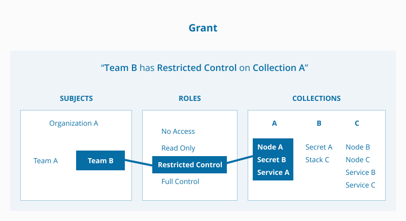



Docker EE administrators can create *grants* to control how users and
organizations access resources.

A grant is made up of *subject*, *role*, and *resource group*.



## Kubernetes grants

With Kubernetes orchestration, a grant is made up of *subject*, *role*, and
*namespace*.

## Swarm grants

With Swarm orchestration, a grant is made up of *subject*, *role*, and
*collection*.

{: .with-border}

A grant defines who (subject) has how much access (role) to a set of resources
(collection). Each grant is a 1:1:1 mapping of subject, role, collection. For
example, you can grant the "Prod Team" "Restricted Control"of the "/Production"
collection.

A common workflow for creating grants has four steps:

- Add and configure **subjects** (users and teams).
- Define custom **roles** (or use defaults) by adding permitted API operations
  per resource type.
- Group cluster **resources** into Swarm collections or Kubernetes namespaces.
- Create **grants** by marrying subject + role + resource.

{: .with-border}

### Create a Swarm grant

You can create grants after creating users, collections, and roles (if using
custom roles).

To create a grant in UCP:

1. Click **Grants** under **User Management**.
2. Click **Create Grant**.
3. On the Collections tab, click **Collections** (for Swarm) or **Namespaces** (for Kubernetes).
4. Click **View Children** until you get to the desired resource group and **Select**.
5. On the Roles tab, select a role.
6. On the Subjects tab, select a user, team, or organization to authorize.
4. Click **Create**.

> By default, all new users are placed in the `docker-datacenter` organization.
> To apply permissions to all Docker EE users, create a grant with the
> `docker-datacenter` org as a subject.



## Swarm grants

With Swarm orchestration, a grant is made up of *subject*, *role*, and
*collection*.

{: .with-border}

A grant defines who (subject) has how much access (role) to a set of resources
(collection). Each grant is a 1:1:1 mapping of subject, role, collection. For
example, you can grant the "Prod Team" "Restricted Control"of the "/Production"
collection.

A common workflow for creating grants has four steps:

- Add and configure **subjects** (users and teams).
- Define custom **roles** (or use defaults) by adding permitted API operations
  per resource type.
- Group cluster **resources** into Swarm collections.
- Create **grants** by marrying subject + role + resource.

{: .with-border}

### Create a Swarm grant

You can create grants after creating users, collections, and roles (if using custom roles).

To create a grant in UCP:

1. Click **Grants** under **User Management**.
2. Click **Create Grant**.
3. On the Collections tab, click **Collections**.
4. Click **View Children** until you get to the desired resource group and **Select**.
5. On the Roles tab, select a role.
6. On the Subjects tab, select a user, team, or organization to authorize.
4. Click **Create**.

> By default, all new users are placed in the `docker-datacenter` organization.
> To apply permissions to all Docker EE users, create a grant with the
> `docker-datacenter` org as a subject.



