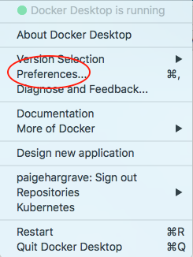
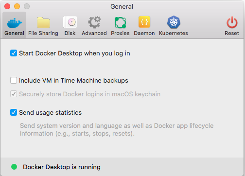
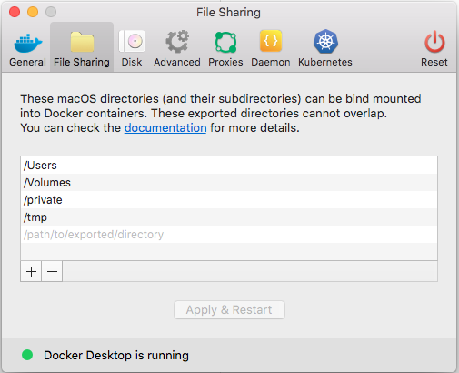
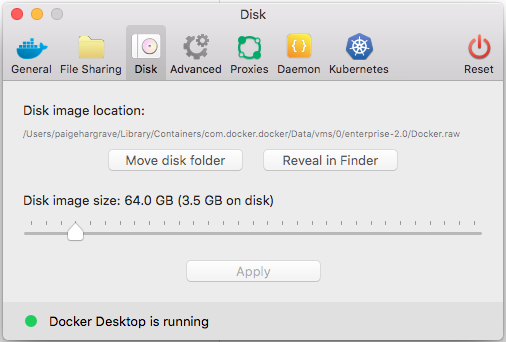
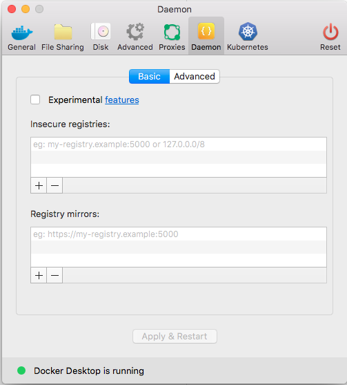
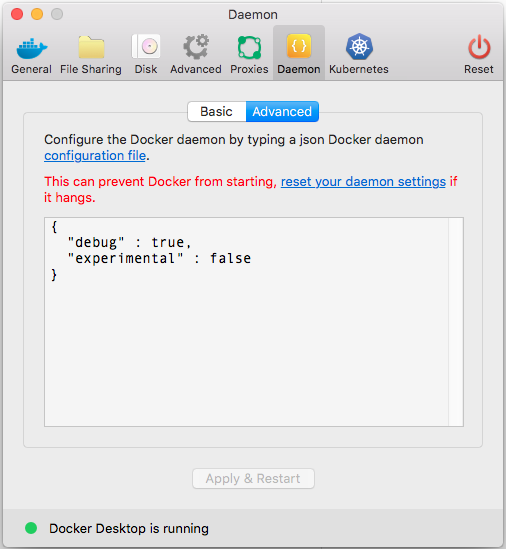
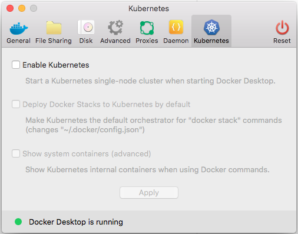
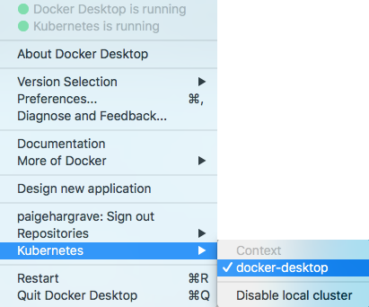
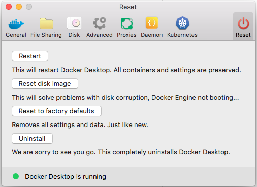

# Getting started with Docker Desktop Enterprise on Mac

## Explore the application

1.  Open a command-line terminal and test that your installation works by
    running the simple Docker image,
    [hello-world](https://hub.docker.com/_/hello-world/){: target="_blank" class="_"}.

    ```shell
    $ docker run hello-world

    Unable to find image 'hello-world:latest' locally
    latest: Pulling from library/hello-world
    ca4f61b1923c: Pull complete
    Digest: sha256:ca0eeb6fb05351dfc8759c20733c91def84cb8007aa89a5bf606bc8b315b9fc7
    Status: Downloaded newer image for hello-world:latest

    Hello from Docker!
    This message shows that your installation appears to be working correctly.
    ...
    ```

2.  Start a Dockerized web server. Like the `hello-world` image above, if the
    image is not found locally, Docker pulls it from Docker Hub.

    ```bash
    $ docker run --detach --publish=80:80 --name=webserver nginx
    ```

3.  In a web browser, go to `http://localhost/` to view the nginx homepage.
    Because we specified the default HTTP port, it isn't necessary to append
    `:80` at the end of the URL.

    

    > Early beta releases used `docker` as the hostname to build the URL. Now,
    > ports are exposed on the private IP addresses of the VM and forwarded to
    > `localhost` with no other host name set.

4.  View the details on the container while your web server is running (with
    `docker container ls` or `docker ps`):

    ```none
    $ docker container ls
    CONTAINER ID   IMAGE   COMMAND                  CREATED              STATUS              PORTS                         NAMES
    56f433965490   nginx   "nginx -g 'daemon off"   About a minute ago   Up About a minute   0.0.0.0:80->80/tcp, 443/tcp   webserver
    ```

5.  Stop and remove containers and images with the following commands. Use the
    "all" flag (`--all` or `-a`) to view stopped containers.

    ```shell
    $ docker container ls
    $ docker container stop webserver
    $ docker container ls -a
    $ docker container rm webserver
    $ docker image ls
    $ docker image rm nginx
    ```

## Preferences menu

Choose {: .inline}  → **Preferences** from the
menu bar and configure the runtime options described below.



**Note**: Administrators have the ability to lock some configuration options. No error message is displayed if you attempt to change the value of a locked configuration option, but the value will remain unchanged.

### General



General settings are:

- **Start Docker when you log in**: Uncheck this option if you don't want Docker
  to start when you open your session.

- **Automatically check for updates** notifies you when an update is available.
  Click **OK** to accept and install updates (or cancel to keep the current
  version). If you disable this option, you can still find out about updates
  manually by choosing {: .inline} → **Check
  for Updates**.

- **Include VM in Time Machine backups** backs up the Docker Desktop Enterprise virtual
  machine. (Disabled by default.)

- **Securely store Docker logins in MacOS keychain** stores your Docker login
  credentials. (Enabled by default.)

- **Send usage statistics** &mdash; Send diagnostics, crash reports, and usage
  data to Docker. This information helps Docker improve the application and get
  more context for troubleshooting problems. (Enabled by default.)

### File sharing

Choose which local directories to share with your containers. File sharing is
required for volume mounting if the project lives outside of the `/Users`
directory. In that case, share the drive where the Dockerfile and volume are
located. Otherwise, you get `file not found` or `cannot start service errors at
runtime`.



**Note**: Administrators have the ability to lock some configuration options. No error message is displayed if you attempt to change the value of a locked configuration option, but the value will remain unchanged.

File share settings are:

- **Add a Directory**: Click `+` and navigate to the directory you want to add.

- **Apply & Restart** makes the directory available to containers using Docker's
  bind mount (`-v`) feature.

  There are some limitations on the directories that can be shared:

  - They cannot be a subdirectory of an already shared directory.
  - They cannot already exist inside of Docker.

For more information, see:

- [Namespaces](https://docs.docker.com/docker-for-mac/osxfs/#namespaces){: target="_blank" class="_"} in the topic on
  [osxfs file system sharing](https://docs.docker.com/docker-for-mac/osxfs/){: target="_blank" class="_"}.
- [Volume mounting requires file sharing for any project directories outside of
  `/Users`](mactroubleshooting/#volume-mounting-requires-file-sharing-for-any-project-directories-outside-of-users){: target="_blank" class="_"}.
  
  
### Disk

Specify the **Disk image location** of the Linux volume, where containers and
images are stored.

You can also move the disk image location. If you attempt to move the disk image
to a location that already has one, you get a prompt asking if you want to use
the existing image or replace it.




### Advanced

On the Advanced tab, you can limit resources available to Docker.


**Note**: Administrators have the ability to lock some configuration options. No error message is displayed if you attempt to change the value of a locked configuration option, but the value will remain unchanged.

Advanced settings are:

**CPUs**: By default, Docker Desktop Enterprise is set to use half the number of processors
available on the host machine. To increase processing power, set this to a
higher number; to decrease, lower the number.

**Memory**: By default, Docker Desktop Enterprise is set to use `2` GB runtime memory,
allocated from the total available memory on your Mac. To increase RAM, set this
to a higher number; to decrease it, lower the number.

**Swap**: Configure swap file size as needed. The default is 1 GB.


### Proxies

Docker Desktop Enterprise detects HTTP/HTTPS Proxy Settings from macOS and automatically
propagates these to Docker and to your containers. For example, if you set your
proxy settings to `http://proxy.example.com`, Docker uses this proxy when
pulling containers.


When you start a container, your proxy settings propagate into the containers.
For example:

```
$ docker run -it alpine env
PATH=/usr/local/sbin:/usr/local/bin:/usr/sbin:/usr/bin:/sbin:/bin
HOSTNAME=b7edf988b2b5
TERM=xterm
HOME=/root
HTTP_PROXY=http://proxy.example.com:3128
http_proxy=http://proxy.example.com:3128
no_proxy=*.local, 169.254/16
```

You can see from the above output that the `HTTP_PROXY`, `http_proxy`, and
`no_proxy` environment variables are set. When your proxy configuration changes,
Docker restarts automatically to pick up the new settings. If you have
containers that you wish to keep running across restarts, you should consider
using [restart policies](https://docs.docker.com/engine/reference/run/#restart-policies---restart){: target="_blank" class="_"}.

<p id="daemon-experimental-mode" />

### Daemon

You can configure options on the Docker daemon that determine how your
containers run.

Select **Basic** to configure the daemon with interactive settings, or select
**Advanced** to edit the JSON directly.



**Note**: Administrators have the ability to lock some configuration options. No error message is displayed if you attempt to change the value of a locked configuration option, but the value will remain unchanged.

#### Experimental features

Docker Desktop Enterprise has experimental features enabled
on Docker Engine, as described in [Docker Experimental Features
README](https://github.com/docker/docker-ce/blob/master/components/cli/experimental/README.md){: target="_blank" class="_"}. If you uncheck **experimental mode**, Docker Desktop Enterprise
uses the current generally available release of Docker Engine.

> Don't enable experimental features in production
>
>Experimental features are not appropriate for production environments or
>workloads. They are meant to be sandbox experiments for new ideas. Some
>experimental features may become incorporated into upcoming stable releases,
>but others may be modified or pulled from subsequent Edge releases, and never
>released on Stable.

You can see whether you are running experimental mode at the command line. If
`Experimental` is `true`, then Docker is running in experimental mode, as shown
here. (If `false`, Experimental mode is off.)

```bash
$ docker version -f {{.Server.Experimental}}
true
```

#### Insecure registries

You can set up a custom and insecure [registry](https://docs.docker.com/registry/introduction){: target="_blank" class="_"} to store your public or private images (instead of
using [Docker Hub](https://hub.docker.com/){: target="_blank" class="_"} or
[Docker Trusted Registry](https://docs.docker.com/ee/dtr/){: target="_blank" class="_"}. Add URLs for
your insecure registries and registry mirrors on which to host your images.

See also:
- [How do I add custom CA
  certificates?](https://docs.docker.com/docker-for-windows/faqs/#how-do-i-add-custom-ca-certificates){: target="_blank" class="_"}
- [How do I add client
  certificates](https://docs.docker.com/docker-for-windows/faqs/#how-do-i-add-client-certificates){: target="_blank" class="_"}

#### Daemon configuration file

Click the **Advanced** tab to configure the daemon from the JSON file. For a
full list of options, see the Docker Engine [dockerd commandline
reference](https://docs.docker.com/engine/reference/commandline/dockerd){: target="_blank" class="_"}.

Click **Apply & Restart** to save your settings and reboot Docker. Or, to cancel
changes, click another preference tab, then choose to discard or not apply
changes when asked.



### Kubernetes

Docker Desktop Enterprise includes a standalone Kubernetes server that runs on your Mac, so
that you can test deploying your Docker workloads on Kubernetes.

**Note**: Administrators have the ability to lock some configuration options. No error message is displayed if you attempt to change the value of a locked configuration option, but the value will remain unchanged.

The Kubernetes client command, `kubectl`, is included and configured to connect
to the local Kubernetes server. If you have `kubectl` already installed and
pointing to some other environment, such as `minikube` or a GKE cluster, be sure
to change context so that `kubectl` is pointing to `docker-for-desktop`:

```bash
$ kubectl config get-contexts
$ kubectl config use-context docker-for-desktop
```

If you installed `kubectl` with Homebrew, or by some other method, and
experience conflicts, remove `/usr/local/bin/kubectl`.

- To enable Kubernetes support and install a standalone instance of Kubernetes
  running as a Docker container, select **Enable Kubernetes**, choose the
  [default
  orchestrator](https://docs.docker.com/docker-for-mac/kubernetes/#override-the-default-orchestrator){: target="_blank" class="_"}
  and click the **Apply** button.

  


  An Internet connection is required. Images required to run the Kubernetes
  server are downloaded and instantiated as containers, and the
  `/usr/local/bin/kubectl` command is installed on your Mac.

  When Kubernetes is enabled and running, an additional status bar item displays
  at the bottom right of the Docker Desktop Enterprise **Preferences** dialog.

  

  The status of Kubernetes shows in the Docker menu and the context points to
  `docker-for-desktop`.

  

- By default, Kubernetes containers are hidden from commands like `docker
  service ls`, because managing them manually is not supported. To make them
  visible, select **Show system containers (advanced)** and click **Apply and
  restart**. Most users do not need this option.

- To disable Kubernetes support at any time, deselect **Enable Kubernetes**. The
  Kubernetes containers are stopped and removed, and the
  `/usr/local/bin/kubectl` command is removed.

  For more about using the Kubernetes integration with Docker Desktop Enterprise, see
  [Deploy on Kubernetes](https://docs.docker.com/docker-for-mac/kubernetes){: target="_blank" class="_"}.

### Reset

Select {: .inline} -> **Preferences** from the
menu bar, then click **Reset** to reset factory defaults, restart the Docker
daemon, or uninstall.



Reset settings are:

* **Restart** - Select to restart the Docker daemon.

* **Remove all data** - This option removes/resets all Docker data _without_ a
  reset to factory defaults (which would cause you to lose settings).

* **Reset to factory defaults** - Choose this option to reset all options on
  Docker Desktop Enterprise to its initial state, the same as when it was first installed.

  * **Uninstall** - Choose this option to remove Docker Desktop Enterprise from your
    system.

> Uninstall Docker Desktop Enterprise from the commandline
>
>To uninstall Docker Desktop Enterprise from a terminal, run: `<DockerforMacPath>
>--uninstall`. If your instance is installed in the default location, this
>command provides a clean uninstall:
>
>```shell
>$ /Applications/Docker.app/Contents/MacOS/Docker --uninstall
>Docker is running, exiting...
>Docker uninstalled successfully. You can move the Docker application to the trash.
>```
>You might want to use the command-line uninstall if, for example, you find that
>the app is non-functional, and you cannot uninstall it from the menu.

## Application Designer

The Application Designer helps Docker developers quickly create new
Docker apps using a library of templates. To start the Application
Designer, select the **Design new application** menu entry.


The list of available templates is provided:


After selecting a template, you can then customize your application, For
example, if you select **Flask / NGINX / MySQL**, you can then

-   select a different version of python or mysql; and

-   choose different external ports:


You can then name your application and customize the disk location:


When you select **Assemble**, your application is created.


Once assembled, the following screen allows you to run the application.
Select **Run application** to pull the images and start the containers:


Use the corresponding buttons to start and stop your application. Select **Open in Finder** on Mac or **Open in Explorer** on Windows to
view application files on disk. Select **Open in Visual Studio Code** to open files with an editor. Note that debug logs from the application are displayed in the lower part of the Application Designer
window.

## Add TLS certificates

You can add trusted Certificate Authorities (CAs) (used to verify registry
server certificates) and client certificates (used to authenticate to
registries) to your Docker daemon.

### Add custom CA certificates (server side)

All trusted CAs (root or intermediate) are supported. Docker Desktop Enterprise creates a
certificate bundle of all user-trusted CAs based on the Mac Keychain, and
appends it to Moby trusted certificates. So if an enterprise SSL certificate is
trusted by the user on the host, it is trusted by Docker Desktop Enterprise.

To manually add a custom, self-signed certificate, start by adding the
certificate to the macOS keychain, which is picked up by Docker Desktop Enterprise. Here is
an example.

```bash
$ sudo security add-trusted-cert -d -r trustRoot -k /Library/Keychains/System.keychain ca.crt
```

Or, if you prefer to add the certificate to your own local keychain only (rather
than for all users), run this command instead:

```
$ security add-trusted-cert -d -r trustRoot -k ~/Library/Keychains/login.keychain ca.crt
```

See also, [Directory structures for
certificates](macconfig.md#directory-structures-for-certificates){: target="_blank" class="_"}.

> **Note:** You need to restart Docker Desktop Enterprise after making any changes to the
keychain or to the `~/.docker/certs.d` directory in order for the changes to
take effect.

For a complete explanation of how to do this, see the blog post [Adding
Self-signed Registry Certs to Docker & Docker Desktop Enterprise](http://container-solutions.com/adding-self-signed-registry-certs-docker-mac/){: target="_blank" class="_"}.

### Add client certificates

You can put your client certificates in
`~/.docker/certs.d/<MyRegistry>:<Port>/client.cert` and
`~/.docker/certs.d/<MyRegistry>:<Port>/client.key`.

When the Docker Desktop Enterprise application starts up, it copies the `~/.docker/certs.d`
folder on your Mac to the `/etc/docker/certs.d` directory on Moby (the Docker
Desktop Enterprise `xhyve` virtual machine).

> * You need to restart Docker Desktop Enterprise after making any changes to the keychain
>   or to the `~/.docker/certs.d` directory in order for the changes to take
>   effect.
>
> * The registry cannot be listed as an _insecure registry_ (see [Docker
>   Daemon](#daemon)). Docker Desktop Enterprise ignores certificates listed
>   under insecure registries, and does not send client certificates. Commands
>   like `docker run` that attempt to pull from the registry produce error
>   messages on the command line, as well as on the registry.

### Directory structures for certificates

If you have this directory structure, you do not need to manually add the CA
certificate to your Mac OS system login:

```
/Users/<user>/.docker/certs.d/
└── <MyRegistry>:<Port>
   ├── ca.crt
   ├── client.cert
   └── client.key
```

The following further illustrates and explains a configuration with custom
certificates:

```
/etc/docker/certs.d/        <-- Certificate directory
└── localhost:5000          <-- Hostname:port
   ├── client.cert          <-- Client certificate
   ├── client.key           <-- Client key
   └── ca.crt               <-- Certificate authority that signed
                                the registry certificate
```

You can also have this directory structure, as long as the CA certificate is
also in your keychain.

```
/Users/<user>/.docker/certs.d/
└── <MyRegistry>:<Port>
    ├── client.cert
    └── client.key
```

To learn more about how to install a CA root certificate for the registry and
how to set the client TLS certificate for verification, see [Verify repository
client with certificates](https://docs.docker.com/engine/security/certificates){: target="_blank" class="_"} in the Docker Engine
topics.

## Install shell completion

Docker Desktop Enterprise comes with scripts to enable completion for the `docker`,
`docker-machine`, and `docker-compose` commands. The completion scripts may be
found inside `Docker.app`, in the `Contents/Resources/etc/` directory and can be
installed both in Bash and Zsh.

### Bash

Bash has [built-in support for
completion](https://www.debian-administration.org/article/316/An_introduction_to_bash_completion_part_1){:target="_blank"
class="_"} To activate completion for Docker commands, these files need to be
copied or symlinked to your `bash_completion.d/` directory. For example, if you
installed bash via [Homebrew](http://brew.sh/){:target="_blank"
class="_"}:

```bash
etc=/Applications/Docker.app/Contents/Resources/etc
ln -s $etc/docker.bash-completion $(brew --prefix)/etc/bash_completion.d/docker
ln -s $etc/docker-machine.bash-completion $(brew --prefix)/etc/bash_completion.d/docker-machine
ln -s $etc/docker-compose.bash-completion $(brew --prefix)/etc/bash_completion.d/docker-compose
```

### Zsh

In Zsh, the [completion
system](http://zsh.sourceforge.net/Doc/Release/Completion-System.html){:target="_blank"
class="_"} takes care of things. To activate completion for Docker commands,
these files need to be copied or symlinked to your Zsh `site-functions/`
directory. For example, if you installed Zsh via [Homebrew](http://brew.sh/){:target="_blank"
class="_"}:

```bash
etc=/Applications/Docker.app/Contents/Resources/etc
ln -s $etc/docker.zsh-completion /usr/local/share/zsh/site-functions/_docker
ln -s $etc/docker-machine.zsh-completion /usr/local/share/zsh/site-functions/_docker-machine
ln -s $etc/docker-compose.zsh-completion /usr/local/share/zsh/site-functions/_docker-compose
```
