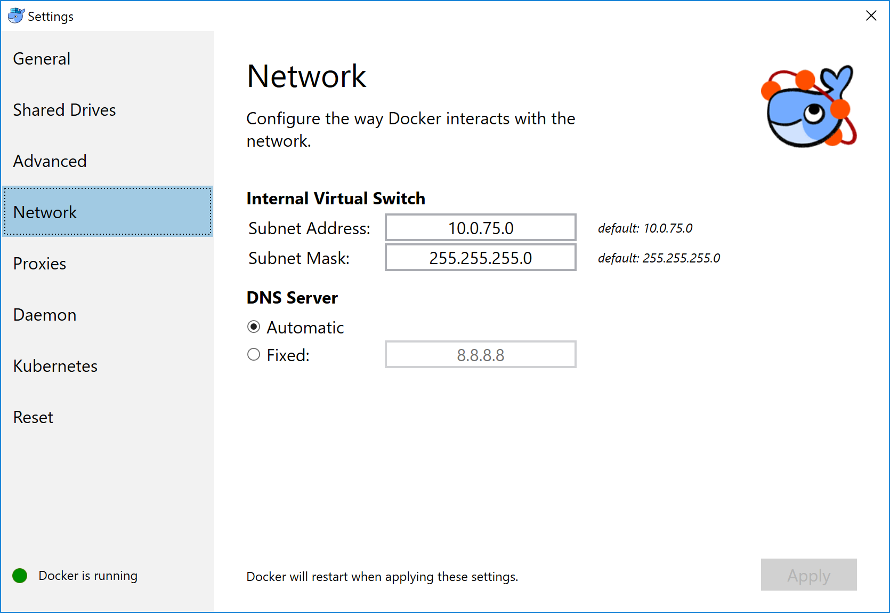

# Getting started with Docker Desktop Enterprise on Windows

## Test your installation

1.  Open a terminal window (Command Prompt or PowerShell, _but not_ PowerShell ISE).

2.  Run `docker --version` to ensure that you have a supported version of Docker:

    ```shell
    > docker --version

    Docker version 18.03.0-ce, build 0520e24
    ```

3.  Pull the [hello-world image](https://hub.docker.com/r/library/hello-world/){: target="_blank" class="_"} from Docker Hub and run a container:

    ```shell
    > docker run hello-world

    docker : Unable to find image 'hello-world:latest' locally
    ...

    latest:
    Pulling from library/hello-world
    ca4f61b1923c:
    Pulling fs layer
    ca4f61b1923c:
    Download complete
    ca4f61b1923c:
    Pull complete
    Digest: sha256:97ce6fa4b6cdc0790cda65fe7290b74cfebd9fa0c9b8c38e979330d547d22ce1
    Status: Downloaded newer image for hello-world:latest

    Hello from Docker!
    This message shows that your installation appears to be working correctly.
    ...
    ```

4.  List the `hello-world` _image_ that was downloaded from Docker Hub:

    ```shell
    > docker image ls
    ```

5.  List the `hello-world` _container_ (that exited after displaying "Hello from Docker!"):

    ```shell
    > docker container ls --all
    ```

6.  Explore the Docker help pages by running some help commands:

    ```shell
    > docker --help
    > docker container --help
    > docker container ls --help
    > docker run --help
    ```

## Explore the application

In this section, we demonstrate the ease and power of Dockerized applications by
running something more complex, such as an OS and a webserver.

1.  Pull an image of the [Ubuntu OS](https://hub.docker.com/r/_/ubuntu/){: target="_blank" class="_"} and run an interactive terminal inside the spawned container:

    ```shell
    > docker run --interactive --tty ubuntu bash

    docker : Unable to find image 'ubuntu:latest' locally
    ...

    latest:
    Pulling from library/ubuntu
    22dc81ace0ea:
    Pulling fs layer
    1a8b3c87dba3:
    Pulling fs layer
    91390a1c435a:
    Pulling fs layer
    ...
    Digest: sha256:e348fbbea0e0a0e73ab0370de151e7800684445c509d46195aef73e090a49bd6
    Status: Downloaded newer image for ubuntu:latest
    ```

    > Do not use PowerShell ISE
    >
    > Interactive terminals do not work in PowerShell ISE (but they do in PowerShell). See [docker/for-win/issues/223](https://github.com/docker/for-win/issues/223){: target="_blank" class="_"}.

2.  You are in the container. At the root `#` prompt, check the `hostname` of the container:

    ```shell
    root@8aea0acb7423:/# hostname
    8aea0acb7423
    ```
    Notice that the hostname is assigned as the container ID (and is also used in the prompt).

3.  Exit the shell with the `exit` command (which also stops the container):

    ```shell
    root@8aea0acb7423:/# exit
    >
    ```

4.  List containers with the `--all` option (because no containers are running).

    The `hello-world` container (randomly named, `relaxed_sammet`) stopped after displaying its message. The `ubuntu` container (randomly named, `laughing_kowalevski`) stopped when you exited the container.

    ```shell
    > docker container ls --all

    CONTAINER ID    IMAGE          COMMAND     CREATED          STATUS                      PORTS    NAMES
    8aea0acb7423    ubuntu         "bash"      2 minutes ago    Exited (0) 2 minutes ago             laughing_kowalevski
    45f77eb48e78    hello-world    "/hello"    3 minutes ago    Exited (0) 3 minutes ago             relaxed_sammet
    ```

5.  Pull and run a Dockerized [nginx](https://hub.docker.com/_/nginx/){: target="_blank" class="_"} web server that we name, `webserver`:

    ```shell
    > docker run --detach --publish 80:80 --name webserver nginx

    Unable to find image 'nginx:latest' locally
    latest: Pulling from library/nginx

    fdd5d7827f33: Pull complete
    a3ed95caeb02: Pull complete
    716f7a5f3082: Pull complete
    7b10f03a0309: Pull complete
    Digest: sha256:f6a001272d5d324c4c9f3f183e1b69e9e0ff12debeb7a092730d638c33e0de3e
    Status: Downloaded newer image for nginx:latest
    dfe13c68b3b86f01951af617df02be4897184cbf7a8b4d5caf1c3c5bd3fc267f
    ```

6.  Point your web browser at `http://localhost` to display the nginx start page. (You don't need to append `:80` because you specified the default HTTP port in the `docker` command.)

    

7.  List only your _running_ containers:

    ```shell
    > docker container ls

    CONTAINER ID    IMAGE    COMMAND                   CREATED          STATUS          PORTS                 NAMES
    0e788d8e4dfd    nginx    "nginx -g 'daemon of…"    2 minutes ago    Up 2 minutes    0.0.0.0:80->80/tcp    webserver
    ```

8.  Stop the running nginx container by the name we assigned it, `webserver`:

    ```shell
    >  docker container stop webserver
    ```

9.  Remove all three containers by their names -- the latter two names will differ for you:

    ```shell
    > docker container rm webserver laughing_kowalevski relaxed_sammet
    ```

## Docker Desktop Enterprise Settings menu

The Docker Desktop Enterprise **Settings** menu provides options for configuring
Docker settings -- installation, updates, version channels, Docker Hub login,
and more.

This section explains the configuration options accessible from the **Settings** dialog.

**Note**: Administrators have the ability to lock some configuration options. No error message is displayed if you attempt to change the value of a locked configuration option, but the value will remain unchanged.

1.  Open  Docker Desktop Enterprise by right-clicking the Docker icon in the Notifications area (or System tray):

    

2.  Select **Settings...** to open the Settings dialog:

    

### General

On the **General** tab of the Settings dialog, you can configure when to start and update Docker.


**Note**: Administrators have the ability to lock some configuration options. No error message is displayed if you attempt to change the value of a locked configuration option, but the value will remain unchanged.

* **Start Docker when you log in** - Automatically start the Docker Desktop Enterprise
application upon Windows system login.

* **Automatically check for updates** - By default, Docker Desktop Enterprise
automatically checks for updates and notifies you when an update is available.
Click **OK** to accept and install updates (or cancel to keep the current
version). You can manually update by choosing **Check for Updates** from the
main Docker menu.

* **Send usage statistics** - By default, Docker Desktop Enterprise sends diagnostics,
crash reports, and usage data. This information helps Docker improve and
troubleshoot the application. Uncheck to opt out. Docker may also sometimes
prompt you for more information.

### Shared drives

Share your local drives (volumes) with Docker Desktop Enterprise, so that they are
available to your [Linux containers](#switch-between-windows-and-linux-containers).


**Note**: Administrators have the ability to lock some configuration options. No error message is displayed if you attempt to change the value of a locked configuration option, but the value will remain unchanged.

Permission for shared drives are tied to the credentials you provide here. If
you run `docker` commands under a different username than the one configured
here, your containers cannot access the mounted volumes.

To apply shared drives, you are prompted for your Windows system (domain)
username and password. You can select an option to have Docker store the
credentials so that you don't need to enter them every time.

> Tips on shared drives, permissions, and volume mounts
>
 * Shared drives are only required for mounting volumes in [Linux containers](#switch-between-windows-and-linux-containers),
 not for Windows containers. For Linux containers, you need to share the drive
 where the Dockerfile and volume are located. If you get errors such as `file not found`
 or `cannot start service` you may need to enable shared drives. See [Volume mounting requires shared drives for Linux containers](windowstroubleshooting.md#volume-mounting-requires-shared-drives-for-linux-containers){: target="_blank" class="_"}.
>
 * If possible, avoid volume mounts from the Windows host, and instead mount on
 the Linux VM, or use a [data volume](https://docs.docker.com/storage/volumes/){: target="_blank" class="_"}
 (named volume) or [data container](https://docs.docker.com/storage/volumes/){: target="_blank" class="_"}.
 There are a number of issues with using host-mounted volumes and network paths
 for database files. See [Volume mounts from host paths use a nobrl option to override database locking](windowstroubleshooting.md#volume-mounts-from-host-paths-use-a-nobrl-option-to-override-database-locking){: target="_blank" class="_"}.
>
 * Docker Desktop Enterprise sets permissions to read/write/execute for users, groups and others [0777 or a+rwx](http://permissions-calculator.org/decode/0777/){: target="_blank" class="_"}.
   This is not configurable. See [Permissions errors on data directories for shared volumes](windowstroubleshooting.md#permissions-errors-on-data-directories-for-shared-volumes){: target="_blank" class="_"}.
>
 * Ensure the domain user has access to shared drives, as described in [Verify domain user has permissions for shared drives](windowstroubleshooting.md#verify-domain-user-has-permissions-for-shared-drives-volumes){: target="_blank" class="_"}.
>
 * You can share local drives with your _containers_ but not with Docker Machine
nodes. See the FAQ, [Can I share local drives and filesystem with my Docker Machine VMs?](https://docs.docker.com/docker-for-windows/faqs/#can-i-share-local-drives-and-filesystem-with-my-docker-machine-vms){: target="_blank" class="_"}.
>

#### Firewall rules for shared drives

Shared drives require port 445 to be open between the host machine and the
virtual machine that runs Linux containers. Docker detects if port 445 is closed
and shows the following message when you try to add a shared drive:


To share the drive, allow connections between the Windows host machine and the
virtual machine in Windows Firewall or your third party firewall software. You
do not need to open port 445 on any other network.

By default, allow connections to `10.0.75.1` on port 445 (the Windows host) from
`10.0.75.2` (the virtual machine). If your firewall rules seem correct, you may
need to toggle or
[reinstall the File and Print sharing service on the Hyper-V virtual network card](http://stackoverflow.com/questions/42203488/settings-to-windows-firewall-to-allow-docker-for-windows-to-share-drive/43904051#43904051){: target="_blank" class="_"}

#### Shared drives on demand

You can share a drive "on demand" the first time a particular mount is requested.

If you run a Docker command from a shell with a volume mount (as shown in the
example below) or kick off a Compose file that includes volume mounts, you get a
popup asking if you want to share the specified drive.

You can select to **Share it**, in which case it is added your Docker Desktop Enterprise [Shared Drives list](#shared-drives) and available to
containers. Alternatively, you can opt not to share it by selecting **Cancel**.


### Advanced

The Linux VM restarts after changing the settings on the **Advanced** tab. This takes a few seconds.


**Note**: Administrators have the ability to lock some configuration options. No error message is displayed if you attempt to change the value of a locked configuration option, but the value will remain unchanged.

* **CPUs** - Change the number of processors assigned to the Linux VM.

* **Memory** - Change the amount of memory the Docker Desktop Enterprise Linux VM uses.

### Network

You can configure Docker Desktop Enterprise networking to work on a virtual private network (VPN).



**Note**: Administrators have the ability to lock some configuration options. No error message is displayed if you attempt to change the value of a locked configuration option, but the value will remain unchanged.

* **Internal Virtual Switch** - You can specify a network address translation (NAT) prefix and subnet mask to enable Internet connectivity.

* **DNS Server** - You can configure the DNS server to use dynamic or static IP addressing.

> **Note**: Some users reported problems connecting to Docker Hub on Docker Desktop Enterprise. This would manifest as an error when trying to run
> `docker` commands that pull images from Docker Hub that are not already
> downloaded, such as a first time run of `docker run hello-world`. If you
> encounter this, reset the DNS server to use the Google DNS fixed address:
> `8.8.8.8`. For more information, see
> [Networking issues](windowstroubleshooting.md#networking-issues){: target="_blank" class="_"} in Troubleshooting.

Updating these settings requires a reconfiguration and reboot of the Linux VM.

### Proxies

Docker Desktop Enterprise lets you configure HTTP/HTTPS Proxy Settings and
automatically propagates these to Docker and to your containers.  For example,
if you set your proxy settings to `http://proxy.example.com`, Docker uses this
proxy when pulling containers.


**Note**: Administrators have the ability to lock some configuration options. No error message is displayed if you attempt to change the value of a locked configuration option, but the value will remain unchanged.

When you start a container, your proxy settings propagate into the containers. For example:

```ps
> docker run alpine env

PATH=/usr/local/sbin:/usr/local/bin:/usr/sbin:/usr/bin:/sbin:/bin
HOSTNAME=b7edf988b2b5
TERM=xterm
HOME=/root
HTTP_PROXY=http://proxy.example.com:3128
http_proxy=http://proxy.example.com:3128
no_proxy=*.local, 169.254/16
```

In the output above, the `HTTP_PROXY`, `http_proxy`, and `no_proxy` environment
variables are set. When your proxy configuration changes, Docker restarts
automatically to pick up the new settings. If you have containers that you wish
to keep running across restarts, you should consider using
[restart policies](https://docs.docker.com/engine/reference/run/#restart-policies---restart){: target="_blank" class="_"}.

<p id="daemon-experimental-mode" />

### Daemon

You can configure the Docker daemon to hone how your containers run.
**Advanced mode** lets you edit the JSON directly. **Basic mode** lets you
configure the more common daemon options with interactive settings (and also JSON).


**Note**: Administrators have the ability to lock some configuration options. No error message is displayed if you attempt to change the value of a locked configuration option, but the value will remain unchanged.

#### Experimental mode

Docker Desktop Enterprise has the experimental version
of Docker Engine enabled, described in the [Docker Experimental Features README](https://github.com/docker/cli/blob/master/experimental/README.md){: target="_blank" class="_"} on
GitHub.

Experimental features are not appropriate for production environments or
workloads. They are meant to be sandbox experiments for new ideas. Some
experimental features may become incorporated into upcoming stable releases, but
others may be modified or pulled from subsequent Edge releases, and never
released on Stable.

In Docker Desktop Enterprise, you can toggle **experimental mode** on and
off. If you toggle it off, Docker Desktop Enterprise uses the current generally
available release of Docker Engine.

Run `docker version` to see if you are in Experimental mode. Experimental mode
is listed under `Server` data. If `Experimental` is `true`, then Docker is
running in experimental mode, as shown here:

```shell
> docker version

Client:
 Version:       18.03.0-ce
 API version:   1.37
 Go version:    go1.9.4
 Git commit:    0520e24
 Built: Wed Mar 21 23:06:28 2018
 OS/Arch:       windows/amd64
 Experimental:  true
 Orchestrator:  swarm

Server:
 Engine:
  Version:      18.03.0-ce
  API version:  1.37 (minimum version 1.24)
  Go version:   go1.9.4
  Git commit:   0520e24
  Built:        Wed Mar 21 23:21:06 2018
  OS/Arch:      windows/amd64
  Experimental: true
```

#### Custom registries

You can set up your own [registries](https://docs.docker.com/registry/introduction){: target="_blank" class="_"} on the **Basic**
Daemon settings.

Normally, you store public or private images in [Docker Hub](https://hub.docker.com/){: target="_blank" class="_"}
and [Docker Trusted Registry](https://docs.docker.com/ee/dtr/){: target="_blank" class="_"}. Here, you
can use Docker to set up your own [insecure registry](https://docs.docker.com/registry/insecure/){: target="_blank" class="_"}.
Simply add URLs for insecure registries and registry mirrors on which to host your images.

See [How do I add custom CA certificates?](https://docs.docker.com/docker-for-windows/faqs/#how-do-i-add-custom-ca-certificates){: target="_blank" class="_"}
and [How do I add client certificates?](https://docs.docker.com/docker-for-windows/faqs/#how-do-i-add-client-certificates){: target="_blank" class="_"} in the FAQs.

#### Daemon configuration file

The **Advanced** daemon settings provide the original option to directly edit
the JSON configuration file for the [daemon](https://docs.docker.com/engine/reference/commandline/dockerd){: target="_blank" class="_"}.

> Updating these settings requires a reconfiguration and reboot of the Linux VM.


For a full list of options on the Docker daemon, see [daemon](https://docs.docker.com/engine/reference/commandline/dockerd){: target="_blank" class="_"}, and also sub-topics:

* [Daemon configuration file](https://docs.docker.com/engine/reference/commandline/dockerd/#daemon-configuration-file){: target="_blank" class="_"}

* [Linux configuration file](https://docs.docker.com/engine/reference/commandline/dockerd/#linux-configuration-file){: target="_blank" class="_"}

* [Windows configuration file](https://docs.docker.com/engine/reference/commandline/dockerd/#windows-configuration-file){: target="_blank" class="_"}

### Kubernetes

Kubernetes is available on Docker Desktop Enterprise. A standalone Kubernetes server is included that runs on your Windows host, so that you can test deploying your
Docker workloads on Kubernetes.


**Note**: Administrators have the ability to lock some configuration options. No error message is displayed if you attempt to change the value of a locked configuration option, but the value will remain unchanged.

The Kubernetes client command, `kubectl`, is included and configured to connect
to the local Kubernetes server. If you have `kubectl` already installed and
pointing to some other environment, such as `minikube` or a GKE cluster, be sure
to change context so that `kubectl` is pointing to `docker-for-desktop`:

```bash
> kubectl config get-contexts
> kubectl config use-context docker-for-desktop
```

You can also change it through the Docker Desktop Enterprise menu:


If you installed `kubectl` by another method, and
experience conflicts, remove it.

- To enable Kubernetes support and install a standalone instance of Kubernetes
  running as a Docker container, select **Enable Kubernetes** and click the
  **Apply and restart** button.

  An Internet connection is required. Images required to run the Kubernetes
  server are downloaded and instantiated as containers, and the
  > `Program Files\Docker\Docker\Resources\bin\kubectl.exe` command is installed.

- By default, Kubernetes containers are hidden from commands like `docker
  service ls`, because managing them manually is not supported. To make them
  visible, select **Show system containers (advanced)** and click **Apply and restart**.
  Most users do not need this option.

- To disable Kubernetes support at any time, deselect **Enable Kubernetes**.
  The Kubernetes containers are stopped and removed, and the
  `/usr/local/bin/kubectl` command is removed.

  For more about using the Kubernetes integration with Docker Desktop Enterprise,
  see [Deploy on Kubernetes](https://docs.docker.com/docker-for-windows/kubernetes){: target="_blank" class="_"}.

### Reset

On the Reset tab, you can restart Docker or reset its configuration.


* **Restart Docker** - Shuts down and restarts the Docker application.

* **Reset to factory defaults** - Resets Docker to factory defaults. This is
  useful in cases where Docker stops working or becomes unresponsive.

### Diagnose & feedback

Visit our [Troubleshooting](windowstroubleshooting.md){: target="_blank" class="_"} guide for more details.

Log on to our [Docker Desktop for Windows forum](https://forums.docker.com/c/docker-for-windows){: target="_blank" class="_"} to get help from the community, review current user topics, or join a discussion.

Log on to [Docker Desktop for Windows issues on GitHub](https://github.com/docker/for-win/issues){: target="_blank" class="_"} to review community reported issues.

To give feedback on the documentation or update it yourself, use the **Feedback** options at the bottom of each docs page.

## Application Designer

The Application Designer helps Docker developers quickly create new
Docker apps using a library of templates. To start the Application
Designer, select the **Design new application** menu entry.


The list of available templates is provided:


After selecting a template, you can then customize your application, For
example, if you select **Flask / NGINX / MySQL**, you can then

-   select a different version of python or mysql; and

-   choose different external ports:


You can then name your application and customize the disk location:


When you select **Assemble**, your application is created.


Once assembled, the following screen allows you to run the application.
Select **Run application** to pull the images and start the containers:


Use the corresponding buttons to start and stop your application. Select **Open in Finder** on Mac or **Open in Explorer** on Windows to
view application files on disk. Select **Open in Visual Studio Code** to open files with an editor. Note that debug logs from the application are displayed in the lower part of the Application Designer
window.

## Switch between Windows and Linux containers

From the Docker Desktop Enterprise menu, you can toggle which daemon (Linux or Windows)
the Docker CLI talks to. Select **Switch to Windows containers** to use Windows
containers, or select **Switch to Linux containers** to use Linux containers
(the default).


For more information on Windows containers, refer to this documentation:

- Microsoft documentation on [Windows containers](https://docs.microsoft.com/en-us/virtualization/windowscontainers/about/index){: target="_blank" class="_"}.

- [Build and Run Your First Windows Server Container (Blog Post)](https://blog.docker.com/2016/09/build-your-first-docker-windows-server-container/){: target="_blank" class="_"}
  gives a quick tour of how to build and run native Docker Windows containers on Windows 10 and Windows Server 2016 evaluation releases.

- [Getting Started with Windows Containers (Lab)](https://github.com/docker/labs/blob/master/windows/windows-containers/README.md){: target="_blank" class="_"}
  shows you how to use the [MusicStore](https://github.com/aspnet/MusicStore/blob/master/README.md){: target="_blank" class="_"}
  application with Windows containers. The MusicStore is a standard .NET application and,
  [forked here to use containers](https://github.com/friism/MusicStore){: target="_blank" class="_"}, is a good example of a multi-container application.

- To understand how to connect to Windows containers from the local host, see:
  [Limitations of Windows containers for `localhost` and published ports](windowstroubleshooting.md#limitations-of-windows-containers-for-localhost-and-published-ports){: target="_blank" class="_"}

> **Settings** dialog changes with Windows containers
>
> When you switch to Windows containers, the **Settings** dialog only shows those tabs that are active and apply to your Windows containers:
>
  * [General](#general)
  * [Proxies](#proxies)
  * [Docker daemon](#daemon)
  * [Diagnose and Feedback](#diagnose--feedback)
  * [Reset](#reset)
>
If you set proxies or daemon configuration in Windows containers mode, these
apply only on Windows containers. If you switch back to Linux containers,
proxies and daemon configurations return to what you had set for Linux
containers. Your Windows container settings are retained and become available
again when you switch back.
>

## Adding TLS certificates

To your Docker daemon, you can add trusted **Certificate Authorities (CAs)**, to verify registry server
certificates, and **client certificates**, to authenticate to registries.

See [How do I add custom CA certificates?](https://docs.docker.com/docker-for-windows/faqs/#how-do-i-add-custom-ca-certificates){: target="_blank" class="_"}
and [How do I add client certificates?](https://docs.docker.com/docker-for-windows/faqs/#how-do-i-add-client-certificates){: target="_blank" class="_"}
in the FAQs.

## Docker Hub

Select **Sign in /Create Docker ID** from the Docker Desktop Enterprise menu to access your [Docker Hub](https://hub.docker.com/){: target="_blank" class="_"} account. Once logged in, you can access your Docker Hub repositories directly from the Docker Desktop Enterprise menu.

See these [Docker Hub topics](https://docs.docker.com/docker-hub/){: target="_blank" class="_"} to learn more:

* [Organizations and Teams in Docker Hub](https://docs.docker.com/docker-hub/orgs/){: target="_blank" class="_"}
* [Builds and Images](https://docs.docker.com/docker-hub/official_images/){: target="_blank" class="_"}

## Where to go next

* Try out the walkthrough at [Orientation and setup](https://docs.docker.com/get-started/){: target="_blank" class="_"}.

* Dig in deeper with [Docker Labs](https://github.com/docker/labs/){: target="_blank" class="_"} example walkthroughs and source code.

* Refer to the [Docker CLI Reference Guide](https://docs.docker.com/develop/sdk/){: target="_blank" class="_"}.

* Refer to [Troubleshooting Docker Desktop Enterprise on Windows](windowstroubleshooting.md){: target="_blank" class="_"} if you experience problems.
