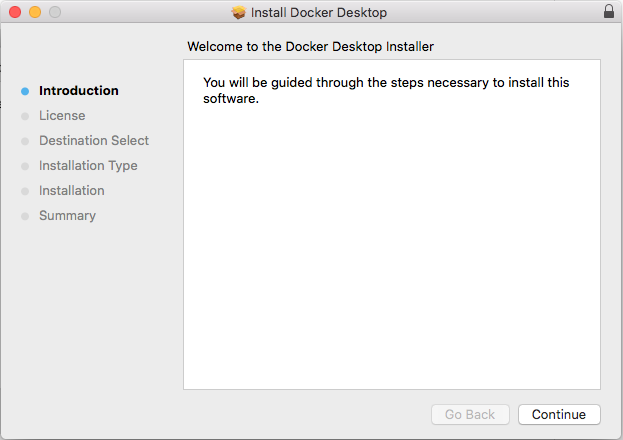
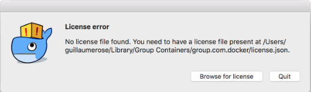
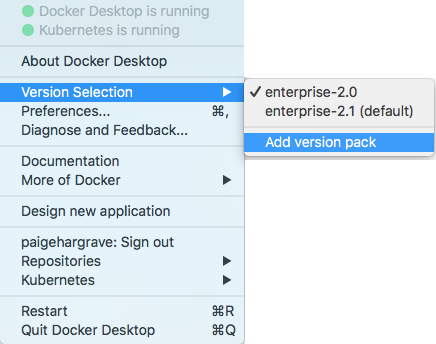

Install Docker Desktop Enterprise
---------------------------------

## System Requirements 

### Windows:

-   Windows 10 Pro or Enterprise version 15063.

-   Hyper-V and Containers Windows features must be enabled.

-   The following hardware prerequisites are required to successfully run Client
Hyper-V on Windows 10:

    -   64 bit processor with [Second Level Address
    Translation (SLAT)](http://en.wikipedia.org/wiki/Second_Level_Address_Translation){: target="_blank" class="_"}

    -   4GB system RAM

    -   BIOS-level hardware virtualization support must be enabled in the
    BIOS settings:

### Mac:

-   Mac hardware must be a 2010 or newer model, with Intel’s hardware support for memory management unit (MMU) virtualization, including Extended Page Tables (EPT) and Unrestricted Mode. You can check to see if your machine has this support by running the following command in a terminal: `sysctl kern.hv_support`

-   MacOS 10.12 and newer macOS releases are supported. We recommend upgrading to the latest version of macOS.

-   At least 4GB of RAM

-   VirtualBox prior to version 4.3.30 must NOT be installed (it is incompatible with Docker for Mac). If you have a newer version of VirtualBox installed, it’s fine.

> **Warning:** If you are using the community version of Docker Desktop, you must uninstall Docker Desktop community in order to install Docker Desktop Enterprise.

## Installation

Download Docker Desktop Enterprise:
-    [**Windows**](https://download-stage.docker.com/win/enterprise/30183/DockerDesktop.msi)

-    [**Mac**](https://download-stage.docker.com/mac/enterprise/30173/Docker.pkg)

What the install includes: Docker Engine, Docker CLI client, and Docker Compose. To install, double-click the .msi or .pkg file and follow the instructions.

For administrators, the following command line options support fine tuning and mass installation:

`\$ sudo installer -pkg Docker.pkg -target /`

Once installed, run Docker Desktop Enterprise from your Application
folder.

Administrators can configure additional settings by modifying the administrator configuration file
as described in the Administrator configuration file section.

### License file

You must have a Docker Desktop Enterprise license file installed in the following location:

`/Library/Application Support/Docker/DockerDesktop/license.json`

If the license file is missing, the following error is displayed when you try to run Docker Desktop Enterprise:

 ### Firewall exceptions

Docker Desktop Enterprise requires the following firewall exceptions. If you do not have firewall access, or are unsure about how to set firewall exceptions, contact your system administrator.

-  The process `com.docker.vpnkit` proxies all outgoing container TCP and
    UDP traffic. This includes Docker image downloading but not DNS
    resolution, which is performed over a Unix domain socket connected
    to the `mDNSResponder` system service.

-  The process `com.docker.vpnkit` binds external ports on behalf of
    containers. For example, `docker run -p 80:80 nginx` binds port 80 on all
    interfaces.

-  If using Kubernetes, the API server is exposed with TLS on
    `127.0.0.1:6443` by `com.docker.vpnkit`.

### Version packs
Docker Desktop Enterprise is bundled with Docker Enterprise 2.0 (Docker
Engine 17.06.2 / Kubernetes 1.8.11). The following version packs can be
downloaded and installed if you want to use a different version of the Docker Engine
and Kubernetes for development work:

-   [Docker Community (18.09.0/Kubernetes
    1.10.3)](https://github.com/docker/pinata/releases/download/2.0.0.0-ent-mac79-enterprise/community.ddvp)

-   [Docker Enterprise 2.1 (18.09.0/Kubernetes
    1.11.2)](https://github.com/docker/pinata/releases/download/2.0.0.0-ent-mac79-enterprise/enterprise-2.1.ddvp)

Version packs are installed manually or, for administrators, by using the version pack status and upgrade tool. Once installed, version packs can be selected for use in the Docker Desktop Enterprise menu.

#### Version pack tool (administrators only)

The administrator version pack tool is a command line executable that provides status and version pack installation and upgrades. 

When you install Docker Desktop Enterprise, the tool is installed in the following location:

-   Windows:

`\[ApplicationPath\]/dockerdesktop-admin.exe`

-   Mac:

`\[ApplicationPath\]/Contents/Resources/bin/desktop-admin`

To run tool commands, you must have elevated access privileges: sudo on macOS,
administrator on Windows.

-   **version-pack install**
Installs or upgrades a version pack to the version contained in the specified `.*ddvp*` archive.

   -   Windows:

`*desktop-admin -InstallVersionPack=\[path-to-archive\]*`

   -   Mac:

`desktop-admin version-pack install \[path-to-archive\]`

-   **version-pack uninstall**
Uninstalls the specified version pack.

   -   Windows:

`*desktop-admin -UninstallVersionPack=\[version-pack-name\]*`

   -   Mac:

`desktop-admin version-pack uninstall \[version-pack-name\]`

#### Manual version pack installation and selection
---------------------------------------------------
Version packs can be installed by double-clicking a .ddvp file
(with Docker Desktop running).

Installed version packs are listed in **Version Selection** and are selected using the **Add version pack** menu entry.

If more than one verson pack is installed, you can select the corresponding entry to work with a different version pack.
After you select a different version pack, Docker Desktop Enterprise restarts and the selected Docker Engine and
Kubernetes versions are used.

## Where to go next

* [Getting started with Docker Desktop Enterprise](../desktop-windows/getting-started/README.md) on Windows

* [Getting started with Docker Desktop Enterprise](../desktop-mac/getting-started/README.md) on Mac
