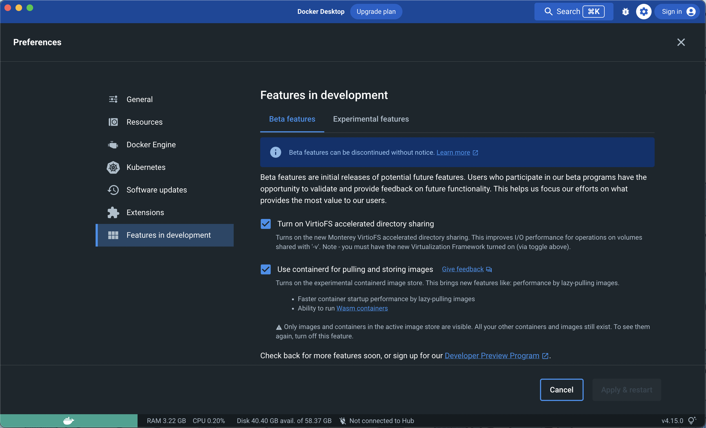

This page provides information about the ongoing integration of `containerd` for
image and file system management in the Docker Engine.

> **Beta**
>
> The containerd image store feature is currently in
> [Beta](../../release-lifecycle.md/#beta). We recommend that you do not use
> this feature in production environments as this feature may change or be
> removed from future releases.

## Enabling the containerd image store feature

The containerd image store beta feature is off by default.

To start using the feature:

1. Navigate to **Settings**.
2. Select the **Experimental** features tab.
3. Next to **Use containerd for pulling and storing images**, select the
   checkbox.

To turn off this feature, clear the **Use containerd for pulling and storing
images** checkbox.

{:width="750px"}

## Simple usage examples

### Show server and storage driver version

```console
$ docker info
Client:
 Context:    default
 Debug Mode: false
 Plugins:
  buildx: Docker Buildx (Docker Inc., v0.9.1)
  compose: Docker Compose (Docker Inc., v2.10.2)
  extension: Manages Docker extensions (Docker Inc., v0.2.9)
  sbom: View the packaged-based Software Bill Of Materials (SBOM) for an image (Anchore Inc., 0.6.0)
  scan: Docker Scan (Docker Inc., v0.19.0)

Server:
 Containers: 0
  Running: 0
  Paused: 0
  Stopped: 0
 Images: 0
 Server Version: 22.06.0-beta.0-372-gd3bb8227ce.m
 Storage Driver: stargz
  driver-type: io.containerd.snapshotter.v1
 Logging Driver: json-file
 Cgroup Driver: cgroupfs
 Cgroup Version: 2
 Plugins:
  Volume: local
  Network: bridge host ipvlan macvlan null overlay
  Log: awslogs fluentd gcplogs gelf journald json-file local logentries splunk syslog
 Swarm: inactive
 Runtimes: runc io.containerd.runc.v2
 Default Runtime: runc
 Init Binary: docker-init
 containerd version: 9cd3357b7fd7218e4aec3eae239db1f68a5a6ec6
 runc version: v1.1.4-0-g5fd4c4d
 init version: de40ad0
 Security Options:
  seccomp
   Profile: builtin
  cgroupns
 Kernel Version: 5.10.124-linuxkit
 Operating System: Docker Desktop
 OSType: linux
 Architecture: aarch64
 CPUs: 5
 Total Memory: 7.653GiB
 Name: docker-desktop
 ID: f4d28427-96df-404c-b47b-647fe5138e2a
 Docker Root Dir: /var/lib/docker
 Debug Mode: false
 HTTP Proxy: http.docker.internal:3128
 HTTPS Proxy: http.docker.internal:3128
 No Proxy: hubproxy.docker.internal
 Registry: https://index.docker.io/v1/
 Labels:
 Experimental: false
 Insecure Registries:
  hubproxy.docker.internal:5000
  127.0.0.0/8
 Live Restore Enabled: false

```

### Run a simple container

```console
$ docker run --rm hello-world
Unable to find image 'hello-world:latest' locally
7d246653d051: Download complete
432f982638b3: Download complete
46331d942d63: Download complete
7050e35b49f5: Downloading [>                                                  ]       0B/3.208kB

Hello from Docker!
This message shows that your installation appears to be working correctly.
...

```

## Run the container

Run the container specifying port settings:

```console
$ docker run -p 8080:80 -d nginx

Unable to find image 'nginx:latest' locally
b95a99feebf7: Download complete
91d5b6827ff7: Download complete
fc5ec3f147e4: Download complete
5b1423465504: Download complete
1cdde8b981f2: Download complete
6c0b05f215c0: Download complete
004f1937a10a: Download complete
fd61d71c75fe: Download complete
717bf61a04cf: Download complete
8b6a7e0df8edbe91dfa77716a5e84ca28348f44f545a0d34c70a8987c56e63e0

```

Confirm the Nginx container is running:

```console
$ docker ps
CONTAINER ID   IMAGE     COMMAND                  CREATED         STATUS         PORTS                  NAMES
93b4d60dfd08   nginx     "/docker-entrypoint.…"   3 seconds ago   Up 3 seconds   0.0.0.0:8080->80/tcp   stoic_mccarthy
```

You can also check from the browser that Nginx is running:

{:width="750px"}

## Building multi-platform images

Sample Dockerfile:

```dockerfile
# syntax=docker/dockerfile:1
FROM alpine

ENTRYPOINT ["echo", "hello friends"]
```

Build a multi-platform image:

```console
$ docker buildx build --platform linux/amd64,linux/arm64 -t <username>/hello-friends .
[+] Building 0.7s (7/7)
FINISHED

 => [internal] load .dockerignore                                                                                                                           0.0s
 => => transferring context: 2B                                                                                                                             0.0s
 => [internal] load build definition from Dockerfile                                                                                                        0.0s
 => => transferring dockerfile: 88B                                                                                                                         0.0s
 => [linux/arm64 internal] load metadata for docker.io/library/alpine:latest                                                                                0.6s
 => [linux/amd64 internal] load metadata for docker.io/library/alpine:latest                                                                                0.6s
 => [linux/amd64 1/1] FROM docker.io/library/alpine@sha256:bc41182d7ef5ffc53a40b044e725193bc10142a1243f395ee852a8d9730fc2ad                                 0.0s
 => => resolve docker.io/library/alpine@sha256:bc41182d7ef5ffc53a40b044e725193bc10142a1243f395ee852a8d9730fc2ad                                             0.0s
 => CACHED [linux/arm64 1/1] FROM docker.io/library/alpine@sha256:bc41182d7ef5ffc53a40b044e725193bc10142a1243f395ee852a8d9730fc2ad                          0.0s
 => => resolve docker.io/library/alpine@sha256:bc41182d7ef5ffc53a40b044e725193bc10142a1243f395ee852a8d9730fc2ad                                             0.0s
 => exporting to image                                                                                                                                      0.0s
 => => exporting layers                                                                                                                                     0.0s
 => => exporting manifest sha256:71bf02afcd7a791c268aa935027f1dc05238f5b5017d755d0fd6d9c71c1b79b9                                                           0.0s
 => => exporting config sha256:f1edbf6b99d22831f9312ab2b8b7642a904c614000bb8369ed673848f4f03578                                                             0.0s
 => => exporting manifest sha256:e41da7320a956163128d77ad69c8109af4799b41bd2e8e660bc6f01136b67f45                                                           0.0s
 => => exporting config sha256:4a5580ab8335432cf6cea7ff695f177d120fa2c9aa4002525025888e3cae16ee                                                             0.0s
 => => exporting manifest list sha256:339d089b539c950268de1edeef9652584e16efa51ea2c84ee586d3143b97234d                                                      0.0s
 => => naming to docker.io/<username>/hello-friends:latest                                                                                              0.0s
 => => unpacking to docker.io/<username>/hello-friends:latest

```

Run multi-platform image:

```console
$ docker run <username>/hello-friends

```

Push a multi-platform image:

```console
$ docker push <username>/hello-friends
Using default tag: latest
f1edbf6b99d2: Pushed
213ec9aee27d: Pushed
71bf02afcd7a: Pushed
e41da7320a95: Pushed
339d089b539c: Pushed
4a5580ab8335: Pushed
9b18e9b68314: Pushed

```

View Tags on DockerHub to see multi-platform result:

{:width="750px"}

## Known issues

### Docker Desktop 4.13.0 release

- Listing images with `docker images` returns the error
  `content digest not found` on ARM machines after running or pulling an image
  with the `--platform` parameter.

### Docker Desktop 4.12.0 release

- The containerd image store feature requires Buildx version 0.9.0 or newer.

  - On Docker Desktop for Linux (DD4L), validate if your locally installed
    version meets this requirement.

    > **Note**
    >
    > If you're using an older version, the Docker daemon reports the following
    > error:
    > `Multiple platforms feature is currently not supported for docker driver. Please switch to a different driver`.
    >
    > Install a newer version of Buildx following the instructions on
    > [how to manually download Buildx](../../build/install-buildx/#download-manually).

- In Docker Desktop 4.12.0, the containerd image store feature is incompatible
  with the Kubernetes cluster support. Turn off the containerd image store
  feature if you are using the Kubernetes from Docker Desktop.
- Local registry mirror configuration isn't implemented yet with the containerd
  image store. The `registry-mirrors` and `insecure-registries` aren't taken
  into account by the Docker daemon.
- The `reference` filter isn't implemented yet and will return the error
  `invalid filter 'reference'` when listing images.
- Pulling an image may fail with the error
  `pull access denied, repository does not exist or may require authorization: server message: insufficient_scope: authorization failed`,
  in the situation where the image does not contain a manifest list. To
  workaround this issue run the `docker login` command and pull the image again.

## Feedback

Thanks for trying the new features available with `containerd`. Give feedback or
report any bugs you may find through the issues tracker on the
[feedback form](https://dockr.ly/3PODIhD){: target="_blank" rel="noopener"
class="_"}.
