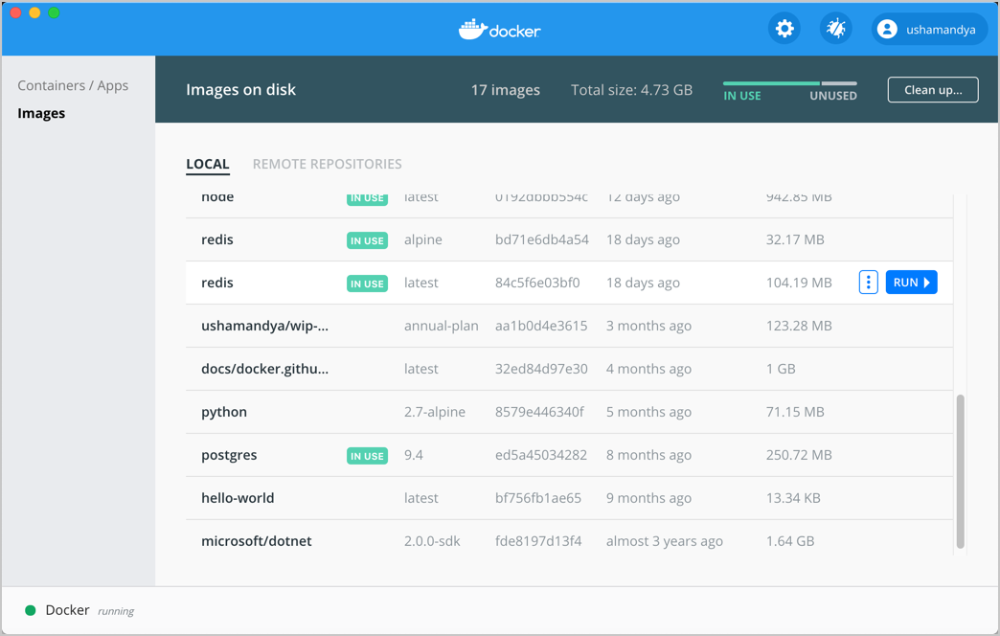
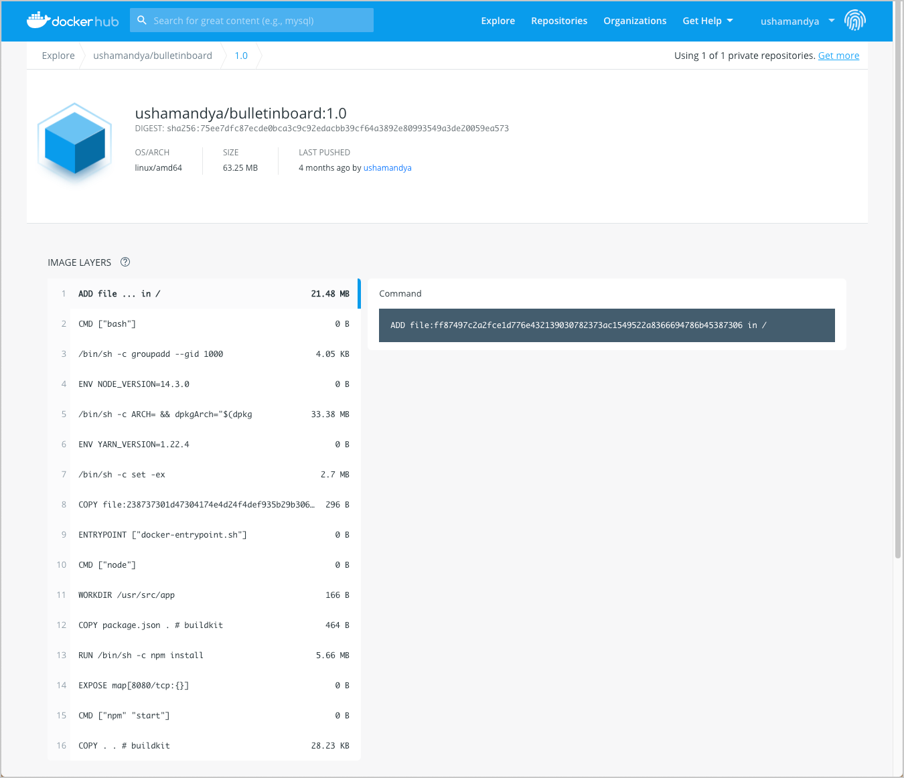
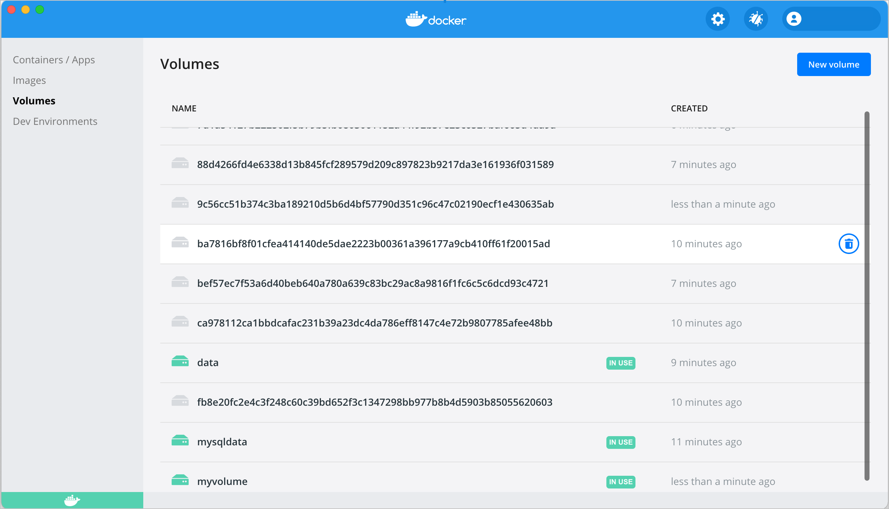

The Docker Dashboard provides a simple interface that enables you to manage your containers, applications, and images directly from your machine without having to use the CLI to perform core actions.

The **Containers/Apps** view provides a runtime view of all your containers and applications. It allows you to interact with containers and applications, and manage the lifecycle of your applications directly from your machine. This view also provides an intuitive interface to perform common actions to inspect, interact with, and manage your Docker objects including containers and Docker Compose-based applications. For more information, see [Explore running containers and applications](#explore-running-containers-and-applications).

The **Images** view displays a list of your Docker images, and allows you to run an image as a container, pull the latest version of an image from Docker Hub, and inspect images. It also displays a summary of the vulnerability scanning report using Snyk. In addition, the Images view contains clean up options to remove unwanted images from the disk to reclaim space. If you are logged in, you can also see the images you and your organization have shared on Docker Hub. For more information, see [Explore your images](#explore-your-images)

The **Volumes** view displays a list of volumes and allows you to easily create and delete volumes and see which ones are being used. For more information, see [Explore volumes](#explore-volumes).

In addition, the Docker Dashboard allows you to:

- Easily navigate to the **Preferences** (**Settings** in Windows) menu to configure Docker Desktop preferences
- Access the **Troubleshoot** menu to debug and perform restart operations
- Sign into [Docker Hub](https://hub.docker.com/) using your Docker ID

To access the Docker Dashboard, from the Docker menu, select **Dashboard**. On Windows, click the Docker icon to open the Dashboard.

## Explore running containers and applications

From the Docker menu, select **Dashboard**. This lists all your running containers and applications. You must have running or stopped containers and applications to see them listed on the Docker Dashboard.


The following sections guide you through the process of creating a sample Redis container and a sample application to demonstrate the core functionalities in Docker Dashboard.

### Start a Redis container

To start a Redis container, open your preferred CLI and run the following command:

`docker run -dt redis`

This creates a new Redis container. From the Docker menu, select **Dashboard** to see the new Redis container.

### Start a sample application

Let's start a sample application. Download the [Example voting app](https://github.com/dockersamples/example-voting-app) from the Docker samples page. The example voting app is a distributed application that runs across multiple Docker containers. The app contains:

- A front-end web app in [Python](https://github.com/dockersamples/example-voting-app/blob/master/vote) or [ASP.NET Core](https://github.com/dockersamples/example-voting-app/blob/master/vote/dotnet) which lets you vote between two options
- A [Redis](https://hub.docker.com/_/redis/) or [NATS](https://hub.docker.com/_/nats/) queue which collects new votes
- A [.NET Core](https://github.com/dockersamples/example-voting-app/blob/master/worker/src/Worker), [Java](https://github.com/dockersamples/example-voting-app/blob/master/worker/src/main) or [.NET Core 2.1](https://github.com/dockersamples/example-voting-app/blob/master/worker/dotnet) worker which consumes votes and stores them
- A [Postgres](https://hub.docker.com/_/postgres/) or [TiDB](https://hub.docker.com/r/dockersamples/tidb/tags/) database backed by a Docker volume
- A [Node.js](https://github.com/dockersamples/example-voting-app/blob/master/result) or [ASP.NET Core SignalR](https://github.com/dockersamples/example-voting-app/blob/master/result/dotnet) web app which shows the results of the voting in real time

To start the application, navigate to the directory containing the example voting application in the CLI and run `docker-compose up --build`.

```console
$ docker-compose up --build
Creating network "example-voting-app-master_front-tier" with the default driver
Creating network "example-voting-app-master_back-tier" with the default driver
Creating volume "example-voting-app-master_db-data" with default driver
Building vote
Step 1/7 : FROM python:2.7-alpine
2.7-alpine: Pulling from library/python
Digest: sha256:d2cc8451e799d4a75819661329ea6e0d3e13b3dadd56420e25fcb8601ff6ba49
Status: Downloaded newer image for python:2.7-alpine
 ---> 1bf48bb21060
Step 2/7 : WORKDIR /app

...
Successfully built 69da1319c6ce
Successfully tagged example-voting-app-master_worker:latest
Creating example-voting-app-master_vote_1   ... done
Creating example-voting-app-master_result_1 ... done
Creating db                                 ... done
Creating redis                              ... done
Creating example-voting-app-master_worker_1 ... done
Attaching to db, redis, example-voting-app-master_result_1, example-voting-app-master_vote_1, example-voting-app-master_worker_1
...
```

When the application starts successfully, from the Docker menu, select **Dashboard** to see the Example voting application. Expand the application to see the containers running inside the application.

{:width="700px"}

Now that you can see the list of running containers and applications on the Dashboard, let us explore some of the actions you can perform:

- Click **Port** to open the port exposed by the container in a browser.
- Click **CLI** to open a terminal and run commands on the container. If you have installed iTerm2 on your Mac, the CLI option opens an iTerm2 terminal. Otherwise, it opens the Terminal app on Mac, or a Command Prompt on Windows.
- Click **Stop**, **Start**, **Restart**, or **Delete** to perform lifecycle operations on the container.

Use the **Search** option to search for a specific object. You can also sort your containers and applications using various options. Click the **Sort by** drop-down to see a list of available options.

### Interact with containers and applications

From the Docker Dashboard, select the example voting application we started earlier.

The **Containers/Apps** view lists all the containers running on the application and contains a detailed logs view. It also allows you to start, stop, or delete the application. Use the **Search** option at the bottom of the logs view to search application logs for specific events, or select the **Copy** icon to copy the logs to your clipboard.

Click **Open in Visual Studio Code** to open the application in VS Code. Hover over the list of containers to see some of the core actions you can perform.

{:width="700px"}

### Container view

Click on a specific container for detailed information about the container. The **container view** displays **Logs**, **Inspect**, and **Stats** tabs and provides quick action buttons to perform various actions.

- Select **Logs** to see logs from the container. You can also search the logs for specific events and copy the logs to your clipboard.

- Select **Inspect** to view low-level information about the container. You can see the local path, version number of the image, SHA-256, port mapping, and other details.

- Select **Stats** to view information about the container resource utilization. You can see the amount of CPU, disk I/O, memory, and network I/O used by the container.

You can also use the quick action buttons on the top bar to perform common actions such as opening a CLI to run commands in a container, and perform lifecycle operations such as stop, start, restart, or delete your container.

## Explore your images

The **Images**  view is a simple interface that lets you manage Docker images without having to use the CLI. By default, it displays a list of all Docker images on your local disk. To view images in remote repositories, click **Sign in** and connect to Docker Hub. This allows you to collaborate with your team and manage your images directly through Docker Desktop.

The Images view allows you to perform core operations such as running an image as a container, pulling the latest version of an image from Docker Hub, pushing the image to Docker Hub, and inspecting images.

In addition, the Images view displays metadata about the image such as the tag, image ID, date when the image was created, and the size of the image. It also displays **In Use** tags next to images used by running and stopped containers. This allows you to review the list of images and use the **Clean up images** option to remove any unwanted images from the disk to reclaim space.

The Images view also allows you to search images on your local disk and sort them using various options.

Let's explore the various options in the **Images** view.

If you don’t have any images on your disk, run the command `docker pull redis` in a terminal to pull the latest Redis image. This command pulls the latest Redis image from Docker Hub.

Select **Dashboard** > **Images** to see the Redis image.

{:width="700px"}

### Run an image as a container

Now that you have a Redis image on your disk, let’s run this image as a container:

1. From the Docker menu, select **Dashboard** > **Images**. This displays a list of images on your local disk.
2. Select the Redis image from the list and click **Run**.
3. When prompted, click the **Optional settings** drop-down to specify a name, port, volumes, and click **Run**.

    To use the defaults, click **Run** without specifying any optional settings. This creates a new container from the Redis image and opens it on the **Container/Apps** view.

### Pull the latest image from Docker Hub

To pull the latest image from Docker Hub:

1. From the Docker menu, select **Dashboard** > **Images**. This displays a list of images on your local disk.
2. Select the image from the list and click the more options button.
3. Click **Pull**. This pulls the latest version of the image from Docker Hub.

> **Note**
>
> The repository must exist on Docker Hub in order to pull the latest version of an image. You must be logged in to pull private images.

### Push an image to Docker Hub

To push an image to Docker Hub:

1. From the Docker menu, select **Dashboard** > **Images**. This displays a list of images on your local disk.
2. Select the image from the list and click the more options button.
3. Click **Push to Hub.**

> **Note**
>
> You can only push an image to Docker Hub if the image belongs to your Docker ID or your organization. That is, the image must contain the correct username/organization in its tag to be able to push it to Docker Hub.

### Inspect an image

Inspecting an image displays detailed information about the image such as the image history, image ID, the date the image was created, size of the image, etc. To inspect an image:

1. From the Docker menu, select **Dashboard** > **Images**. This displays a list of images on your local disk.
2. Select the image from the list and click the more options button.
3. Click **Inspect**.
4. The image inspect view also provides options to pull the latest image, push image to Hub, remove the image, or run the image as a container.

### Remove an image

The **Images** view allows you to remove unwanted images from the disk. The Images on disk status bar displays the number of images and the total disk space used by the images.

You can remove individual images or use the **Clean up** option to delete unused and dangling images.

To remove individual images:

1. From the Docker menu, select **Dashboard** > **Images**. This displays a list of images on your local disk.
2. Select the image from the list and click the more options button.
3. Click **Remove**. This removes the image from your disk.

> **Note**
>
> To remove an image used by a running or a stopped container, you must first remove the associated container.

**To remove unused and dangling images:**

An **unused** image is an image which is not used by any running or stopped containers. An image becomes **dangling** when you build a new version of the image with the same tag.

**To remove an unused or a dangling image:**

1. From the Docker menu, select **Dashboard** > **Images**. This displays a list of images on your disk.
2. Select the **Clean up** option from the **Images on disk** status bar.
3. Use the **Unused** and **Dangling** check boxes to select the type of images you would like to remove.

    The **Clean up** images status bar displays the total space you can reclaim by removing the selected images.
4. Click **Remove** to confirm.

### Interact with remote repositories

The Images view also allows you to manage and interact with images in remote repositories and lets you switch between organizations. Select an organization from the drop-down to view a list of repositories in your organization.

> **Note**
>
> If you have a paid Docker subscription and enabled [Vulnerability Scanning](../docker-hub/vulnerability-scanning.md) in Docker Hub, the scan results will appear on the Remote repositories tab.

The **Pull** option allows you to pull the latest version of the image from Docker Hub. The **View in Hub** option opens the Docker Hub page and displays detailed information about the image, such as the OS architecture, size of the image, the date when the image was pushed, and a list of the image layers.

{:width="700px"}

To interact with remote repositories:

1. Click the **Remote repositories** tab.
2. Select an organization from the drop-down list. This displays a list of repositories in your organization.
3. Click on an image from the list and then select **Pull** to pull the latest image from the remote repository.
4. To view a detailed information about the image in Docker Hub, select the image and then click **View in Hub**.

    The **View in Hub** option opens the Docker Hub page and displays detailed information about the image, such as the OS architecture, size of the image, the date when the image was pushed, and a list of the image layers.

    If you have a paid Docker subscription and have enabled [Vulnerability Scanning](../docker-hub/vulnerability-scanning.md) the Docker Hub page also displays a summary of the vulnerability scan report and provides detailed information about the vulnerabilities identified.

## Explore volumes

You can use [volumes](../storage/volumes.md) to store files and share them among containers. Volumes are created and are directly managed by Docker. They are also the preferred mechanism to persist data in Docker containers and services.

> **Volume Management is now available for all subscriptions**
>
> Starting with Docker Desktop 4.1.0 release, Volume management is available for users on any subscription, including Docker Personal. Update Docker Desktop to 4.1.0 to start managing your volumes for free.
{: .important}

The **Volumes** view in Docker Dashboard enables you to easily create and delete volumes and see which ones are being used. You can also see which container is using a specific volume and explore the files and folders in your volumes.

### Manage volumes

By default, the **Volumes** view displays a list of all the volumes. Volumes that are currently used by a container display the **In Use** badge.

{:width="700px"}

Use the **Search** field to search for any specific volumes. You can also sort volumes by the name, the date created, and the size of the volume.

To explore the details of a specific volume, select a volume from the list. This opens the detailed view.

The **In Use** tab displays the name of the container using the volume, the image name, the port number used by the container, and the target. A target is a path inside a container that gives access to the files in the volume.

The **Data** tab displays the files and folders in the volume and their file size. To save a file or a folder, hover over the file or folder and click on the more options menu. Select **Save As** and then specify a location to download the file.

To delete a file or a folder from the volume, select **Remove** from the more options menu.

### Remove a volume

Removing a volume deletes the volume and all its data. To remove a volume, hover over the volume and then click the **Delete** button. Alternatively, select the volume from the list and then click the **Delete** button.
