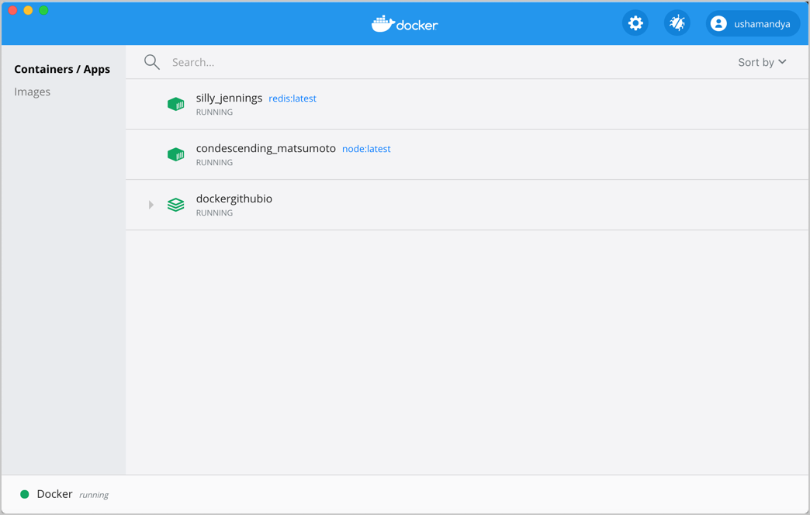
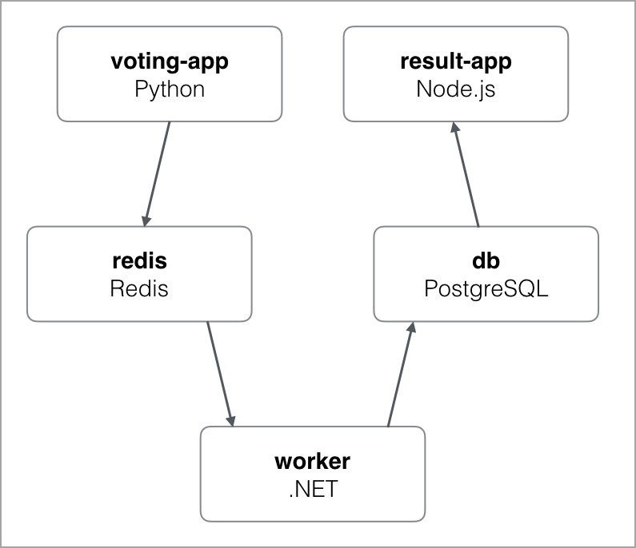
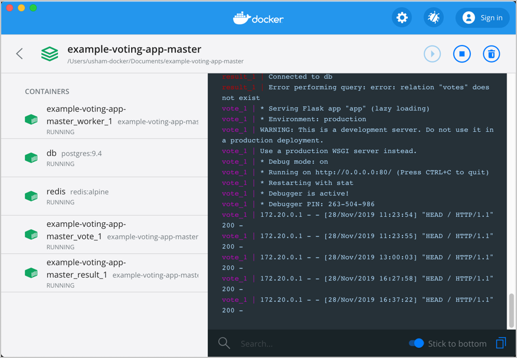
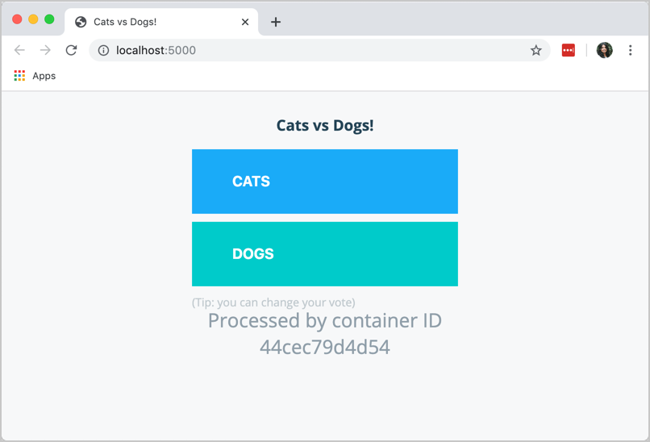

The Docker Desktop Dashboard provides a simple interface that enables you to interact with containers and applications, and manage the lifecycle of your applications directly from your machine. The Dashboard UI shows all running, stopped, and started containers with their status. It provides an intuitive interface to perform common actions to inspect, interact with, and manage your Docker objects including containers and Docker Compose-based applications.

The Docker Desktop Dashboard offers the following benefits:

- A GUI to abstract core information from the CLI
- Access to container logs directly in the UI to search and explore container behavior
- Access to combined Compose logs from the UI to understand Compose applications
- Quick visibility into ports being used by containers
- Monitor container resource utilization

In addition, the Dashboard UI allows you to:

- Navigate to the **Preferences** (**Settings** in Windows) menu to configure Docker Desktop preferences
- Access the **Troubleshoot** menu to debug and perform restart operations
- Sign into [Docker Hub](https://hub.docker.com/) using your Docker ID

To access the Docker Desktop Dashboard, from the Docker menu, select **Dashboard**. The Dashboard provides a runtime view of all your containers and applications.



## Explore running containers and applications

From the Docker menu, select **Dashboard**. This lists all your running containers and applications. Note that you must have running containers and applications to see them listed on the Docker Desktop Dashboard.

The following sections guide you through the process of creating a sample Redis container and a sample application to demonstrate the core functionalities in Docker Desktop Dashboard.

### Start a Redis container

To start a Redis container, open your preferred CLI and run the following command:

`docker run -dt redis`

This creates a new Redis container. From the Docker menu, select **Dashboard** to see the new Redis container.

{:width="700px"}

### Start a sample application

Now, let us start a sample application. You can download the [Example voting app](https://github.com/dockersamples/example-voting-app) from the Docker samples page. The example voting app is a distributed application that runs across multiple Docker containers.

{:width="600px"}

The example voting app contains:

- A front-end web app in [Python](https://github.com/dockersamples/example-voting-app/blob/master/vote) or [ASP.NET Core](https://github.com/dockersamples/example-voting-app/blob/master/vote/dotnet) which lets you vote between two options
- A [Redis](https://hub.docker.com/_/redis/) or [NATS](https://hub.docker.com/_/nats/) queue which collects new votes
- A [.NET Core](https://github.com/dockersamples/example-voting-app/blob/master/worker/src/Worker), [Java](https://github.com/dockersamples/example-voting-app/blob/master/worker/src/main) or [.NET Core 2.1](https://github.com/dockersamples/example-voting-app/blob/master/worker/dotnet) worker which consumes votes and stores them
- A [Postgres](https://hub.docker.com/_/postgres/) or [TiDB](https://hub.docker.com/r/dockersamples/tidb/tags/) database backed by a Docker volume
- A [Node.js](https://github.com/dockersamples/example-voting-app/blob/master/result) or [ASP.NET Core SignalR](https://github.com/dockersamples/example-voting-app/blob/master/result/dotnet) web app which shows the results of the voting in real time

To start the application, navigate to the directory containing the example voting application in the CLI and run `docker-compose up --build`.

```
$ docker-compose up --build
Creating network "example-voting-app-master_front-tier" with the default driver
Creating network "example-voting-app-master_back-tier" with the default driver
Creating volume "example-voting-app-master_db-data" with default driver
Building vote
Step 1/7 : FROM python:2.7-alpine
2.7-alpine: Pulling from library/python
Digest: sha256:d2cc8451e799d4a75819661329ea6e0d3e13b3dadd56420e25fcb8601ff6ba49
Status: Downloaded newer image for python:2.7-alpine
 ---> 1bf48bb21060
Step 2/7 : WORKDIR /app
 ---> Running in 7a6a0c9d8b61
Removing intermediate container 7a6a0c9d8b61
 ---> b1242f3c6d0c
Step 3/7 : ADD requirements.txt /app/requirements.txt
 ---> 0f5d69b65243
Step 4/7 : RUN pip install -r requirements.txt
 ---> Running in 92788dc9d682

...
Successfully built 69da1319c6ce
Successfully tagged example-voting-app-master_worker:latest
Creating example-voting-app-master_vote_1   ... done
Creating example-voting-app-master_result_1 ... done
Creating db                                 ... done
Creating redis                              ... done
Creating example-voting-app-master_worker_1 ... done
Attaching to db, redis, example-voting-app-master_result_1, example-voting-app-master_vote_1, example-voting-app-master_worker_1
...
```

When the application successfully starts, from the Docker menu, select **Dashboard** to see the Example voting application. Expand the application to see the containers running inside the application.

{:width="700px"}

Now that you can see the list of running containers and applications on the Dashboard, let us explore some of the actions you can perform:

- Click **Port** to open the port exposed by the container in a browser.
- Click **CLI** to open a terminal and run commands on the container.
- Click **Stop**, **Start**, **Restart**, or **Delete** to perform lifecycle operations on the container.

Use the **Search** option to search for a specific object. You can also sort your containers and applications using various options. Click the **Sort by** drop-down to see a list of available options.

## Interact with containers and applications

From the Docker Desktop Dashboard, select the example voting application we started earlier.

The **application view** lists all the containers running on the application and contains a detailed logs view. It also allows you to start, stop, or delete the application.

Hover over the containers to see some of the core actions you can perform. Use the **Search** option at the bottom to search the application logs for specific events, or select the **Copy** icon to copy the logs to your clipboard.

{:width="700px"}

Click on a specific container for detailed information about the container. The **container view** displays **Logs**, **Inspect**, and **Stats** tabs and provides quick action buttons to perform various actions.

{:width="700px"}

- Select **Logs** to see logs from the container. You can also search the logs for specific events and copy the logs to your clipboard.

- Select **Inspect** to view low-level information about the container. You can see the local path, version number of the image, SHA-256, port mapping, and other details.

- Select **Stats** to view information about the container resource utilization. You can see the amount of CPU, disk I/O, memory, and network I/O used by the container.

You can also use the quick action buttons on the top bar to perform common actions such as opening a CLI to run commands in a container, and perform lifecycle operations such as stop, start, restart, or delete your container.

Click **Port** to open the port exposed by the container in a browser.

{:width="700px"}

## Feedback

We would like to hear from you about the new Dashboard UI. Let us know your feedback by creating an issue in the [docker/for-mac](https://github.com/docker/for-mac/issues) or [docker/for-win](https://github.com/docker/for-win/issues) GitHub repository.
