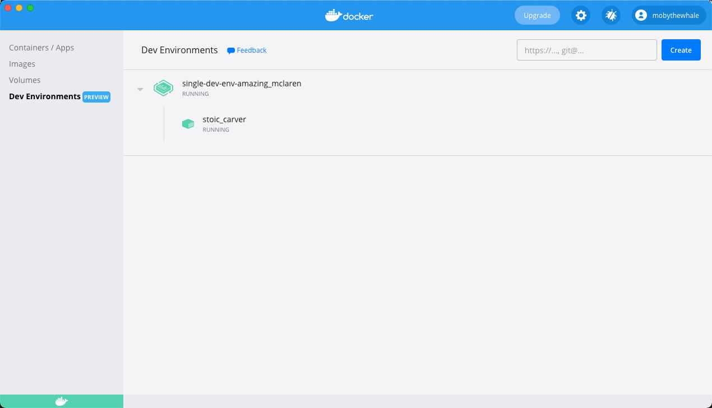
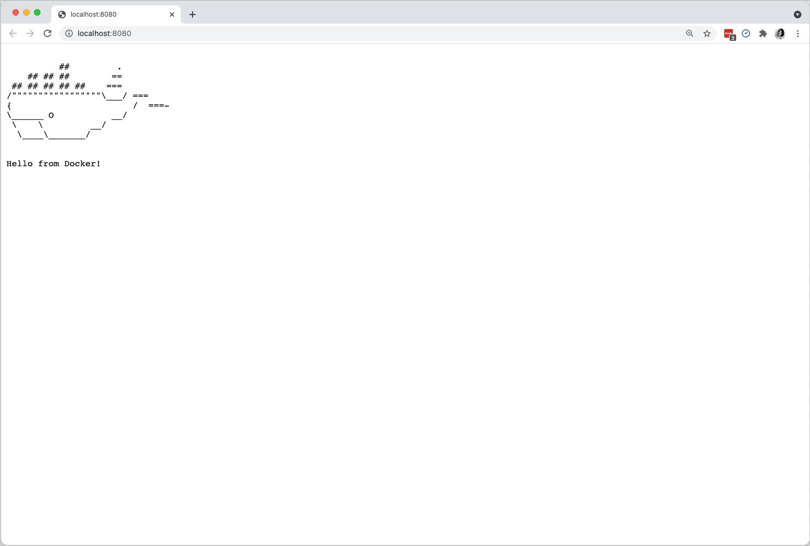

## Start a single container Dev Environment

The simplest way to get started with Dev Environments is to create a new environment by cloning the Git repository of the project you are working on. For example, let us create a new Dev Environment using a simple `single-dev-env` project from the [Docker Samples](https://github.com/dockersamples/single-dev-env){:target="_blank" rel="noopener" class="_"} GitHub repository.

> **Note**
>
> When cloning a Git repository using SSH, ensure you've added your SSH key to the ssh-agent. To do this, open a terminal and run `ssh-add <path to your private ssh key>`.

> **Note**
>
> If you have enabled the WSL 2 integration in Docker Desktop for Windows, make sure you have an SSH agent running in your WSL 2 distribution.

    

    How to start an SSH agent in WSL2
    <i class="chevron fa fa-fw"></i>

    

    If your WSL 2 distribution doesn't have an `ssh-agent` running, you can append this script at the end of your profile file (that is: ~/.profile, ~/.zshrc, ...).
<pre><code>
SSH_ENV="$HOME/.ssh/agent-environment"
function start_agent {
    echo "Initialising new SSH agent..."
    /usr/bin/ssh-agent | sed 's/^echo/#echo/' > "${SSH_ENV}"
    echo succeeded
    chmod 600 "${SSH_ENV}"
    . "${SSH_ENV}" > /dev/null
}
# Source SSH settings, if applicable
if [ -f "${SSH_ENV}" ]; then
    . "${SSH_ENV}" > /dev/null
    ps -ef | grep ${SSH_AGENT_PID} | grep ssh-agent$ > /dev/null || {
        start_agent;
    }
else
    start_agent;
fi
</code></pre>
    

1. Under Dev Environments, click **Create**. This opens the **Create a Dev Environment** dialog. Click **Get Started** and then copy `https://github.com/dockersamples/single-dev-env.git` and add it to the **Enter the Git Repository** field on the **Existing Git repo** source.
2. Now, click **Continue**.

    This clones the Git code inside a volume, determines the best image for your Dev Environment, and finally, opens VS Code inside the Dev Environment container.

{:width="700px"}

In the above example, the names `wizardly_ellis` and `relaxed_maclaren` are randomly generated. You'll most likely see different names when you create your Dev Environment.

Hover over the container and click **Open in VS Code** to start working in VS Code as usual. You can also open a terminal in VS Code, and use Git to push or pull code to your repository, or switch between branches and work as you would normally.

You can launch the application by running the command `make run` in your VS Code terminal. This opens an http server on port 8080. Open [http://localhost:8080](http://localhost:8080) in your browser to see the running application.

{:width="700px"}

### Create a Dev Environment from a specific branch or tag

You can create a dev environment from a specific branch (for example, a branch corresponding to a Pull Request) or a tag by adding `@mybranch` or `@tag` as a suffix to your Git URL:

 `https://github.com/dockersamples/single-dev-env@mybranch`

 or

 `git@github.com:dockersamples/single-dev-env.git@mybranch`

Docker then clones the repository with your specified branch or tag.

### Recap

Let's summarize the tasks we performed so far to start a single container Dev Environment.

1. First, we cloned a Git repository in a container using Git credentials. Note that this did not conflict with any of the local files on your host.
2. The Go tools required for our sample project was set up automatically for us. Also, this did not cause any friction with our local tooling setup.
3. Finally, we were able to run the application server inside a container using the VS Code terminal and access it automatically from the host.

## Start a Dev Environment from a local folder

You can also start a Dev Environment from local code on your machine.

1. Click **Create** to open the **Create a Dev Environment** dialog. Select the **Local Folder** tab, and click **Select directory** to open the root of the code that you would like to work on.
2. Now, click **Create**.

    This creates a Dev Environment using your local folder, and bind-mounts your local code in the Dev Environment. Finally, it opens VS Code inside the Dev Environment container.

> **Note**
>
> When using a local folder for a Dev Environment, file changes are synchronized between your Dev Environment container and your local files. This can affect the performance inside the container, depending on the number of files in your local folder and the operations performed in the container.
