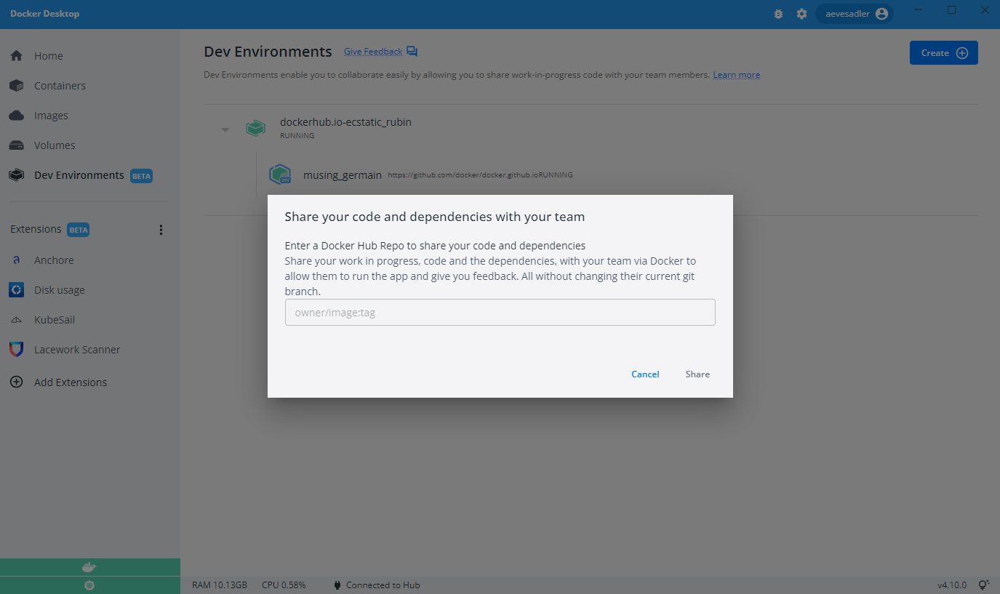

Need to emphasise - Kevin can use anything he wants in the dev environment (link to the Awesome compose samples he can test) and then be pointed to Compose/yaml help to answer the ‘ok, what next?’

"Don't interrupt your team. Test out upgrades in a safe sandbox. Atomically roll it out to everyone when you're ready.”
Distribute to your teams

Every project has it’s own list of required tools, dependencies to build an application and waste time spending days trying to set it up and following out of date readme files and this is amplified if you have to do this over multiple different prjects that have different settings and envrionemnt configurations

Step 1. Get set up with Dev Env tab, gather your team requirements

step 2. Dive into Compose

You can either start your compose off from scratch or use an Awesome Compose sample as a starting point  then add additional requirements 

links to relevant compose files 

step 3. test in a sandbox 

step 4. distribute to your team 

#How do I make one?
There are various ways to craft your Landofile but we've found and observed a strategy to be generally a good approach as follows:

Shop around for a recipe that can serve as a good starting point. lando init is helpful for this.
Add in additional services when you need more JUICE.
Define more complex tooling and events to simplify difficult command patterns and automate common tasks.
Add in some build steps to further automate setting your services up or to mix in additional project dependencies.
Define custom services as a catch all for anything else you need.
Create custom recipes or services to lock down your new power tools.
Rinse and repeat

# Share a dev environment 

Make it more explicit about what is exaclty being shared - dev env shares a snapshot of what you’re working on. Not working on somethingat the same time



Sharing a Dev Environment lets your team members access the code, any dependencies, and the current Git branch you are working on. They can also review your changes and provide feedback before you create a pull request.

## Share your Dev Environment

When you are ready to share your environment, hover over your Dev Environment, select the **Share** icon, and specify the Docker Hub namespace where you’d like to push your Dev Environment to.

This creates an image of your Dev Environment, uploads it to the Docker Hub namespace you have specified, and provides a tiny URL to share with your team members.

{:width="700px"}

## Open a Dev Environment that has been shared with you

To open a Dev Environment that has been shared with you, select the **Create** button in the top right-hand corner, select the **Existing Dev Environment** tab, and then paste the URL.

Using this shared Dev Environment, your team members can access the code, any dependencies, and the current Git branch you are working on. They can also review your changes and provide feedback even before you create a pull request!
