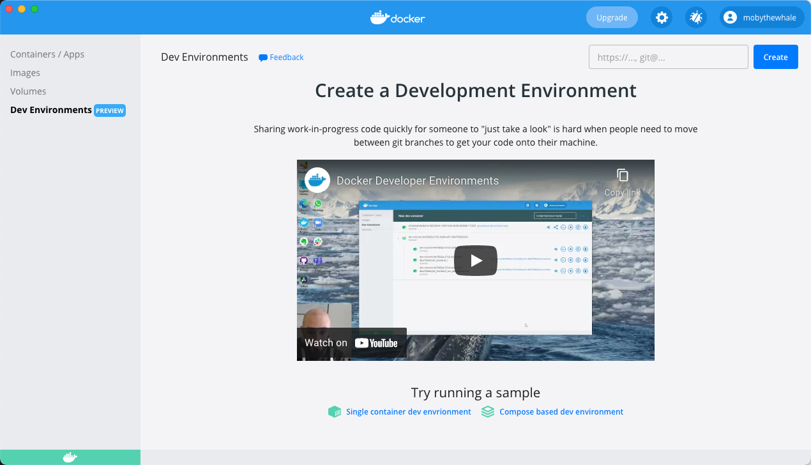

Dev Environments enable you to collaborate easily by allowing you to share work-in-progress code with your team members. When using Dev Environments, you can easily set up repeatable development environments, keeping the environment details versioned along with your code. You can also share your work-in-progress code with your team members in just one click and without having to deal with any merge conflicts while moving between Git branches to get your code on to their machine.

Dev Environments also allow you to switch between your developer environments or your team members' environments, move between branches to look at changes that are in progress, without moving off your current Git branch.

> **Beta**
>
> The Dev Environments feature is currently in Beta. We recommend that you do not use this in production environments.

To access Dev Environments, from the Docker menu, select **Dashboard** > **Dev Environments**.

{:width="700px"}

## Prerequisites

Dev Environments are available as part of Docker Desktop 3.5.0 release. Download and install **Docker Desktop 3.5.0** or higher:

- [Docker Desktop](../release-notes.md)

To get started with Dev Environments, you must have the following tools and extension installed on your machine:

- [Git](https://git-scm.com){:target="_blank" rel="noopener" class="_"}
- [Visual Studio Code](https://code.visualstudio.com/){:target="_blank" rel="noopener" class="_"}
- [Visual Studio Code Remote Containers Extension](https://marketplace.visualstudio.com/items?itemName=ms-vscode-remote.remote-containers){:target="_blank" rel="noopener" class="_"}

Click **Install** to download and install any missing tools.

### Add Git to your PATH on Windows

If you have already installed Git, and it's not detected properly, run the following command to check whether you can use Git with the CLI or PowerShell:

`$ git --version`

If it doesn't detect Git as a valid command, you must reinstall Git and ensure you choose the option  **Git from the command line...** or the **Use Git and optional Unix tools...**  on the **Adjusting your PATH environment**  step.

{:width="300px"}

> **Note**
>
> After you have installed Git, you must quit and then start Docker Desktop. From the Docker menu, select **Quit Docker Desktop**, and then start it again.

## Known issues

The following section lists known issues and workarounds in the Dev Environments Preview:

1. It is currently not possible to share Compose-based applications using Dev Environments because registries do not support Compose applications. Refer to the [Feedback](#feedback) section to let us know your requirements for sharing Compose-based applications.
2. When sharing a Dev Environment between Mac and Windows, the VS Code terminal may not function correctly in some cases. To work around this issue, use the Exec in CLI option in the Docker Dashboard.
3. When sharing a Dev Environment between ARM64 and AMD64 machines, the environment will be emulated.
