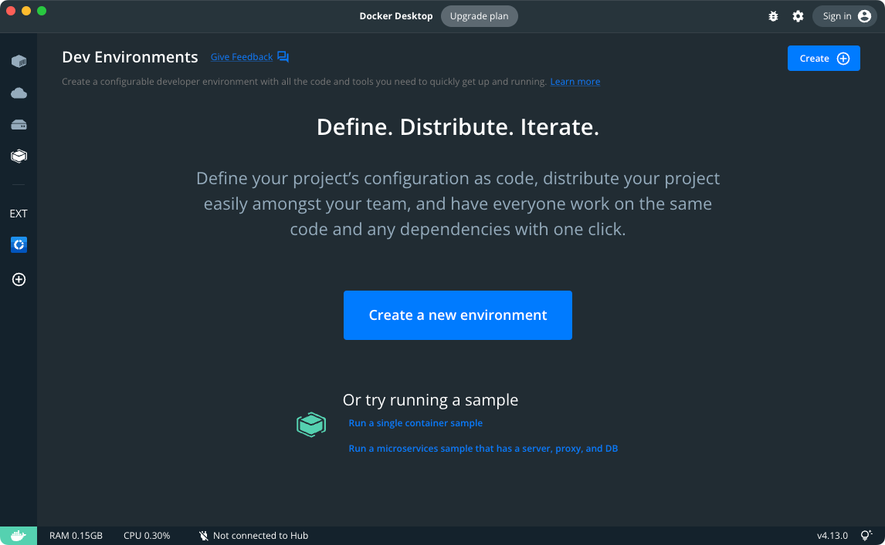

Dev Environments boosts collaboration by allowing you to share work-in-progress code with your team members. This removes any potential merge conflicts while moving between Git branches to get your code on to their machine.

Dev Environments uses tools built into code editors that allows Docker to access code mounted into a container rather than on your local host. This isolates the tools, files and running services on your machine allowing multiple versions of them to exist side by side.

You can also switch between your developer environments or your team members' environments, move between branches to look at changes that are in progress, without moving off your current Git branch. This makes reviewing PRs as simple as opening a new environment.

> **Beta**
>
> The Dev Environments feature is currently in [Beta](../../release-lifecycle.md#beta). We recommend that you do not use this in production environments.

{:width="700px"}

## Prerequisites

Dev Environments is available as part of Docker Desktop 3.5.0 release. Download and install **Docker Desktop 3.5.0** or higher:

- [Docker Desktop](../release-notes.md)

To get started with Dev Environments, you must also install the following tools and extension on your machine:

- [Git](https://git-scm.com){:target="_blank" rel="noopener" class="_"}
- [Visual Studio Code](https://code.visualstudio.com/){:target="_blank" rel="noopener" class="_"}
- [Visual Studio Code Remote Containers Extension](https://marketplace.visualstudio.com/items?itemName=ms-vscode-remote.remote-containers){:target="_blank" rel="noopener" class="_"}

### Add Git to your PATH on Windows

If you have already installed Git, and it's not detected properly, run the following command to check whether you can use Git with the CLI or PowerShell:

`$ git --version`

If it doesn't detect Git as a valid command, you must reinstall Git and ensure you choose the option  **Git from the command line...** or the **Use Git and optional Unix tools...**  on the **Adjusting your PATH environment**  step.

{:width="300px"}

> **Note**
>
> After Git is installed, restart Docker Desktop. Select **Quit Docker Desktop**, and then start it again.

## Known issues

The following section lists known issues and workarounds:

1. When sharing a Dev Environment between Mac and Windows, the VS Code terminal may not function correctly in some cases. To work around this issue, use the Exec in CLI option in the Docker Dashboard.
2. When sharing a Dev Environment between ARM64 and AMD64 machines, the environment is emulated.

## What's next?

Learn how to:
- [Create a Dev Environment](create-dev-env.md)
- [Create a Compose Dev Environment](create-compose-dev-env.md)
- [Share your Dev Environment](share.md)
