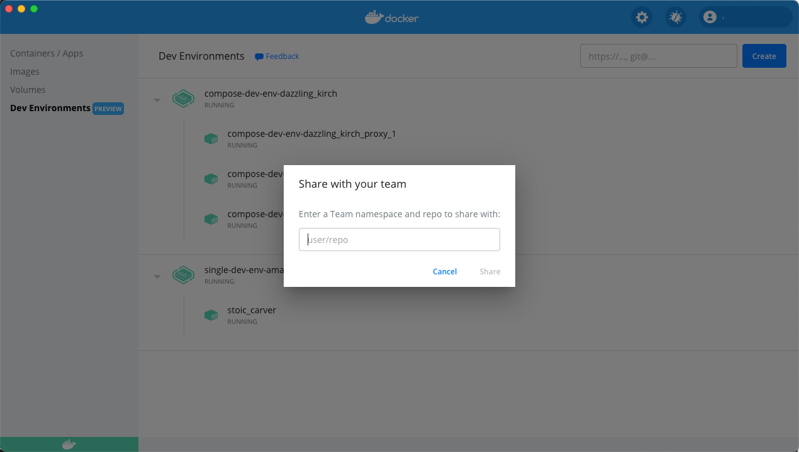
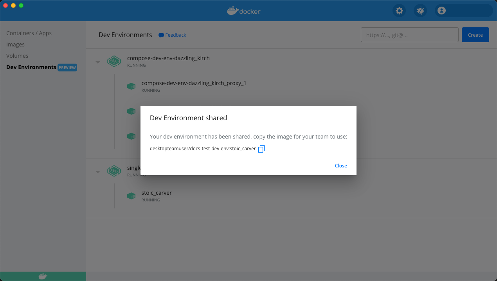

## Share your Dev Environment



When you are ready to share your environment, just click the **Share** button and specify the Docker Hub namespace where you’d like to push your Dev Environment to.

{:width="700px"}

This creates a Docker image of your dev environment, uploads it to the Docker Hub namespace you have specified in the previous step, and provides a tiny URL which you can use to share your work with your team members.

{:width="700px"}

Your team members need to open the **Create** dialog, select the **Existing Dev Environment** tab, and then paste the URL. Your Dev Environment now starts in the exact same state as you shared it.

Using this shared Dev Environment, your team members can access the code, any dependencies, and the current Git branch you are working on. They can also review your changes and provide feedback even before you create a pull request!
