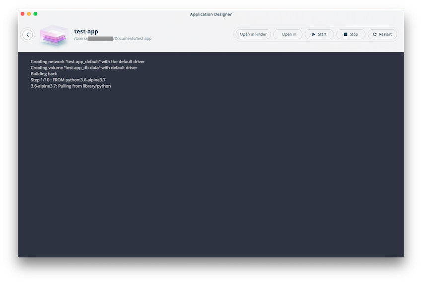

## Overview

The Application Designer helps Docker developers quickly create new
Docker apps using a library of templates. To start the Application
Designer, select the **Design new application** menu entry.

The list of available templates is provided:

After selecting a template, you can then customize your application, For
example, if you select **Flask / NGINX / MySQL**, you can then

- select a different version of python or mysql; and

- choose different external ports:

You can then name your application and customize the disk location:

When you select **Assemble**, your application is created.

Once assembled, the following screen allows you to run the application. Select **Run application** to pull the images and start the containers:

Use the corresponding buttons to start and stop your application. Select **Open in Finder** on Mac or **Open in Explorer** on Windows to
view application files on disk. Select **Open in Visual Studio Code** to open files with an editor. Note that debug logs from the application are displayed in the lower part of the Application Designer
window.
