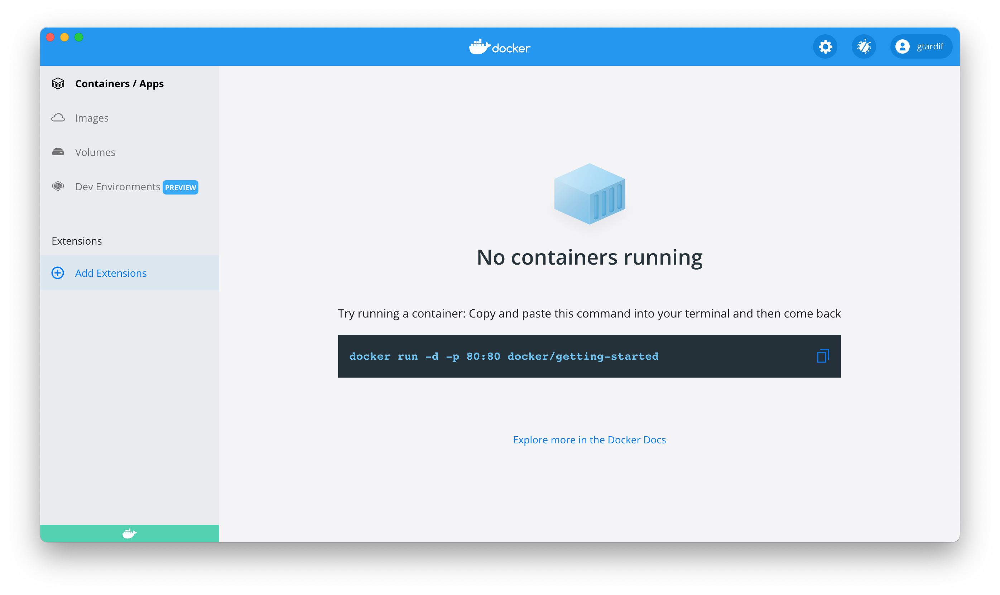

To start creating your extension, you first need a directory with files which range from the extension’s source code to the required extension-specific files.

## Prerequisites

Before you create your own extension, you need to install [Docker Desktop](../../release-notes.md).

You also need the latest [Extensions CLI](https://github.com/docker/extensions-sdk/releases/latest), which is used to manage extensions later on.

> Using the CLI to install unpublished extensions
>
> Extensions can install binaries, invoke commands and access files on your machine. Make sure you trust extensions before installing them on your machine.
> {: .warning}

Once you've downloaded the Extensions CLI, extract the binary in to `~/.docker/cli-plugins`.

In your terminal, run:

<ul class="nav nav-tabs">
  <li class="active"><a data-toggle="tab" data-target="#prereq-macos-intel">MacOS (intel)</a></li>
  <li><a data-toggle="tab" data-target="#prereq-macos-m1">MacOS (M1)</a></li>
  <li><a data-toggle="tab" data-target="#prereq-windows">Windows</a></li>
  <li><a data-toggle="tab" data-target="#prereq-wsl2">WSL2</a></li>
  <li><a data-toggle="tab" data-target="#prereq-linux">Linux</a></li>
</ul>
<div class="tab-content">
  <div id="prereq-macos-intel" class="tab-pane fade in active" markdown="1">

```console
$ tar -xvzf desktop-extension-cli-darwin-amd64.tar.gz
$ mkdir -p ~/.docker/cli-plugins
$ mv docker-extension ~/.docker/cli-plugins
```

  <hr></div>
  <div id="prereq-macos-m1" class="tab-pane fade" markdown="1">

```console
$ tar -xvzf desktop-extension-cli-darwin-arm64.tar.gz
$ mkdir -p ~/.docker/cli-plugins
$ mv docker-extension ~/.docker/cli-plugins
```

  <hr></div>
  <div id="prereq-windows" class="tab-pane fade" markdown="1">

```console
PS> tar -xvzf desktop-extension-cli-windows-amd64.tar.gz
PS> mkdir -p ~/.docker/cli-plugins
PS> mv docker-extension.exe ~/.docker/cli-plugins
```

  <hr></div>
  <div id="prereq-wsl2" class="tab-pane fade" markdown="1">

```console
$ tar -xvzf desktop-extension-cli-linux-amd64.tar.gz
$ mkdir -p ~/.docker/cli-plugins
$ mv docker-extension ~/.docker/cli-plugins
```

  <hr></div>
  <div id="prereq-linux" class="tab-pane fade" markdown="1">

```console
$ tar -xvzf desktop-extension-cli-linux-amd64.tar.gz
$ mkdir -p ~/.docker/cli-plugins
$ mv docker-extension ~/.docker/cli-plugins
```

  <hr></div>
</div>

You can now list installed extensions (the list should be empty if you have not installed extensions already):

```console
$ docker extension ls
ID                  PROVIDER            VERSION             UI                  VM                  HOST
```



You can now continue to step two and set up your directory. 

## What’s next?

Explore how to set up:
- [A frontend extension based on plain HTML](set-up/minimal-frontend-extension.md)
- [A simple Docker extension that contains only a UI part and is based on ReactJS](set-up/react-extension.md)
- [An extension that invokes Docker CLI commands](set-up/minimal-frontend-using-docker-cli.md)
- [A simple backend extension](set-up/minimal-backend-extension.md)
