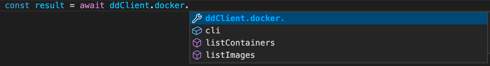

To start creating your extension, you first need a directory with files which range from the extension’s source code to the required extension-specific files. This page provides information on how to set up a simple Docker extension that invokes Docker CLI commands.

>Note
>
>Before you start, make sure you have installed the latest version of [Docker Desktop](../../release-notes.md).

## Extension folder structure

In the `minimal-docker-cli` [sample folder](https://github.com/docker/extensions-sdk/tree/main/samples), you can find a ready-to-go example that represents a UI Extension invoking Docker commands. We will go through this code example in this tutorial.

Although you can start from an empty directory, it is highly recommended that you start from the template below and change it accordingly to suit your needs.

```bash
.
├── Dockerfile # (1)
├── metadata.json # (2)
└── client # (3)
│   └── src
│       ├── App.tsx
│       └── ... React aplication
```

1. Contains everything required to build the extension and run it in Docker Desktop.
2. A file that provides information about the extension such as the name, description, and version.
3. The source folder that contains all your HTML, CSS and JS files. In this example we use a React frontend, the main part of th extension is an App.tsx. For more information and guidelines on building the UI, see the [Design and UI styling section](../../design/design-guidelines.md).

If you want to set up user authentication for the extension, see [Authentication](../../dev/oauth2-flow.md).

## Invoke docker CLI in your javascript code

Using the [React extension example](./react-extension.md), we can invoke docker commands from the App.tsx file.

Use the Docker Desktop Client object to discover extension APIs about `docker`. The application uses `@docker/extension-api-client` in order to obtain a Docker Desktop Client object. Because we have set `@docker/extension-api-client-types` as a dev dependency, we also have auto-completion in our IDE:



We can invoke a Docker command with `ddClient.docker.cli.exec()`.
For example, to run `docker info` and obtain json formatted results:

`ddClient.docker.cli.exec("info", ["--format", '"{{ json . }}"'])`.

We can use `result.parseJsonObject()` to read results as a json object and use it in our application.

```typescript
const ddClient = createDockerDesktopClient();
const [dockerInfo, setDockerInfo] = useState<any>(null);

async function runDockerInfo() {
  const result = await ddClient.docker.cli.exec("info", [
    "--format",
    '"{{json .}}"',
  ]);
  setDockerInfo(result.parseJsonObject());
}
```

We can then use our `dockerInfo` object in the display part of the application.

## Create a Dockerfile

At minimum, your Dockerfile needs:

- Labels which provide extra information about the extension.
- The source code which in this case is an `index.html` that sits within the `ui` folder. `index.html` refers to javascript code in `script.js`.
- The `metadata.json` file.

```Dockerfile
FROM node:17.7-alpine3.14 AS client-builder
# ... build React application

FROM scratch

LABEL org.opencontainers.image.title="MyExtension" \
    org.opencontainers.image.description="A sample extension to show how easy it's to get started with Desktop Extensions." \
    org.opencontainers.image.vendor="Docker Inc." \
    com.docker.desktop.extension.api.version="1.0.0-beta.1" \
    com.docker.desktop.extension.icon="https://www.docker.com/wp-content/uploads/2022/03/Moby-logo.png"

COPY ui ./ui
COPY metadata.json .
```

## Configure the metadata file

A `metadata.json` file is required at the root of the image filesystem.

```json
{
  "ui": {
    "dashboard-tab": {
      "title": "Docker VM info",
      "root": "/ui",
      "src": "index.html"
    }
  }
}
```

For more information on the `metadata.json`, see [Metadata](../../extensions/METADATA.md).

## What's next?

Learn how to [build and install your extension](../build-install.md).
