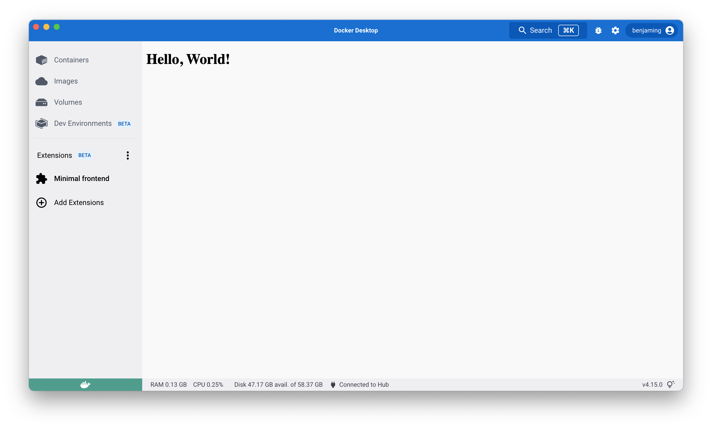

Once your extension has been [built and installed](build-install.md), you can preview your extension in Docker Desktop. 

## Preview the extension

To preview the extension in Docker Desktop, close and open Docker Dashboard once the installation is complete.

The left-hand menu displays a new tab with the name of your extension. 
The example below shows the [`Min FrontEnd Extension`](set-up/minimal-frontend-extension.md). 



### Open Chome DevTools

In order to open the Chrome DevTools for your extension when you click on the extension tab, run:

`$ docker extension dev debug <name-of-your-extensions>`

Each subsequent click on the extension tab will also open Chrome Dev Tools. To stop this behaviour, run:

`$ docker extension dev reset <name-of-your-extensions>`

After an extension is deployed, it is also possible to open Chrome DevTools from the UI extension part using a variation of the [Konami Code](https://en.wikipedia.org/wiki/Konami_Code). Click on the extension tab, and then hit the key sequence `up, up, down, down, left, right, left, right, p, d, t`.

### Hot reloading whilst developing the UI

During UI development, it’s helpful to use hot reloading to test your changes without rebuilding your entire extension. To do this, you can configure Docker Desktop to load your UI from a development server, such as the one Create React App starts when invoked with yarn start.

Assuming your app runs on the default port, start your UI app and then run:

```
cd ui
npm start
```

This starts a development server that listens on port 3000.

You can now tell Docker Desktop to use this as the frontend source. In another terminal run:

`$ docker extension dev ui-source <name-of-your-extensions> http://localhost:3000`

Close and reopen the Docker Desktop dashboard and go to your extension. All the changes to the frontend code are immediately visible.

Once finished, you can reset the extension configuration to the original settings. This will also reset opening Chrome dev tools if you used `docker extension dev debug <name-of-your-extensions>`:

`$ docker extension dev reset <name-of-your-extensions>`

## Show the extension containers

If your extension is composed of one or more services running as containers in the Docker Desktop VM, you can access them easily from the dashboard in Docker Desktop.

1. In Docker Desktop, navigate to **Settings** or **Preferences** if you’re a Mac user.
2. Under the **Extensions** tab, select the **Show Docker Desktop Extensions system containers** option. You can now view your extension containers and their logs.


## Update the extension

To update the extension, you must first [rebuild and reinstall](build-install.md) your extension. You can then use the update command.

`docker extension update <name-of-your-extensions>`

## What's next?

- Explore our [design principles](../design/design-principles.md).
- Take a look at our [UI styling guidelines](../design/overview.md).
- Set up [authentication for your extension](../dev/oauth2-flow.md)
- Learn how to [publish your extension](../extensions/index.md).
