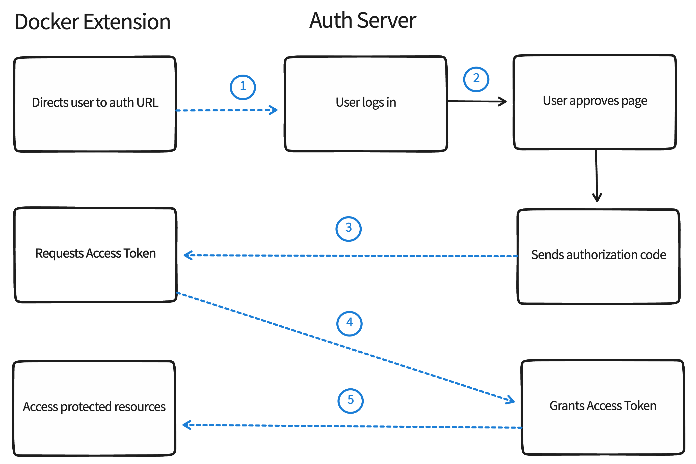

You may need users to authenticate from your Docker Extension using OAuth 2.0 via the web browser, and return them back into the Docker Extension.

> ** Note **
>
> This page assumes that you already have an identity provider (IdP) which handles the authentication process and returns an access token, like Google, Azure AD or Okta, among many others.

## Introduction

In OAuth 2.0, the term "grant type" refers to the way an application gets an access token. Although OAuth 2.0 defines several grant types, this page will only describe how to authorize users from your Docker Extension using the Authorization Code grant type.

## Authorization Code Grant Flow

The Authorization Code grant type is used by confidential and public clients to exchange an authorization code for an access token.

After the user returns to the client via the redirect URL, the application will get the authorization code from the URL and use it to request an access token.

{: style=width:80% }

- The Docker Extension makes a request for the user to authorize access to their data.
- If the user grants access, the Docker Extension then requests an access token from the service provider, passing the access grant from the user and - authentication details to identify the client.
- The service provider validates these details and returns an access token.
- The Docker Extension uses the access token to request the user data with the service provider.

## OAuth 2.0 terminology

- **Auth URL** - The endpoint for the API provider authorization server, to retrieve the auth code.
- **Redirect URI** - The client application callback URL to redirect to after auth. This must be registered with the API provider.

Once the user enters the username and password, he would have been successfully authenticated.

## Open a browser page to authenticate the user

From the extension UI, you can provide a button that, on click, it opens a browser window to authenticate the user.

Use the [ddClient.host.openExternal](https://docs.docker.com/desktop/extensions-sdk/dev/api/dashboard/#open-a-url) API to open a browser to the **auth URL**, for instance:

```typescript
window.ddClient.openExternal("https://authorization-server.com/authorize?
  response_type=code
  &client_id=T70hJ3ls5VTYG8ylX3CZsfIu
  &redirect_uri=${REDIRECT_URI}
  &scope=photo+offline_access
  &state=kH_0FdAtjCfYjOkF);
```

## Get the authorization code and access token

### From the extension UI

> **Passing the access token**
>
> At the moment of this writing, passing the authorization code as a query parameter to the `docker-desktop://dashboard/open` URL is not supported.
> {: .warning}

You will not be able to get the authorization code from the extension UI by listing `docker-desktop://dashboard/open` as the `redirect_uri` in the OAuth app you're using and concatenating the authorization code as a query parameter.

See [from backend service](#from-a-backend-service) instead.

### From a backend service

You will need a backend service running as part of your extension that handles the OAuth 2.0 flow. For this, you must ensure the Redirect URI has been registered with the API provider to redirect to that location after OAuth had completed, e.g. `http://localhost:8080/callback`.

The default communication is socket-based, so the backend service will actually need to expose the port in order for the browser to connect to it.

#### Authorization

This is the step where the user enters its credentials in the browser. After the authorization is completed successfully, the user will be redirected back to your backend service, and you'll consume the authorization code that is part of the query parameters in the URL.

How you will consume the query parameters will depend on the technology that is used by the backend service.

#### Exchange the Authorization Code

Now you're ready to exchange the authorization code for an access token.

The backend service must build a `POST` request to the token endpoint with the following parameters, for instance:

```
POST https://authorization-server.com/token

grant_type=authorization_code
&client_id=T70hJ3ls5VTYG8ylX3CZsfIu
&client_secret=YABbyHQShPeO1T3NDQZP8q5m3Jpb_UPNmIzqhLDCScSnRyVG
&redirect_uri=${REDIRECT_URI}
&code=N949tDLuf9ai_DaOKyuFBXStCNMQzuQbtC1QbvLv-AXqPJ_f
```

> **Note**
>
> The client's credentials are included in the `POST` body in this example. Other authorization servers may require that the credentials are sent as a HTTP Basic Authentication header.

#### Token Endpoint Response

Finally, you can read the access token from the HTTP response and pass it to the extension UI by having the browser after OAuth be redirected to the backend service. The backend service, in turn, will have to explicitly redirect the browser to `docker-desktop://dashboard/open`.

## Store the access token

At the time of this writing, the Docker Extensions SDK does not provide a mechanism to safely store secrets.

Therefore, it is highly recommended to use an external source of storage to store the access token.

> ** Warning **
>
> Storing the access token in the client's localStorage would be a security risk as that storage is currently shared amongst all extensions.
> {: .warning}
