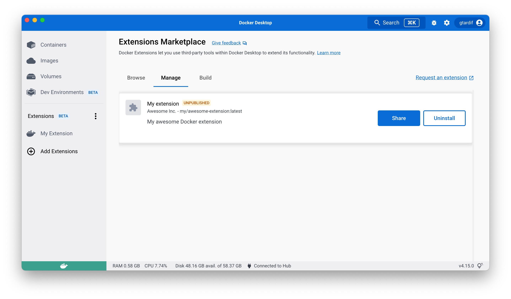
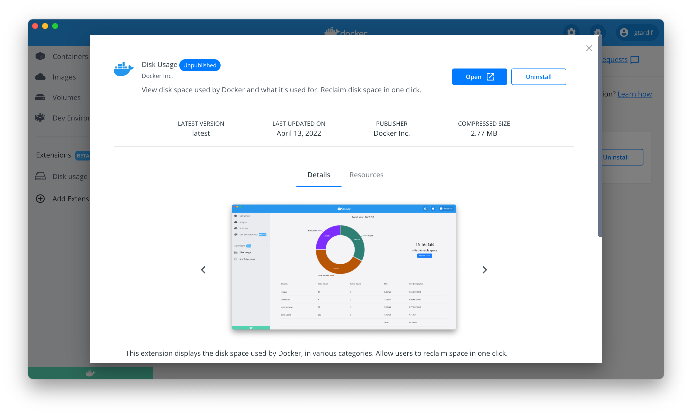

[Labels](../../../engine/reference/builder.md#label) are specified in the extension's `Dockerfile` and used to provide information about the extension.

| Label                                       | Required | Description                                                                                                                                                                                                                                                                                                                                                                                                                                                                      | Example                                                                                                                                                                                                                                            |
|---------------------------------------------|----------|----------------------------------------------------------------------------------------------------------------------------------------------------------------------------------------------------------------------------------------------------------------------------------------------------------------------------------------------------------------------------------------------------------------------------------------------------------------------------------|----------------------------------------------------------------------------------------------------------------------------------------------------------------------------------------------------------------------------------------------------|
| `org.opencontainers.image.title`            | Yes      | Human-readable title of the image (string). This appears in the UI for Docker Desktop.                                                                                                                                                                                                                                                                                                                                                                                           | my-extension                                                                                                                                                                                                                                       |
| `org.opencontainers.image.description`      | Yes      | Human-readable description of the software packaged in the image (string)                                                                                                                                                                                                                                                                                                                                                                                                        | This extension is cool.                                                                                                                                                                                                                            |
| `org.opencontainers.image.vendor`           | Yes      | Name of the distributing entity, organization, or individual.                                                                                                                                                                                                                                                                                                                                                                                                                    | Acme, Inc.                                                                                                                                                                                                                                         |
| `com.docker.desktop.extension.api.version`  | Yes      | Version of the Docker Extension manager that the extension is compatible with. It must follow [semantic versioning](https://semver.org/).                                                                                                                                                                                                                                                                                                                                        | A specific version like `0.1.0` or, a constraint expression: `>= 0.1.0`, `>= 1.4.7, < 2.0` . For your first extension, you can use `docker extension version` to know the SDK API version and specify `>= <SDK_API_VERSION>`.                      |
| `com.docker.desktop.extension.icon`         | Yes      | The extension icon (format: .svg .png .jpg)                                                                                                                                                                                                                                                                                                                                                                                                                                      | <a href="{{ site.docs_url }}/assets/images/engine.svg" target="__blank">{{ site.docs_url }}/assets/images/engine.svg<a>                                                                                                                            |
| `com.docker.extension.screenshots`          | Yes      | A JSON array of image URLs and an alternative text displayed to users (in the order they appear in your metadata) in your extension's details page. **Note:** The recommended size for sceenshots is 2400x1600 pixels.                                                                                                                                                                                                                                                           | `"[{"alt":"alternative text for image 1",` `"url":"https://foo.bar/image1.png"},` `{"alt":"alternative text for image2",` `"url":"https://foo.bar/image2.jpg"}]"`                                                                                  |
| `com.docker.extension.detailed-description` | Yes      | Additional information in plain text or HTML about the extension to be displayed in the details dialog.                                                                                                                                                                                                                                                                                                                                                                          | `My detailed description` or `<h1>My detailed description</h1>`                                                                                                                                                                                    |
| `com.docker.extension.publisher-url`        | Yes      | The publisher website URL to be displayed in the details dialog.                                                                                                                                                                                                                                                                                                                                                                                                                 | `https://foo.bar`                                                                                                                                                                                                                                  |
| `com.docker.extension.additional-urls`      | No       | A JSON array of titles and additional URLs displayed to users (in the order they appear in your metadata) in your extension's details page. We recommend you display the following links if they apply: documentation, support, terms of service, and privacy policy links.                                                                                                                                                                                                      | `[{"title":"Documentation","url":"https://foo.bar/docs"},` `{"title":"Support","url":"https://foo.bar/support"},` `{"title":"Terms of Service","url":"https://foo.bar/tos"},` `{"title":"Privacy policy","url":"https://foo.bar/privacy-policy"}]` |
| `com.docker.extension.changelog`            | Yes      | Changelog in plain text or HTML containing the change for the current version only.                                                                                                                                                                                                                                                                                                                                                                                              | `Extension changelog` or `
Extension changelog<ul>` `<li>New feature A</li>` `<li>Bug fix on feature B</li></ul>
`                                                                                                                            |
| `com.docker.extension.account-info`         | No       | Whether the user needs to sign up or log in to a SaaS platform to use some features of the extension.                                                                                                                                                                                                                                                                                                                                                                            | `required` in case it does, leave it empty otherwise.                                                                                                                                                                                              |
| `com.docker.extension.categories`           | No       | The list of Marketplace categories that your extension belongs to: `ci-cd`, `container-orchestration`, `cloud-deployment`, `cloud-development`, `database`, `kubernetes`, `networking`, `security`,`testing-tools`, `utility-tools`,`volumes`. If you don't specify this label, users won't be able to find your extension in the Extension Marketplace when filtering by a category. Extensions published to the Marketplace before the 22nd of September 2022 have been auto-categorized by Docker. | Specified as comma separated values in case of having multiple categories e.g: `kubernetes,security` or a single value e.g. `kubernetes`.                                                                                                          |

> Missing required labels
>
> If any of the previous _required_ labels are missing in the `Dockerfile`, Docker Desktop considers the extension invalid and does not list it in the Marketplace.

> HTML content styling
>
> Docker Desktop CSS styles will be applied to the provided HTML content. You can make sure that it renders nicely [within the marketplace](#preview-the-extension-in-the-marketplace). We recommend that you follow our [Styling guidelines](../design/overview.md).

## Preview the extension in the Marketplace

You can validate that the image labels render as you expect.

When you build and install your unpublished extension, you can preview the extension in the Marketplace "installed" tab. You can see how the extension labels are rendered in the list and in the details page of the extension.

> Preview extensions already listed in Marketplace
>
> When you install a local image of an extension already published in the Marketplace, for example with the tag `latest`, your local image is currently not detected as "unpublished".
>
> You can retag your image in order to have a different image name that is not listed as a published extension.
> Use `docker tag org/published-extension unpublished-extension` and then `docker extension install unpublished-extension`.

