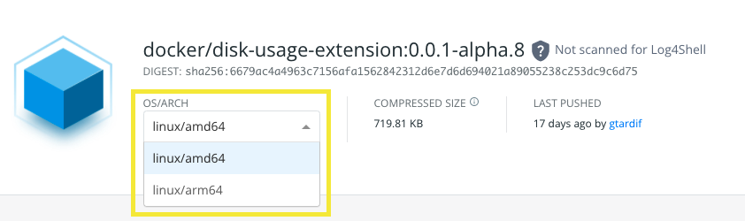

## Introduction

At a minimum, you must ensure your extension is supported for the following architectures:

- `linux/amd64`
- `linux/arm64`

Docker Desktop retrieves the extension image according to the user's system architecture. If the extension does not provide an image that matches the user's system architecture, Docker Desktop is not able to install the extension. As a result, users can't run the extension in Docker Desktop.

## Building and pushing for multiple architectures

If you created an extension from the `docker extension init` command, there's a `Makefile` at the root of the directory that includes a target with name `push-extension`.

You can do `make push-extension` to build your extension against both `linux/amd64` and `linux/arm64` platforms, and push them to DockerHub.

Alternatively, if you do not want to use the provided `Makefile`, you can use the command below to build your extension for multiple architectures:

```cli
docker buildx build \
    --push \
    --platform=linux/amd64,linux/arm64 \
    --tag=my-extension:0.0.1 .
```

The information above serves as a guide to help you get started. It's up to you to define the CI/CD process to build and push the extension.



## Adding multi-arch binaries

If your extension includes some binaries that deploy to the host, it's important that they also have the right architecture when building the extension against multiple architectures.

Currently, Docker does not provide a way to explicitly specify multiple binaries for every architecture in the `metadata.json` file. However, you can add architecture-specific binaries depending on the `TARGETARCH` in the extension's `Dockerfile`.

The example below shows an extension that uses a binary as part of its operations. The extension needs to run both in Docker Desktop for Mac and Windows.

In the `Dockerfile`, we download the binary depending on the target architecture:

```Dockerfile
#syntax=docker/dockerfile:1.3-labs

FROM alpine AS dl
WORKDIR /tmp
RUN apk add --no-cache curl tar
ARG TARGETARCH
RUN <<EOT ash
    mkdir -p /out/darwin
    curl -fSsLo /out/darwin/kubectl "https://dl.k8s.io/release/$(curl -Ls https://dl.k8s.io/release/stable.txt)/bin/darwin/${TARGETARCH}/kubectl"
    chmod a+x /out/darwin/kubectl
EOT
RUN <<EOT ash
    if [ "amd64" = "$TARGETARCH" ]; then
        mkdir -p /out/windows
        curl -fSsLo /out/windows/kubectl.exe "https://dl.k8s.io/release/$(curl -Ls https://dl.k8s.io/release/stable.txt)/bin/windows/amd64/kubectl.exe"
    fi
EOT

FROM alpine
LABEL org.opencontainers.image.title="example-extension" \
    org.opencontainers.image.description="My Example Extension" \
    org.opencontainers.image.vendor="Docker Inc." \
    com.docker.desktop.extension.api.version=">= 0.1.0"

COPY --from=dl /out /
```

In the `metadata.json` file, we specify the path for every binary on every platform:

```json
{
  "icon": "docker.svg",
  "ui": {
    "dashboard-tab": {
      "title": "Example Extension",
      "src": "index.html",
      "root": "ui"
    }
  },
  "host": {
    "binaries": [
      {
        "darwin": [
          {
            "path": "/darwin/kubectl"
          }
        ],
        "windows": [
          {
            "path": "/windows/kubectl.exe"
          }
        ]
      }
    ]
  }
}
```

As a result, when `TARGETARCH` equals:

- `arm64`, the `kubectl` binary fetched corresponds to the `arm64` architecture, and is copied to `/darwin/kubectl` in the final stage.

- `amd64`, two `kubectl` binaries are fetched. One for Darwin and another for Windows. They are copied to `/darwin/kubectl` and `/windows/kubectl.exe` respectively, in the final stage.

> Note that the binary destination path for `darwin` is `darwin/kubectl` in both cases. The only change is the architecture-specific binary that is downloaded.

When the extension is installed, the extension framework copies the binaries from the extension image at `/darwin/kubectl` for Darwin, or `/windows/kubectl.exe` for Windows, to a specific location in the user's host filesystem.

## FAQs

- Can I develop extensions that run Windows containers?

Although Docker Extensions is supported on Docker Desktop for Windows, Mac, and Linux, the extension framework only supports linux containers. Therefore, you must target `linux` as the OS when you build your extension image.
