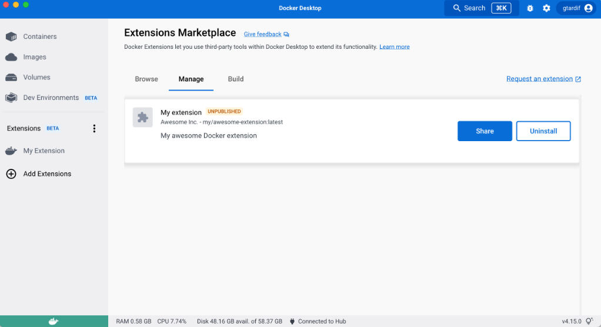

## Share your extension with others

Once your extension image is accessible on Docker Hub, anyone with access to the image can install the extension.

People can install you extension by typing `docker extension install my/awesome-extension:latest`.
But this doesn't provide a lot of information; people might want to know more about your extension before they install it and start using it.

Docker provides a way for you to share a URL pointing to your extension. When people navigate to this URL, it will open Docker Desktop and display your extension description card, similarly to extensions in the marketplace. Especially, it displays the extension description, screenshots, etc. that you provide as [extension labels](labels.md).


Users can then simply select "Install" without copy-pasting command line in a terminal.

You can generate this link with the extension command line :

```
docker extension share my/awesome-extension:0.0.1
```

and this will give you the URL to share your extension

or, once you have installed your extension locally, you can to the "Manage" tab of extensions, and select "Share":


