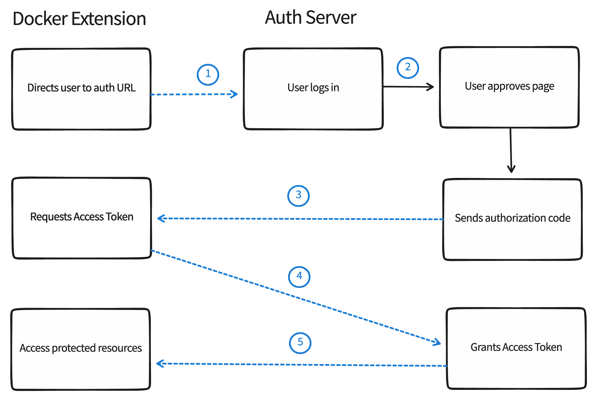

> Note
>
> This page assumes that you already have an Identity Provider (IdP), such as Google, Azure AD or Okta, which handles the authentication process and returns an access token.

Learn how you can let users authenticate from your Docker Extension using OAuth 2.0 via a web browser, and return them back to your Docker Extension.

In OAuth 2.0, the term "grant type" refers to the way an application gets an access token. Although OAuth 2.0 defines several grant types, this page only describes how to authorize users from your Docker Extension using the Authorization Code grant type.

## Authorization code grant flow

The Authorization Code grant type is used by confidential and public clients to exchange an authorization code for an access token.

After the user returns to the client via the redirect URL, the application gets the authorization code from the URL and uses it to request an access token.

{: style=width:80% }

The image above shows that:

- The Docker Extension asks the user to authorize access to their data.
- If the user grants access, the Docker Extension then requests an access token from the service provider, passing the access grant from the user and authentication details to identify the client.
- The service provider then validates these details and returns an access token.
- The Docker Extension uses the access token to request the user data with the service provider.

### OAuth 2.0 terminology

- Auth URL: The endpoint for the API provider authorization server, to retrieve the auth code.
- Redirect URI: The client application callback URL to redirect to after auth. This must be registered with the API provider.

Once the user enters the username and password, they're successfully authenticated.

## Open a browser page to authenticate the user

From the extension UI, you can provide a button that, when selected, opens a new window in a browser to authenticate the user.

Use the [ddClient.host.openExternal](../dev/api/dashboard.md#open-a-url) API to open a browser to the auth URL. For
example:

```typescript
window.ddClient.openExternal("https://authorization-server.com/authorize?
  response_type=code
  &client_id=T70hJ3ls5VTYG8ylX3CZsfIu
  &redirect_uri=${REDIRECT_URI});
```

## Get the authorization code and access token

You can get the authorization code from the extension UI by listing `docker-desktop://dashboard/extension-tab?extensionId=awesome/my-extension` as the `redirect_uri` in the OAuth app you're using and concatenating the authorization code as a query parameter. The extension UI code will then be able to read the corresponding code query-param.

> Note
> using this feature requires the extension SDK 0.3.2 in Docker Desktop. You need to ensure that the required SDK version for your extension set with `com.docker.desktop.extension.api.version` in [image labels](../extensions/labels.md) is higher than 0.3.2.
{: .important}

#### Authorization

This step is where the user enters their credentials in the browser. After the authorization is complete, the user is redirected back to your extension user interface, and the extension UI code can consume the authorization code that's part of the query parameters in the URL.

#### Exchange the Authorization Code

Next, you exchange the authorization code for an access token.

The extension must send a `POST` request to the oauth authorization server with the following parameters:

```
POST https://authorization-server.com/token
&client_id=T70hJ3ls5VTYG8ylX3CZsfIu
&client_secret=YABbyHQShPeO1T3NDQZP8q5m3Jpb_UPNmIzqhLDCScSnRyVG
&redirect_uri=${REDIRECT_URI}
&code=N949tDLuf9ai_DaOKyuFBXStCNMQzuQbtC1QbvLv-AXqPJ_f
```

> **Note**
>
> The client's credentials are included in the `POST` query params in this example. OAuth authorization servers may require that the credentials are sent as a HTTP Basic Authentication header or might support different formats. See your OAuth provider docs for details.

#### Token Endpoint Response

Finally, you can read the access token from the HTTP response and pass it to the extension UI by having the browser after OAuth be redirected to the backend service. The backend service, in turn, has to explicitly redirect the browser to `docker-desktop://dashboard/open`.

## Step three: Store the access token

The Docker Extensions SDK doesn't currently provide a specific mechanism to store secrets.

It's highly recommended that you use an external source of storage to store the access token.

> Note
>
> The user interface Local Storage is isolated between extensions (an extension can't access another extension's local storage), and each extension's local storage gets deleted when users uninstall an extension.

## What's next

Learn how to [publish and distribute your extension](../extensions/index.md)
