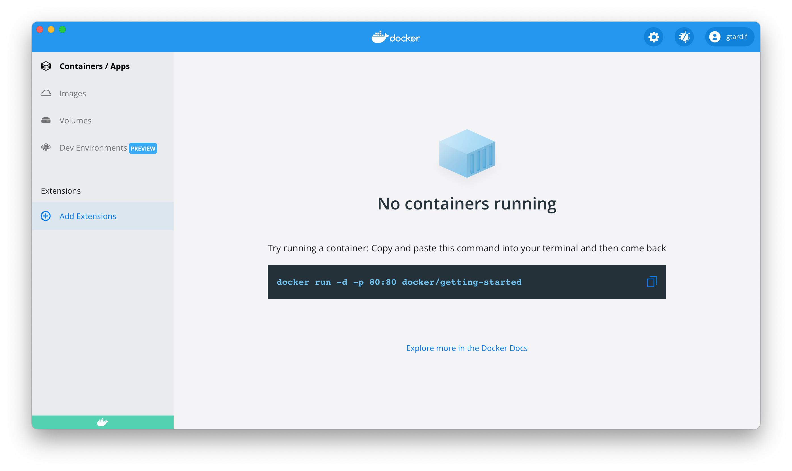

Use the resources in this section to create your own Docker Extension.

> Beta
>
> The Docker Extensions SDK is currently in Beta.
> Features and APIs detailed below are subject to change.

## Overview

Extensions are packaged as specially formatted Docker images, which our CLI tool helps to build. At the root of the image filesystem is a `metadata.json` file which describes the content of the extension. It is a fundamental element of a Docker extension.

An extension can contain a UI part and backend parts that run either on the host or in the Desktop virtual machine. For further details, see [Extension metadata](extensions/METADATA.md).

Extensions are distributed through the Docker Hub.
Development of extensions can be done locally without the need to push the extension to Docker Hub. See [Extensions distribution](extensions/DISTRIBUTION.md) for further details.

## Prerequisites

Before you create your own extension, you need a specific Docker Desktop build that comes with extension capabilities.

From the [releases page](https://github.com/docker/extensions-sdk/releases/latest), install both the Docker Desktop build and the Extensions CLI which is used to manage extensions later on.

> Using the CLI to install unpublished extensions
>
> Extensions can install binaries, invoke commands and access files on your machine. Make sure you trust extensions before installing them on your machine.
> {: .warning}

Once you've downloaded the Extensions CLI, extract the binary in to `~/.docker/cli-plugins`.

In your terminal, run:

<ul class="nav nav-tabs">
  <li class="active"><a data-toggle="tab" data-target="#prereq-macos-intel">MacOS (intel)</a></li>
  <li><a data-toggle="tab" data-target="#prereq-macos-m1">MacOS (M1)</a></li>
  <li><a data-toggle="tab" data-target="#prereq-windows">Windows</a></li>
  <li><a data-toggle="tab" data-target="#prereq-wsl2">WSL2</a></li>
  <li><a data-toggle="tab" data-target="#prereq-linux">Linux</a></li>
</ul>
<div class="tab-content">
  <div id="prereq-macos-intel" class="tab-pane fade in active" markdown="1">
    
```console
$ tar -xvzf desktop-extension-cli-darwin-amd64.tar.gz
$ mkdir -p ~/.docker/cli-plugins
$ mv docker-extension ~/.docker/cli-plugins
```

  <hr></div>
  <div id="prereq-macos-m1" class="tab-pane fade" markdown="1">
    
```console
$ tar -xvzf desktop-extension-cli-darwin-arm64.tar.gz
$ mkdir -p ~/.docker/cli-plugins
$ mv docker-extension ~/.docker/cli-plugins
```

  <hr></div>
  <div id="prereq-windows" class="tab-pane fade" markdown="1">
    
```console
PS> tar -xvzf desktop-extension-cli-windows-amd64.tar.gz
PS> mkdir -p ~/.docker/cli-plugins
PS> mv docker-extension.exe ~/.docker/cli-plugins
```

  <hr></div>
  <div id="prereq-wsl2" class="tab-pane fade" markdown="1">
    
```console
$ tar -xvzf desktop-extension-cli-linux-amd64.tar.gz
$ mkdir -p ~/.docker/cli-plugins
$ mv docker-extension ~/.docker/cli-plugins
```

  <hr></div>
  <div id="prereq-linux" class="tab-pane fade" markdown="1">

```console
$ tar -xvzf desktop-extension-cli-linux-amd64.tar.gz
$ mkdir -p ~/.docker/cli-plugins
$ mv docker-extension ~/.docker/cli-plugins
```

  <hr></div>
</div>

You can now list installed extensions (the list should be empty if you have not installed extensions already):

```console
$ docker extension ls
ID                  PROVIDER            VERSION             UI                  VM                  HOST
```


