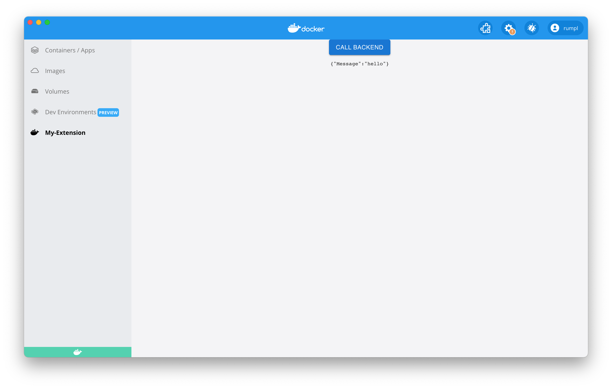

Learn how to create a new Docker extension.

## Prerequisites

- [Docker Desktop](https://www.docker.com/products/docker-desktop/)
- [Docker Extensions CLI](https://github.com/docker/extensions-sdk/releases/)
- [NodeJS](https://nodejs.org)
- [Go](https://go.dev/dl/)

> Note
>
> NodeJS and Go are only required if an extension is created using the `docker extension init` command. This command uses a template based on a ReactJS and Go application.

## Create a new extension

To create a new extension, use the `init` subcommand and provide a name for your extension.

```bash
docker extension init my-extension
```

You'll be asked a series of questions about your extension, such as its name, a description, and the name of your Hub repository. This helps the CLI to generate a set of boilerplate files for you to get started. The boilerplate files are stored in the directory `my-extension`.

The automatically generated extension contains:

- A backend service that listens on a socket. It has one endpoint `/hello` that returns
  a JSON payload.
- A React frontend that can call the backend and output the backend's response.

## Build the extension

As part of the extension boilerplate files, a `Makefile` is generated at the root of the extension directory with targets to build and push the extension.

To build the extension, run:

```bash
cd my-extension
make build-extension
```

`make build-extension` builds your extension and also generates an image which is named after your chosen hub repository. For instance, if you typed `john/my-extension` as the answer to the following question:

```
? Hub repository (eg. namespace/repository on hub): john/my-extension
```

The `make build-extension` generates an image with name `john/my-extension`.

## Install the extension

To install the extension in Docker Desktop, run:

```bash
docker extension install john/my-extension
```

If the installation is successful, the following output displays:

```bash
Installing new extension "john/my-extension"
Installing service in Desktop VM...
Setting additional compose attributes
VM service started
Installing Desktop extension UI for tab "My-Extension"...
Extension UI tab "My-Extension" added.
Extension "my-extension" installed successfully
```

## Preview the extension

You can also enter the command below to verify the extension installed successfully:

```bash
docker extension ls
```

It outputs all the extensions installed:

```bash
ID                    PROVIDER      VERSION   UI                  VM          HOST
john/my-extension     Docker Inc.             1 tab(My-Extension) Running(1)  -
```

In Docker Desktop, the left-hand menu now displays a new tab with the name `My-Extension`. When you select the new tab, a **Call Backend** button appears. When you select it, it displays a response from the backend.



### Opening Dev Tools

You can now develop your custom Docker Extension. See the [Developer guide](../../dev/overview) for more information.

### Iterate faster while developing

To iterate faster and try out new changes whilst you develop your extension, use the `docker extension update` command. This uninstalls the previous version and installs the new one with your latest changes.

### Developing the frontend

During UI development, it's helpful to use hot reloading to test your changes without rebuilding your entire extension.
To do this, you can configure Docker Desktop to load your UI from a development server, such as the one Create React
App starts when invoked with yarn start.

Assuming your app runs on the default port, start your UI app and then run:

```bash
cd ui
npm start
```

This starts a development server that listens on port 3000.

You can now tell
Docker Desktop to use this as the frontend source. In another terminal run:

```bash
docker extension dev ui-source john/my-extension http://localhost:3000
```

Close and reopen the Docker Desktop dashboard and go to your extension. All the
changes to the frontend code are immediately visible.

Once you're done you can remove the ui-source override:

```bash
docker extension dev reset john/my-extension
```

## Submit your extension to the marketplace

If you want to make your extension available to all Docker Desktop users, you can submit it for publication in the Marketplace. For more information, see [Publish your extension in the Marketplace](../extensions/DISTRIBUTION.md#publish-your-extension-in-the-marketplace).

## Clean up

To remove the extension, run:

```bash
docker extension rm john/my-extension
```

The following output displays:

```bash
Removing extension john/my-extension...
Removing extension VM service...
Extension removed from Desktop VM
VM service socket forwarding stopped
Extension UI tab My-Extension removed
Extension "john/my-extension" removed
```
