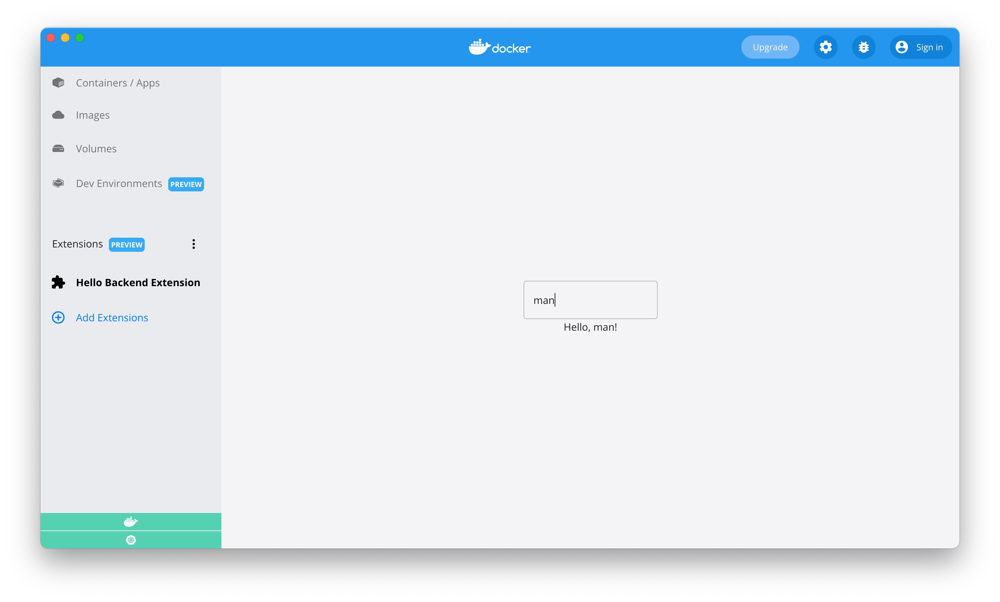

Learn how to create a simple Docker Extension that runs CLI commands in the backend.

For extensions with a backend service running REST services over sockets or named pipes, see the `vm-ui extension` [sample](https://github.com/docker/extensions-sdk/tree/main/samples).

## Prerequisites

- [Docker Desktop](https://www.docker.com/products/docker-desktop/)
- [Docker Extensions CLI](https://github.com/docker/extensions-sdk/releases/)

## Extension folder structure

A Docker extension is made of several files which range from the extension's source code to the required extension-specific files.

In the `minimal-backend` [sample folder](https://github.com/docker/extensions-sdk/tree/main/samples), you can find a ready-to-go example that represents a UI extension built on HTML that runs a backend service. We will go through this code example in this tutorial.

Although you can start from an empty directory, it is highly recommended that you start from the template below and change it accordingly to suit your needs.

```bash
.
├── Dockerfile # (1)
├── Makefile
├── client # (2)
│   └── src
│       ├── App.tsx
│       └── ... React aplication
├── hello.sh # (3)
└── metadata.json # (4)
```

1. Contains everything required to build the extension and run it in Docker Desktop.
2. The source folder that contains the UI application. In this example we use a React frontend, the main part of th extension is an App.tsx.
3. The script that runs inside the container.
4. A file that provides information about the extension such as the name, description, and version.

## Invoke the extension backend from your javascript code

Let's reuse the React extension from the [React extension tutorial](./react-extension.md), and see how we can invoke our extension backend from the App.tsx file.

Use the Docker Desktop Client object and then invoke a binary provided in our backend container (that lives inside the Docker Desktop VM) with `ddClient.docker.extension.vm.cli.exec()`.
In our example, our hello.sh script returns a string as result, we obtain it with `result?.stdout`.

```typescript
const ddClient = createDockerDesktopClient();
const [backendInfo, setBackendInfo] = useState<string | undefined>();

async function runExtensionBackend(inputText: string) {
  const result = await ddClient.extension.vm?.cli.exec("./hello.sh", [
    inputText,
  ]);
  setBackendInfo(result?.stdout);
}
```

## Create a Dockerfile

An extension requires a `Dockerfile` to build, publish, and run the extension in Docker Desktop.

At minimum, your Dockerfile needs:

- Labels which provide extra information about the extension.
- The source code which in this case is an `index.html` that sits within the `ui` folder. `index.html` refers to javascript code in `script.js`.
- The `metadata.json` file.

```Dockerfile
FROM node:17.7-alpine3.14 AS client-builder
# ... build React application

FROM alpine:3.15

LABEL org.opencontainers.image.title="HelloBackend" \
    org.opencontainers.image.description="A sample extension that runs a shell script inside a container's Desktop VM." \
    org.opencontainers.image.vendor="Docker Inc." \
    com.docker.desktop.extension.api.version="1.0.0-beta.1" \
    com.docker.desktop.extension.icon="https://www.docker.com/wp-content/uploads/2022/03/Moby-logo.png"

COPY hello.sh .
COPY metadata.json .
COPY --from=client-builder /app/client/dist ui

CMD [ "sleep", "infinity" ]
```

## Configure the metadata file

A `metadata.json` file is required at the root of the image filesystem.

```json
{
  "vm": {
    "image": "${DESKTOP_PLUGIN_IMAGE}"
  },
  "ui": {
    "dashboard-tab": {
      "title": "Hello Backend Extension",
      "root": "/ui",
      "src": "index.html"
    }
  }
}
```

> Do not replace the `${DESKTOP_PLUGIN_IMAGE}` placeholder in the `metadata.json` file. The placeholder is replaced automatically with the correct image name when the extension is installed.

## Build the extension

To build the extension, run:

```bash
docker build -t desktop-backend-minimal-extension:0.0.1 .
```

### Build the extension for multiple platforms

To build the extension for multiple platforms, run:

```bash
docker buildx build --platform=linux/amd64,linux/arm64 -t desktop-backend-minimal-extension:0.0.1 .
```

## Validate the extension

Verify the extension image is compliant.

The validation checks if the extension's `Dockerfile` specifies all the required labels and if the metadata file is valid against the JSON schema file.

```bash
docker extension validate desktop-backend-minimal-extension:0.0.1
```

If your extension is valid, the message below displays:

`The extension image "desktop-backend-minimal-extension:0.0.1" is valid`.

## Install the extension

To install the extension in Docker Desktop, run:

```bash
docker extension install desktop-backend-minimal-extension:0.0.1
```

If the installation is successful, the output below displays:

```bash
Installing new extension "hello-backend" with desktop-backend-minimal-extension:0.0.1 ...
Installing service in Desktop VM...
Setting additional compose attributes
VM service started
Installing Desktop extension UI for tab "Hello Backend Extension"...
Extension UI tab "Hello Backend Extension" added.
Extension "hello-backend" installed successfully
```

## Preview the extension

You can also enter the command below to verify the extension installed successfully:

```bash
docker extension ls
```

It outputs all the extensions installed:

```bash
PLUGIN              PROVIDER            IMAGE                           UI                      VM      HOST
hello-backend       Docker Inc.         desktop-backend-minimal-extension:0.0.1   1 tab(Hello Backend Extension)   Running(1)          -
```

To preview the extension in Docker Desktop, close and open the Docker Desktop dashboard once the installation has completed.

The left-hand menu displays a new tab with name `Hello Backend Extension`. When you select the new tab, the result below is rendered.



## Publish the extension

To publish the extension, upload the Docker image to [DockerHub](https://hub.docker.com).

Tag the previous image to prepend the account owner at the beginning of the image name:

```bash
docker tag desktop-backend-minimal-extension:0.0.1 owner/desktop-backend-minimal-extension:0.0.1
```

Push the image to DockerHub:

```bash
docker push owner/desktop-backend-minimal-extension:0.0.1
```

> Publishing extensions in the marketplace
>
> For Docker Extensions images to be listed in Docker Desktop, they must be approved by Docker and be tagged following semantic versioning, e.g: `0.0.1`.
>
> See [distribution and new releases](../extensions/DISTRIBUTION.md#distribution-and-new-releases) for more information.
>
> See <a href="https://semver.org/" target="__blank">semver.org</a> to learn more about semantic versioning.

> Having trouble to push the image?
>
> Ensure you are logged into DockerHub. Otherwise, run `docker login` to authenticate.

## Clean up

To remove the extension, run:

```bash
docker extension rm hello-backend
```

The following output displays:

```bash
Removing extension hello-backend...
Removing extension VM service...
Extension removed from Desktop VM
Extension UI tab Hello Backend Extension removed
Extension "hello-backend" removed
```
