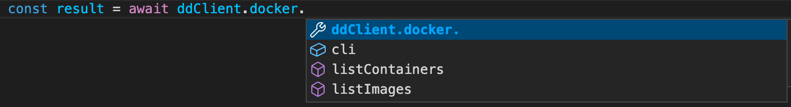
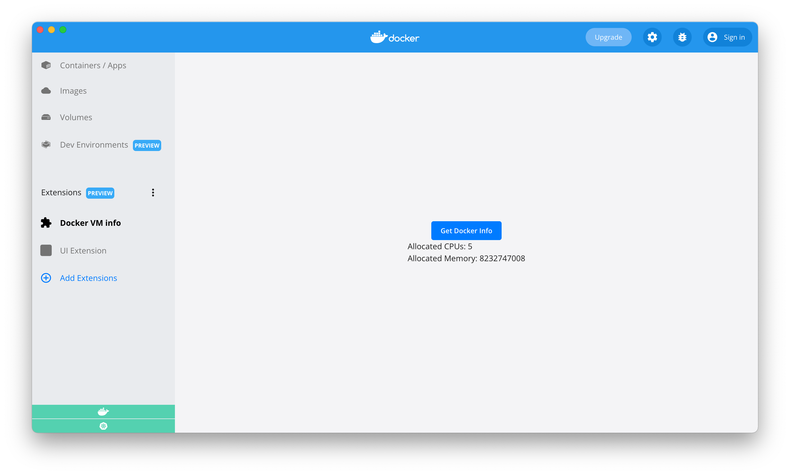

Learn how to create a simple Docker extension that invokes Docker CLI commands.

## Prerequisites

- [Docker Desktop build with Extensions capabilities](https://github.com/docker/extensions-sdk/releases/)
- [Docker Extensions CLI](https://github.com/docker/extensions-sdk/releases/)

## Extension folder structure

A Docker extension is made of several files which range from the extension's source code to the required extension-specific files.

In the `minimal-docker-cli` [sample folder](https://github.com/docker/extensions-sdk/tree/main/samples), you can find a ready-to-go example that represents a UI Extension invoking Docker commands. We will go through this code example in this tutorial.

Although you can start from an empty directory, it is highly recommended that you start from the template below and change it accordingly to suit your needs.

```bash
.
├── Dockerfile # (1)
├── metadata.json # (2)
└── client # (3)
│   └── src
│       ├── App.tsx
│       └── ... React aplication
```

1. Contains everything required to build the extension and run it in Docker Desktop.
2. A file that provides information about the extension such as the name, description, and version.
3. The source folder that contains all your HTML, CSS and JS files. In this example we use a React frontend, the main part of th extension is an App.tsx.

## Invoke docker CLI in your javascript code

Let's reuse the React extension from the [React extension tutorial](./react-extension.md), and see how we can invoke docker commands from the App.tsx file.

Use the Docker Desktop Client object to discover extension APIs about `docker`. The application uses `@docker/extension-api-client` in order to obtain a Docker Desktop Client object. Because we have set `@docker/extension-api-client-types` as a dev dependency, we also have auto-completion in our IDE:



We can invoke a Docker command with `ddClient.docker.cli.exec()`.
For example, to run `docker info` and obtain json formatted results:

`ddClient.docker.cli.exec("info", ["--format", '"{{ json . }}"'])`.

We can use `result.parseJsonObject()` to read results as a json object and use it in our application.

```typescript
const ddClient = createDockerDesktopClient();
const [dockerInfo, setDockerInfo] = useState<any>(null);

async function runDockerInfo() {
  const result = await ddClient.docker.cli.exec("info", [
    "--format",
    '"{{json .}}"',
  ]);
  setDockerInfo(result.parseJsonObject());
}
```

We can then use our `dockerInfo` object in the display part of the application.

## Create a Dockerfile

An extension requires a `Dockerfile` to build, publish, and run in Docker Desktop.

At minimum, your Dockerfile needs:

- Labels which provide extra information about the extension.
- The source code which in this case is an `index.html` that sits within the `ui` folder. `index.html` refers to javascript code in `script.js`.
- The `metadata.json` file.

```Dockerfile
FROM node:17.7-alpine3.14 AS client-builder
# ... build React application

FROM scratch

LABEL org.opencontainers.image.title="MyExtension" \
    org.opencontainers.image.description="A sample extension to show how easy it's to get started with Desktop Extensions." \
    org.opencontainers.image.vendor="Docker Inc." \
    com.docker.desktop.extension.api.version="1.0.0-beta.1" \
    com.docker.desktop.extension.icon="https://www.docker.com/wp-content/uploads/2022/03/Moby-logo.png"

COPY ui ./ui
COPY metadata.json .
```

## Configure the metadata file

A `metadata.json` file is required at the root of the image filesystem.

```json
{
  "ui": {
    "dashboard-tab": {
      "title": "Docker VM info",
      "root": "/ui",
      "src": "index.html"
    }
  }
}
```

## Build the extension

To build the extension, run:

```bash
docker build -t desktop-docker-cli-minimal-extension:0.0.1 .
```

### Build the extension for multiple platforms

To build the extension for multiple platforms, run:

```bash
docker buildx build --platform=linux/amd64,linux/arm64 -t desktop-docker-cli-minimal-extension:0.0.1 .
```

## Validate the extension

Verify the extension image is compliant.

The validation checks if the extension's `Dockerfile` specifies all the required labels and if the metadata file is valid against the JSON schema file.

```bash
docker extension validate desktop-docker-cli-minimal-extension:0.0.1
```

If your extension is valid, the message below displays:

`The extension image "desktop-docker-cli-minimal-extension:0.0.1" is valid`.

## Install the extension

To install the extension in Docker Desktop, run:

```bash
docker extension install desktop-docker-cli-minimal-extension:0.0.1
```

If the installation is successful, the output below displays:

```bash
Installing new extension "MyExtension" with desktop-docker-cli-minimal-extension:0.0.1 ...
Installing Desktop extension UI for tab "My Extension"...
Extension UI tab "Docker VM info" added.
Extension "MyExtension" installed successfully
```

## Preview the extension

You can also enter the command below to verify the extension installed successfully:

```bash
docker extension ls
```

It outputs all the extensions installed:

```bash
PLUGIN              PROVIDER            IMAGE                                       UI                  VM  HOST
MyExtension         Docker Inc.         desktop-docker-cli-minimal-extension:0.0.1  1 tab(My Extension) -   -
```

To preview the extension in Docker Desktop, close and open the Docker Desktop dashboard once the installation is complete.

The left-hand menu displays a new tab with name `Docker VM info`. When you select the new tab, the result below is rendered.



## Publish the extension

To publish the extension, upload the Docker image to [DockerHub](https://hub.docker.com).

Tag the previous image to prepend the account owner at the beginning of the image name:

```bash
docker tag desktop-docker-cli-minimal-extension:0.0.1 owner/desktop-docker-cli-minimal-extension:0.0.1
```

Push the image to DockerHub:

```bash
docker push owner/desktop-docker-cli-minimal-extension:0.0.1
```

> Publishing extensions in the marketplace
>
> For Docker Extensions images to be listed in Docker Desktop, they must be approved by Docker and be tagged following semantic versioning, e.g: `0.0.1`.
>
> See [distribution and new releases](../extensions/DISTRIBUTION.md#distribution-and-new-releases) for more information.
>
> See <a href="https://semver.org/" target="__blank">semver.org</a> to learn more about semantic versioning.

> Having trouble to push the image?
>
> Ensure you are logged into DockerHub. Otherwise, run `docker login` to authenticate.

## Clean up

To remove the extension, run:

```bash
docker extension rm desktop-docker-cli-minimal-extension
```

The following output displays:

```bash
Removing extension MyExtension...
Extension UI tab Disk usage removed
Extension "MyExtension" removed
```

## What's next?

Learn how to [create a minimal backend extension.](./minimal-backend-extension.md)
