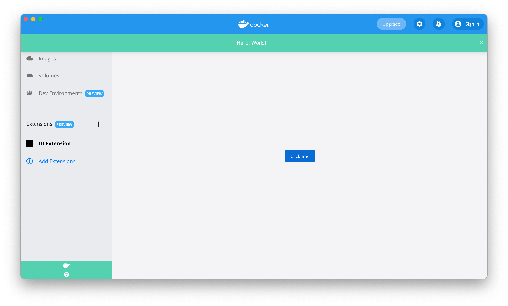

Learn how to create a simple Docker extension that contains only a UI part and is based on ReactJS.

## Prerequisites

- [Docker Desktop build with Extensions capabilities](https://github.com/docker/extensions-sdk/releases/)
- [Docker Extensions CLI](https://github.com/docker/extensions-sdk/releases/)

## Extension folder structure

A Docker extension is made of several files which range from the extension's source code to the required extension-specific files.

In the `react-extension` [sample folder](https://github.com/docker/extensions-sdk/tree/main/samples), you can find a ready-to-go example that represents a UI Extension built on ReactJS. We will go through this code example in this tutorial.

Although you can start from an empty directory, it is highly recommended that you start from the template below and change it accordingly to suit your needs.

```bash
.
├── Dockerfile # (1)
├── client # (2)
│   ├── package.json
│   ├── public # (3)
│   │   └── index.html
│   ├── src # (4)
│   │   ├── App.tsx
│   │   ├── globals.d.ts
│   │   ├── index.tsx
│   │   └── react-app-env.d.ts
│   ├── tsconfig.json
│   └── yarn.lock
├── docker.svg # (5)
└── metadata.json # (6)
```

1. Contains everything required to build the extension and run it in Docker Desktop.
2. High-level folder containing your front-end app source code.
3. Assets that aren’t compiled or dynamically generated are stored here. These can be static assets like logos or the robots.txt file.
4. The src, or source folder contains all the React components, external CSS files, and dynamic assets that are brough into the component files.
5. The icon that is displayed in the left-menu of the Docker Desktop Dashboard.
6. A file that provides information about the extension such as the name, description, and version.

## Create a Dockerfile

An extension requires a `Dockerfile` to build, publish, and run in Docker Desktop.

```Dockerfile
FROM node:14.17-alpine3.13 AS client-builder
WORKDIR /app/client
# cache packages in layer
COPY client/package.json /app/client/package.json
COPY client/yarn.lock /app/client/yarn.lock
ARG TARGETARCH
RUN yarn config set cache-folder /usr/local/share/.cache/yarn-${TARGETARCH}
RUN --mount=type=cache,target=/usr/local/share/.cache/yarn-${TARGETARCH} yarn
# install
COPY client /app/client
RUN --mount=type=cache,target=/usr/local/share/.cache/yarn-${TARGETARCH} yarn build

FROM debian:bullseye-slim
LABEL org.opencontainers.image.title="ui-extension" \
    org.opencontainers.image.description="Your Desktop Extension Description" \
    org.opencontainers.image.vendor="Docker Inc." \
    com.docker.desktop.extension.api.version="1.0.0-beta.1" \
    com.docker.desktop.extension.icon="https://www.docker.com/wp-content/uploads/2022/03/Moby-logo.png"

COPY --from=client-builder /app/client/dist ui
COPY docker.svg .
COPY metadata.json .

```

## Configure the metadata file

A `metadata.json` file is required at the root of your extension directory.

```json
{
  "icon": "docker.svg",
  "ui": {
    "dashboard-tab": {
      "title": "UI Extension",
      "root": "/ui",
      "src": "index.html"
    }
  }
}
```

## Use extension APIs in the application code

The React application can import `@docker/extension-api-client` and use extension APIs to perform actions with Docker Desktop.

```ts
import { Box, Button } from '@mui/material';
import { createDockerDesktopClient } from '@docker/extension-api-client';

export function App() {
  //obtain docker destkop extension client
  const ddClient = createDockerDesktopClient();

  function sayHello() {
    ddClient.desktopUI.toast.success('Hello, World!');
  }

  ...
}
```

## Build the extension

To build the extension, run:

```bash
docker build -t desktop-react-extension:0.0.1 .
```

### Build the extension for multiple platforms

To build the extension for multiple platforms, run:

```bash
docker buildx build --platform=linux/amd64,linux/arm64 -t desktop-react-extension:0.0.1 .
```

## Validate the extension

Verify the extension image is compliant.

The validation checks if the extension's `Dockerfile` specifies all the required labels and if the metadata file is valid against the JSON schema file.

```bash
docker extension validate desktop-backend-minimal-extension:0.0.1
```

If your extension is valid, the message below displays:

`The extension image "desktop-backend-minimal-extension:0.0.1" is valid`.

## Install the extension

To install the extension in Docker Desktop, run:

```bash
docker extension install desktop-react-extension:0.0.1
```

If the installation is successful, the output below displays:

```bash
Installing new extension "ui-extension" with desktop-react-extension:0.0.1 ...
Installing Desktop extension UI for tab "UI Extension"...
Extension UI tab "UI Extension" added.
Extension "ui-extension" installed successfully
```

## Preview the extension

You can also enter the command below to verify the extension installed successfully:

```bash
docker extension ls
```

It outputs all the extensions installed:

```bash
PLUGIN              PROVIDER            IMAGE                           UI                      VM       HOST
ui-extension #(1)   Docker Inc. (2)     desktop-react-extension:0.0.1 (3)  1 tab(UI Extension)(4)  -(5)    -(6)
```

1. Name of the extension (from property `name` in `metadata.json`).
2. Provider of the extension (from property `provider` in `metadata.json`)
3. Docker image name
4. Tab name (from property `ui.dashboard-tab.title` in `metadata.json`)
5. No backend services running in the Desktop VM.
6. No binaries deployed on the host.

To preview the extension in Docker Desktop, close and open the Docker Desktop dashboard once the installation is complete.

The left-hand menu displays a new tab with the name `UI Extension`. When you select the new tab, a button appears in the top-left corner. Click the button to display `Hello, World!`.



### Open Dev Tools

See the [Developer guide](../../dev/overview) for more information.

## Publish the extension

To publish the extension, upload the Docker image to [DockerHub](https://hub.docker.com).

Tag the previous image to prepend the account owner at the beginning of the image name:

```bash
docker tag desktop-react-extension:0.0.1 owner/desktop-react-extension:0.0.1
```

Push the image to DockerHub:

```bash
docker push owner/desktop-react-extension:0.0.1
```

> Publishing extensions in the marketplace
>
> For Docker Extensions images to be listed in Docker Desktop, they must be approved by Docker and be tagged following semantic versioning, e.g: `0.0.1`.
>
> See [distribution and new releases](../extensions/DISTRIBUTION.md#distribution-and-new-releases) for more information.
>
> See <a href="https://semver.org/" target="__blank">semver.org</a> to learn more about semantic versioning.

> Having trouble to push the image?
>
> Ensure you are logged into DockerHub. Otherwise, run `docker login` to authenticate.

## Clean up

To remove the extension, run:

```bash
docker extension rm ui-extension
```

The following output displays:

```bash
Removing extension ui-extension...
Extension UI tab UI Extension removed
Extension "ui-extension" removed
```

## What's next?

Learn how to [create an extension using Docker CLI commands.](./minimal-frontend-using-docker-cli.md)
