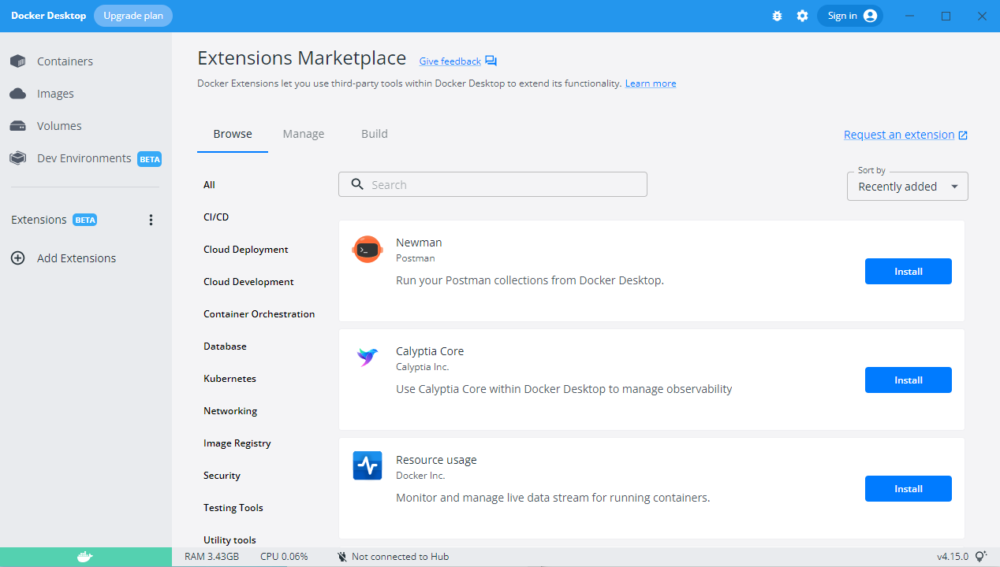

Docker Extensions lets you use third-party tools within Docker Desktop to extend its functionality. There is no limit to the number of extensions you can install.

Docker Community members and partners can use our [SDK](extensions-sdk/index.md) to create new extensions. 

> **Beta**
>
> The Docker Extensions feature is currently in Beta. We recommend that you do not use Extensions in production environments.

{:width="750px"}

## Prerequisites

Docker Extensions is available as part of Docker Desktop 4.8.0 or a later release. Download and install Docker Desktop 4.8.0 or later:

* [Mac](mac/release-notes/index.md)
* [Windows](windows/release-notes/index.md)
* [Linux](linux/index.md)

## Add an extension

>**Note**
>
> For some extensions, a separate account needs to be created before use.

To add Docker Extensions:

1. Open Docker Desktop.
2. From the Dashboard, select **Add Extensions** in the menu bar. 
The Extensions Marketplace opens. 
3. Browse the available extensions.
    You can sort the list of extensions by **Recently added** or alphabetically. 
4. Click **Install**.

From here, you can click **Open** to access the extension or install additional extensions. The extension also appears in the menu bar.

## See containers created by extensions

By default, containers created by extensions are hidden from the list of containers in Docker Dashboard and the Docker CLI. To make them visible 
update your settings:

1. Navigate to  **Settings**, or **Preferences** if you're a Mac user.
2. Select the **Extensions** tab.
3. Next to **Show Docker Extensions system containers**, select or clear the checkbox to set your desired state.
4. In the bottom-right corner, click **Apply & Restart**.

## Enable or disable extensions available in the Marketplace

Docker Extensions are switched on by default. To change your settings:

1. Navigate to  **Settings**, or **Preferences** if you're a Mac user.
2. Select the **Extensions** tab.
3. Next to **Enable Docker Extensions**, select or clear the checkbox to set your desired state.
4. In the bottom-right corner, click **Apply & Restart**.

## Enable or disable extensions not available in the Marketplace

You can install Docker Extensions through the Marketplace or through the Extensions SDK tools. You can choose to only allow published extensions (that have been published in the Extensions Marketplace).

1. Navigate to **Settings**, or **Preferences** if you're a Mac user.
2. Select the **Extensions** tab.
3. Next to **Allow only extensions distributed through the Docker Marketplace**, select or clear the checkbox to set your desired state.
4. In the bottom-right corner, click **Apply & Restart**.

## Update an extension
You can update Docker Extensions outside of Docker Desktop releases. To update an extension to the latest version:

1. Navigate to Docker Dashboard, and from the menu bar select the ellipsis to the right of **Extensions**.
2. Click **Manage Extensions**.
If an extension has a new version available, it displays an **Update** button.
3. Click **Update**.

## Submit feedback
Feedback can be given to an extension author through a dedicated Slack channel or Github. To submit feedback about a particular extension:

1. Navigate to Docker Dashboard and from the menu bar select the ellipsis to the right of **Extensions**.
2. Click **Manage Extensions**.
3. Select the extension you want to provide feedback on. 
4. Scroll down to the bottom of the extension's description and, depending on the 
extension, select:
    - Support
    - Slack
    - Issues. You'll be sent to a page outside of Docker Desktop to submit your feedback.

If an extension does not provide a way for you to give feedback, contact us and we'll pass on the feedback for you. 

## Uninstall an extension
 You can uninstall an extension at any time. 
 
 > **Note**  
 >
 > Any data used by the extension that is stored in a volume must be manually deleted. 

1. From the menu bar, select the ellipsis to the right of **Extensions**.
2. Click **Manage Extensions**. This displays a list of extensions you've installed.
3. Click **Uninstall**.
