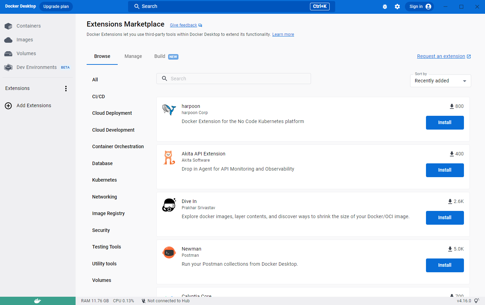

> **Beta**
>
> The Docker Extensions feature is currently in [Beta](../../release-lifecycle.md#beta). We recommend that you do not use Docker Extensions in production environments.

Docker Extensions lets you use third-party tools within Docker Desktop to extend its functionality. There is no limit to the number of extensions you can install.

{:width="750px"}

You can explore the list of available extensions in [Docker Hub](https://hub.docker.com/search?q=&type=extension) or in the Extensions Marketplace within Docker Desktop.

Docker Community members and partners can use our [SDK](../extensions-sdk/index.md) to create new extensions.

To find out more about Docker Extensions, we recommend the video walkthrough from DockerCon 2022:

<iframe width="750" height="315" src="https://www.youtube.com/embed/3rAGXS8pszQ" title="YouTube video player" frameborder="0" allow="accelerometer; autoplay; clipboard-write; encrypted-media; gyroscope; picture-in-picture" allowfullscreen></iframe>

## Prerequisites

Docker Extensions is available as part of Docker Desktop 4.8.0 or a later release. [Download and install Docker Desktop 4.8.0 or later](../release-notes.md).
