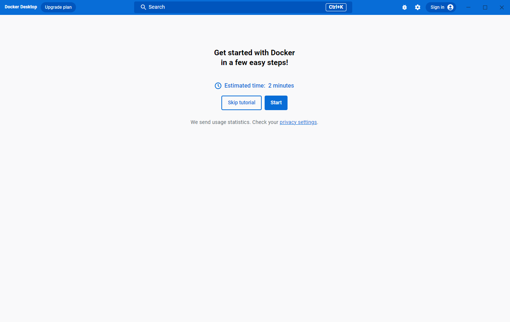

## Quick Start Guide

The Quick Start Guide includes a simple exercise to build an example Docker image, run it as a container, push and save the image to Docker Hub.



To run the Quick Start Guide, select the Docker menu {: .inline} and then choose **Quick Start Guide**.

> **Note**
>
> To access the Quick Start Guide, you must turn off **Access experimental features**.
> Learn how to turn off **Access experimental features** on [Mac](../settings/mac/#experimental-features), [Windows](../settings/windows/#experimental-features), or [Linux](../settings/linux/#experimental-features).


For a more detailed guide, see [Get started](../get-started/index.md), or the [Docker Desktop hands-on guides](../get-started/hands-on-overview.md).

## Sign in to Docker Desktop

We recommend that you authenticate using the **Sign in** option in the top-right corner of the Docker Dashboard.

Once logged in, you can access your Docker Hub repositories directly from Docker Desktop.

Authenticated users get a higher pull rate limit compared to anonymous users. For example, if you are authenticated, you get 200 pulls per 6 hour period, compared to 100 pulls per 6 hour period per IP address for anonymous users. For more information, see [Download rate limit](../docker-hub/download-rate-limit.md).

In large enterprises where admin access is restricted, administrators can [Configure registry.json to enforce sign-in](../docker-hub/configure-sign-in.md). Enforcing developers to authenticate through Docker Desktop also allows administrators to improve their organization’s security posture for containerized development by taking advantage of [Hardened Desktop](hardened-desktop/index.md).

### Credentials management for Linux users

Docker Desktop relies on [`pass`](https://www.passwordstore.org/){: target="_blank" rel="noopener" class="_"} to store credentials in gpg2-encrypted files.
Before signing in to Docker Hub from the Docker Dashboard or the Docker menu, you must initialize `pass`.
Docker Desktop displays a warning if you've not initialized `pass`.

You can initialize pass by using a gpg key. To generate a gpg key, run:

``` console
$ gpg --generate-key
``` 

Below is an example similar to what you see once you run the above command:

```console
...
GnuPG needs to construct a user ID to identify your key.

Real name: Molly
Email address: molly@example.com
You selected this USER-ID:
    "Molly <molly@example.com>"

Change (N)ame, (E)mail, or (O)kay/(Q)uit? O
...
pub   rsa3072 2022-03-31 [SC] [expires: 2024-03-30]
      <generated gpg-id public key>
uid                      Molly <molly@example.com>
sub   rsa3072 2022-03-31 [E] [expires: 2024-03-30]
```

To initialize `pass`, run the following command using the public key generated from the previous command:

```console
$ pass init <generated gpg-id public key>
``` 
Below is an example similar to what you see once you run the above command:

```console
mkdir: created directory '/home/molly/.password-store/'
Password store initialized for <generated gpg-id public key>
```

Once `pass` is initialized, you can sign in on the Docker Dashboard and pull your private images.
When credentials are used by the Docker CLI or Docker Desktop, a user prompt may pop up for the password you set during the gpg key generation.

```console
$ docker pull molly/privateimage
Using default tag: latest
latest: Pulling from molly/privateimage
3b9cc81c3203: Pull complete 
Digest: sha256:3c6b73ce467f04d4897d7a7439782721fd28ec9bf62ea2ad9e81a5fb7fb3ff96
Status: Downloaded newer image for molly/privateimage:latest
docker.io/molly/privateimage:latest
```
## What's next?

- [Explore Docker Desktop](use-desktop/index.md) and its features. 
- Change your Docker Desktop settings
- [Browse common FAQs](faqs/general.md)
