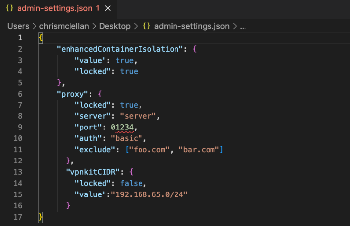

---
description: admin controls for desktop
keywords: admin, controls, rootless, enhanced container isolation
title: Configure Admin Controls
--- 

>Note
>
>Admin Controls is currently in [Early Access](../../../release-lifecycle.md#early-access-ea) and available to Docker Business customers only. 

This page contains information on how Enterprise admins can configure Admin Controls to specify and lock configuration parameters to create a standardized Docker Desktop environment across the organization.

## Prerequisite

You need to [configure a registry.json to enforce sign-in](../../../docker-hub/configure-sign-in.md). This is because your Docker Desktop users must authenticate to your organization for this configuration to take effect. 

## Step one: Place the `admin-settings.json` file in the correct location

Place the `admin-settings.json` file on your developers machines in the following locations:

- Mac: /Library/Application Support/com.docker.docker/admin-settings.json
- Windows: /ProgramData/DockerDesktop/admin-settings.json
- Linux - /usr/share/docker-desktop/registry/admin-settings.json

By placing this file in the above protected directories, end users are unable to modify it.

>Note
>
> It is assumed that Enterprise admins have the ability to push the `admin-settings.json` settings file to the locations specified above through a device management software such as [Jamf](https://www.jamf.com/lp/en-gb/apple-mobile-device-management-mdm-jamf-shared/?attr=google_ads-brand-search-shared&gclid=CjwKCAjw1ICZBhAzEiwAFfvFhEXjayUAi8FHHv1JJitFPb47C_q_RCySTmF86twF1qJc_6GST-YDmhoCuJsQAvD_BwE).

## Step two: Add the key value pairs for the admin controls you want to lock in

The `admin-settings.json` file requires a nested list of configuration parameters, each of which must contain the  `locked` setting. If set to `true`, users are not able to edit this setting from the UI or CLI. If set to `false`, users can change this setting from the UI or the CLI by directly editing settings.json. If this setting is omitted, the default value is `false`.

The image below displays an example `admin-settings.json` file.

{:width="500px"}

The following table provides the required syntax and descriptions for parameters and values:

| Parameter                        | Description                      |
| :--------------------------------- | :--------------------------------- |
| `enhancedContainerIsolation`        |     |

Once you have created and configured `admin-settings.json`, Docker Desktop users receive the changed settings when they next authenticate to your organization on Docker Desktop. We do not automatically mandate that developers re-authenticate once a change has been made, so as not to disrupt your developers workflow. 