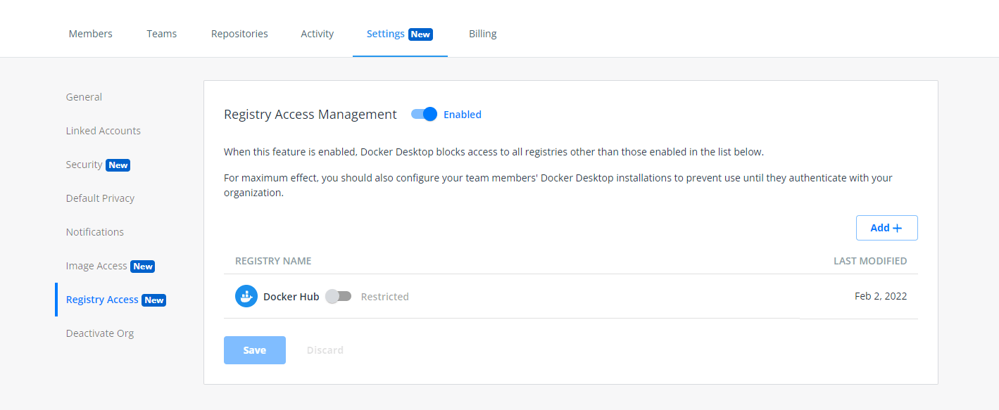

>Note
>
>Registry Access Management is available to Docker Business customers only. 

With Registry Access Management, administrators can ensure that their developers using Docker Desktop only access registries that are allowed. This is done through the Registry Access Management dashboard on Docker Hub. 

Below are some example registries administrators can allow: 
 - Docker Hub. This is enabled by default.
 - Amazon ECR
 - GitHub Container Registry
 - Google Container Registry

Administrators can ensure registries are locked in and cannot be edited by developers, if Enhanced Container Isolation is switched on. To learn more, see [Enhanced Container Isolation](enhanced-container-isolation/index.md).

## Prerequisites 

You need to [configure a registry.json to enforce sign-in](../../docker-hub/configure-sign-in.md). For Registry Access Management to take effect, Docker Desktop users must authenticate to your organization. 

## Configure Registry Access Management permissions

To configure Registry Access Management permissions:

1. Sign in to your [Docker Hub](https://hub.docker.com){: target="_blank" rel="noopener" class="_"} account as an organization owner.
2. Select an organization and then navigate to the **Settings** tab on the **Organizations** page and select **Registry Access**.
3. Toggle on Registry Access Management to set the permissions for your registry.

   > **Note**
   >
   > When enabled, the Docker Hub registry is set by default, however you can also restrict this registry for your developers.

4. To add registries to your list, select **Add** and enter your registry details in the applicable fields, then select **Create**.
5. Verify that the registry appears in your list and select **Save & Apply**. You can verify that your changes are saved in the **Activity** tab. There is no limit on the number of registries you can add.

   > **Note**
   >
   > Once you add a registry, it takes up to 24 hours for the changes to be enforced on your developers’ machines. If you want to apply the changes sooner, you must force a Docker logout on your developers’ machine and have the developers re-authenticate for Docker Desktop.

{:width="700px"}

## Verify the restrictions

The new Registry Access Management policy takes effect after the developer successfully authenticates to Docker Desktop using their organization credentials. If a developer attempts to pull an image from a disallowed registry via the Docker CLI, they receive an error message that the organization has disallowed this registry.

## Known issues

There are certain limitations when using Registry Access Management:

- Windows image pulls, and image builds are not restricted
- Builds such as `docker buildx` using a Kubernetes driver are not restricted
- Builds such as `docker buildx` using a custom docker-container driver are not restricted
- Blocking is DNS-based; you must use a registry's access control mechanisms to distinguish between “push” and “pull”
- WSL 2 requires at least a 5.4 series Linux kernel (this does not apply to earlier Linux kernel series)
- Under the WSL 2 network, traffic from all Linux distributions is restricted (this will be resolved in the updated 5.15 series Linux kernel)

Also, Registry Access Management operates on the level of hosts, not IP addresses. Developers can bypass this restriction within their domain resolution, for example by running Docker against a local proxy or modifying their operating system's `sts` file. Docker Desktop does not support blocking these forms of manipulation.
