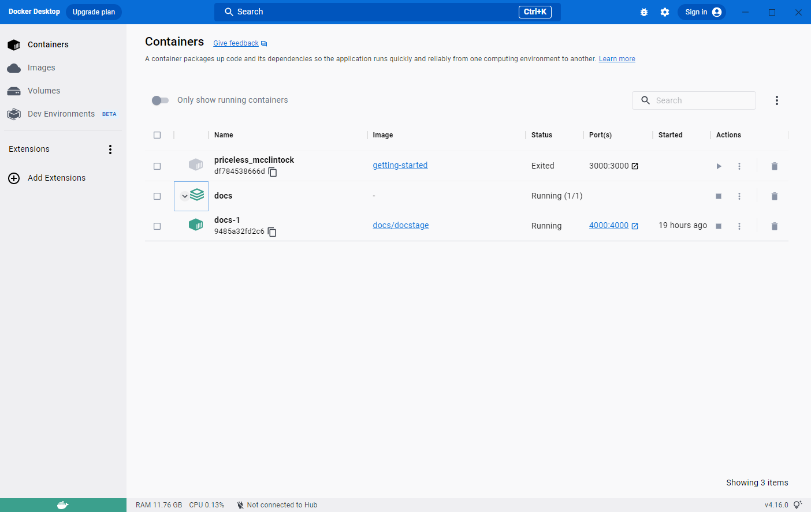

> **Update to the Docker Desktop terms**
>
> Commercial use of Docker Desktop in larger enterprises (more than 250
> employees OR more than $10 million USD in annual revenue) now requires a paid
> subscription.
{: .important}

Docker Desktop is an easy-to-install application for your Mac or Windows environment
that enables you to build and share containerized applications and microservices. 

It provides a simple interface that enables you to manage your containers, applications, and images directly from your machine without having to use the CLI to perform core actions.

Docker Desktop includes:

- [Docker Engine](../engine/index.md)
- Docker CLI client
- [Docker Compose](../compose/index.md)
-[Docker Content Trust](../engine/security/trust/index.md)
- [Kubernetes](https://github.com/kubernetes/kubernetes/)
- [Credential Helper](https://github.com/docker/docker-credential-helpers/).

Docker Desktop works with your choice of development tools and languages and
gives you access to a vast library of certified images and templates in
[Docker Hub](https://hub.docker.com/). This enables development teams to extend
their environment to rapidly auto-build, continuously integrate, and collaborate
using a secure repository.

## Overview of Docker Dashboard

When you open Docker Desktop, the Docker Dashboard displays.

{:width="750px"}

The **Containers** view provides a runtime view of all your containers and applications. It allows you to interact with containers and applications, and manage the lifecycle of your applications directly from your machine. This view also provides an intuitive interface to perform common actions to inspect, interact with, and manage your Docker objects including containers and Docker Compose-based applications. For more information, see [Explore running containers and applications](use-desktop/container.md).

The **Images** view displays a list of your Docker images and allows you to run an image as a container, pull the latest version of an image from Docker Hub, and inspect images. It also displays a summary of the vulnerability scanning report using Snyk. In addition, the **Images** view contains clean-up options to remove unwanted images from the disk to reclaim space. If you are logged in, you can also see the images you and your organization have shared on Docker Hub. For more information, see [Explore your images](use-desktop/images.md)

The **Volumes** view displays a list of volumes and allows you to easily create and delete volumes and see which ones are being used. For more information, see [Explore volumes](use-desktop/volumes.md).

In addition, the Docker Dashboard allows you to:

- Easily navigate to the **Preferences** (**Settings** in Windows) menu to configure Docker Desktop preferences. Select the **Preferences** or **Settings** icon in the Dashboard header.
- Access the **Troubleshoot** menu to debug and perform restart operations. Select the **Troubleshoot** icon in the Dashboard header.

### Other key features of Docker Desktop:

* Ability to containerize and share any application on any cloud platform, in multiple languages and frameworks.
* Easy installation and setup of a complete Docker development environment.
* Includes the latest version of Kubernetes.
* Automatic updates to keep you up to date and secure.
* On Windows, the ability to toggle between Linux and Windows Server environments to build applications.
* Fast and reliable performance with native Windows Hyper-V virtualization.
* Ability to work natively on Linux through WSL 2 on Windows machines.
* Volume mounting for code and data, including file change notifications and easy access to running containers on the localhost network.
* In-container development and debugging with supported IDEs.

## Download and install

Docker Desktop is available for Mac, Linux, and Windows. For download information, system requirements, and installation instructions, see:

* [Install Docker Desktop on Linux](install/linux-install.md)
* [Install Docker Desktop on Mac](install/mac-install.md)
* [Install Docker Desktop on Windows](install/windows-install.md)

For information about Docker Desktop licensing, see [Docker Desktop License Agreement](../subscription/index.md#docker-desktop-license-agreement).

For information about new features, improvements, and bug fixes in Docker Desktop releases, see [Release notes](release-notes.md).
