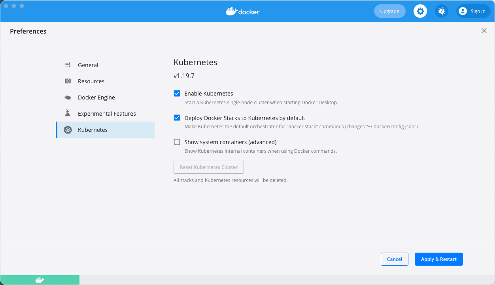

Docker Desktop includes a standalone Kubernetes server and client,
as well as Docker CLI integration that runs on your machine. The Kubernetes server runs locally within your Docker instance, is not configurable, and is a single-node cluster.

The Kubernetes server runs within a Docker container on your local system, and
is only for local testing. Enabling Kubernetes allows you to deploy
your workloads in parallel, on Kubernetes, Swarm, and as standalone containers. Enabling or disabling the Kubernetes server does not affect your other
workloads.

## Prerequisites

The Kubernetes client command `kubectl` is included and configured to connect
to the local Kubernetes server. If you have already installed `kubectl` and
pointing to some other environment, such as `minikube` or a GKE cluster, ensure you change the context so that `kubectl` is pointing to `docker-desktop`:

```console
$ kubectl config get-contexts
$ kubectl config use-context docker-desktop
```

If you installed `kubectl` using Homebrew, or by some other method, and
experience conflicts, remove `/usr/local/bin/kubectl`.

## Enable Kubernetes

To enable Kubernetes in Docker Desktop, go to **Preferences** > **Kubernetes** and then click **Enable Kubernetes**.

By default, Kubernetes containers are hidden from commands like `docker ps`, because managing them manually is not supported. To see these internal containers, select **Show system containers (advanced)**. Most users do not need this option.

Click **Apply & Restart** to save the settings and then click **Install** to confirm. This instantiates images required to run the Kubernetes server as containers, and installs the `/usr/local/bin/kubectl` command on your machine.

{:width="750px"}

When Kubernetes is enabled and running, an additional status bar item displays
  at the bottom right of the Docker Desktop Settings dialog.

The status of Kubernetes shows in the Docker menu and the context points to
  `docker-desktop`.

{: width="400px"}

> Upgrade Kubernetes
>
> Docker Desktop does not upgrade your Kubernetes cluster automatically after a new update. To upgrade your Kubernetes cluster to the latest version, select **Reset Kubernetes Cluster**.

## Use the kubectl command

Kubernetes integration provides the Kubernetes CLI command
at `/usr/local/bin/kubectl` on Mac and at `C:\>Program Files\Docker\Docker\Resources\bin\kubectl.exe` on Windows. This location may not be in your shell's `PATH`
variable, so you may need to type the full path of the command or add it to
the `PATH`.

You can test the command by listing the available nodes:

```console
$ kubectl get nodes

NAME                 STATUS    ROLES     AGE       VERSION
docker-desktop       Ready     master    3h        v1.19.7
```

For more information about `kubectl`, see the
[`kubectl` documentation](https://kubernetes.io/docs/reference/kubectl/overview/){:target="_blank" rel="noopener" class="_"}.

## Disable Kubernetes

To disable Kubernetes support at any time, clear the **Enable Kubernetes** check box. This stops and removes Kubernetes containers, and also removes the `/usr/local/bin/kubectl` command.
