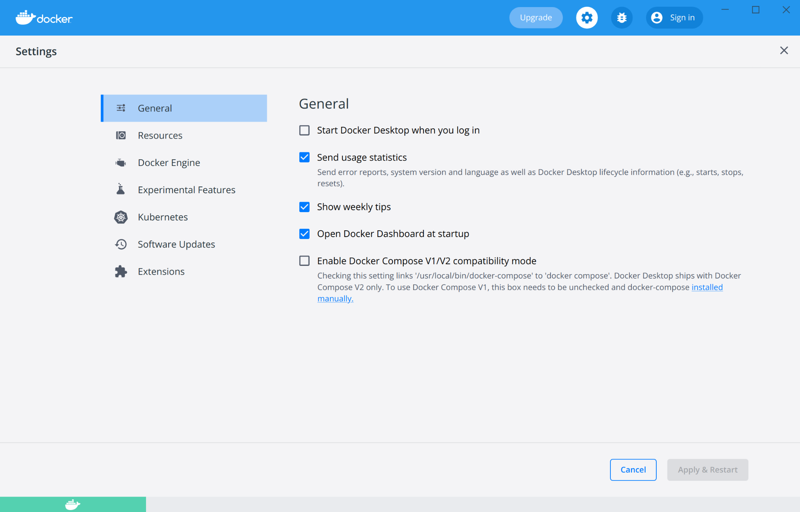
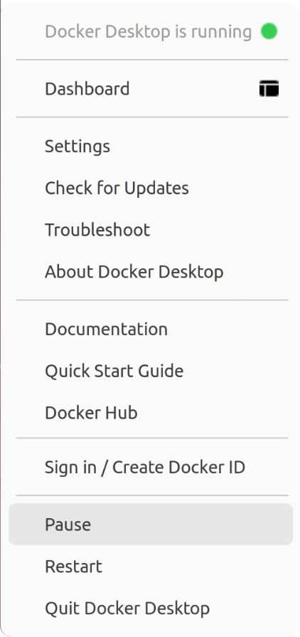

Welcome to Docker Desktop! The Docker Desktop for Linux user manual provides information on how to configure and manage your Docker Desktop settings.

Docker Desktop is an easy-to-install application that enables you to build and share containerized applications and microservices. 

For information about Docker Desktop download, system requirements, and installation instructions, see [Install Docker Desktop](install.md).

## Settings

The Docker **Settings** menu allows you to configure your Docker settings such as installation, updates, version channels, Docker Hub login,
and more.

Choose the Docker menu {: .inline} > **Settings** from the
menu bar and configure the runtime options described below.

### General

{:width="750px"}

On the **General** tab, you can configure when to start Docker and specify other settings:

- **Start Docker Desktop when you log in**: Automatically starts Docker Desktop when you open your session.

- **Send usage statistics**: Docker Desktop sends diagnostics, crash reports, and usage data. This information helps Docker improve and troubleshoot the application. Clear the check box to opt out.

- **Show weekly tips**: Displays useful advice and suggestions about using Docker.

- **Open Docker Desktop dashboard at startup**: Automatically opens the dashboard when starting Docker Desktop.

- **Enable Docker Compose V1/V2 compatibility mode**: Select this option to enable the `docker-compose` command to use Docker Compose V2.

### Resources

The **Resources** tab allows you to configure CPU, memory, disk, proxies, network, and other resources.

#### Advanced

On the Advanced tab, you can limit resources available to Docker.

{:width="750px"}

Advanced settings are:

- **CPUs**: By default, Docker Desktop is set to use half the number of processors
available on the host machine. To increase processing power, set this to a
higher number; to decrease, lower the number.

- **Memory**: By default, Docker Desktop is set to use 25% of your host's memory. To increase the RAM, set this to a higher number. To decrease it, lower the number.

- **Swap**: Configure swap file size as needed. The default is 1 GB.

- **Disk image size**: Specify the size of the disk image.

- **Disk image location**: Specify the location of the Linux volume where containers and images are stored.

You can also move the disk image to a different location. If you attempt to move a disk image to a location that already has one, you get a prompt asking if you want to use the existing image or replace it.

#### File sharing

Use File sharing to allow local directories on the Linux host to be shared with Linux containers.
This is especially useful for
editing source code in an IDE on the host while running and testing the code in a container.
By default the `/home/<user>` directory is shared. If your project is outside this directory then it must be added
to the list. Otherwise you may get `Mounts denied` or `cannot start service` errors at runtime.

File share settings are:

- **Add a Directory**: Click `+` and navigate to the directory you want to add.

- **Remove a Directory**: Click `-` next to the directory you want to remove

- **Apply & Restart** makes the directory available to containers using Docker's
  bind mount (`-v`) feature.

> Tips on shared folders, permissions, and volume mounts
>
 * Share only the directories that you need with the container. File sharing
 introduces overhead as any changes to the files on the host need to be notified
 to the Linux VM. Sharing too many files can lead to high CPU load and slow
 filesystem performance.
>
 * Shared folders are designed to allow application code to be edited 
 on the host while being executed in containers. For non-code items
 such as cache directories or databases, the performance will be much 
 better if they are stored in the Linux VM, using a [data volume](../../storage/volumes.md)
 (named volume) or [data container](../../storage/volumes.md).

#### Proxies

To configure HTTP proxies, switch on the **Manual proxy configuration** setting.

Your proxy settings, however, will not be propagated into the containers you start.
If you wish to set the proxy settings for your containers, you need to define
environment variables for them, just like you would do on Linux, for example:

```console
$ docker run -e HTTP_PROXY=http://proxy.example.com:3128 alpine env

PATH=/usr/local/sbin:/usr/local/bin:/usr/sbin:/usr/bin:/sbin:/bin
HOSTNAME=b7edf988b2b5
TERM=xterm
HOME=/root
HTTP_PROXY=http://proxy.example.com:3128
```

For more information on configuring the Docker CLI to automatically set proxy variables for both `docker run` and `docker build`
see [Configure the Docker client](/network/proxy#configure-the-docker-client).

#### Network

Docker Desktop uses a private IPv4 network for internal services such as a DNS server and an HTTP proxy. In case the choice of subnet clashes with something in your environment, specify a custom subnet using the **Network** setting.

### Docker Engine

The Docker Engine page allows you to configure the Docker daemon to determine how your containers run.

Type a JSON configuration file in the box to configure the daemon settings. For a full list of options, see the Docker Engine
[dockerd commandline reference](/engine/reference/commandline/dockerd/){:target="_blank" rel="noopener" class="_"}.

Click **Apply & Restart** to save your settings and restart Docker Desktop.

### Experimental Features

On the **Experimental Features** page, you can specify whether or not to enable experimental features.

Experimental features provide early access to future product functionality. These features are intended for testing and feedback only as they may change between releases without warning or can be removed entirely from a future release. Experimental features must not be used in production environments. Docker does not offer support for experimental features.

### Kubernetes

Docker Desktop includes a standalone Kubernetes server, so
that you can test deploying your Docker workloads on Kubernetes. To enable Kubernetes support and install a standalone instance of Kubernetes running as a Docker container, select **Enable Kubernetes**.

- Select **Show system containers (advanced)** to view internal containers when using Docker commands.

- Select **Reset Kubernetes cluster** to delete all stacks and Kubernetes resources. For more information, see [Kubernetes](../kubernetes.md){:target="_blank" rel="noopener" class="_"}.

- Click **Apply & Restart** for your changes to take effect.

### Reset

> Reset and Restart options
>
> On Docker Desktop Linux, the **Restart Docker Desktop**, **Reset to factory defaults**, and other reset options are available from the **Troubleshoot** menu.

For information about the reset options, see [Logs and Troubleshooting](troubleshoot.md).

### Software Updates

The **Software Updates** section notifies you of any updates available to Docker Desktop. When there's a new update, click the **Release Notes** option to learn what's included in the updated version.

> **Disable automatic check for updates**
>
> Turn off the check for updates by clearing the **Automatically check for updates** check box. This disables notifications in the Docker menu and also the notification badge that appears on the Docker Dashboard. To check for updates manually, select the **Check for updates** option in the Docker menu.

## Dashboard

The Docker Dashboard enables you to interact with containers and applications and manage the lifecycle of your applications directly from your machine. The Dashboard UI shows all running, stopped, and started containers with their state. It provides an intuitive interface to perform common actions to inspect and manage containers and existing Docker Compose applications. For more information, see [Docker Dashboard](../dashboard.md).

## Credentials management

Docker Desktop relies on [`pass`](https://www.passwordstore.org/){: target="_blank" rel="noopener" class="_"} to store credentials in gpg2-encrypted files.
Before signing in to Docker Hub from the Docker Dashboard or the Docker menu, you must initialize `pass`.
Docker Desktop displays a warning if you've not initialized `pass`.

You can intialize pass by using a gpg key. To generate a gpg key, run:

``` console
$ gpg --generate-key
...
GnuPG needs to construct a user ID to identify your key.

Real name: Molly
Email address: molly@example.com
You selected this USER-ID:
    "Molly <molly@example.com>"

Change (N)ame, (E)mail, or (O)kay/(Q)uit? O
...
pub   rsa3072 2022-03-31 [SC] [expires: 2024-03-30]
      7865BA9185AFA2C26C5B505669FC4F36530097C2
uid                      Molly <molly@example.com>
sub   rsa3072 2022-03-31 [E] [expires: 2024-03-30]
```

To initialize `pass`, run:

```console
molly@ubuntu:~$ pass init 7865BA9185AFA2C26C5B505669FC4F36530097C2
mkdir: created directory '/home/molly/.password-store/'
Password store initialized for 7865BA9185AFA2C26C5B505669FC4F36530097C2
```

Once `pass` is initialized, we can sign in on the Docker Dashboard and pull our private images.
When credentials are used by the Docker CLI or Docker Desktop, a user prompt may pop up for the password you set during the gpg key generation.

```console
$ docker pull molly/privateimage
Using default tag: latest
latest: Pulling from molly/privateimage
3b9cc81c3203: Pull complete 
Digest: sha256:3c6b73ce467f04d4897d7a7439782721fd28ec9bf62ea2ad9e81a5fb7fb3ff96
Status: Downloaded newer image for molly/privateimage:latest
docker.io/molly/privateimage:latest
```

## Docker Hub

Select **Sign in / Create Docker ID** from the Docker Desktop menu to access your [Docker](https://hub.docker.com/){: target="_blank" rel="noopener" class="_" } account. Once logged in, you can access your Docker Hub repositories and organizations directly from the Docker Desktop menu.

For more information, refer to the following [Docker Hub topics](../../docker-hub/index.md){:target="_blank"
class="_"}:

* [Organizations and Teams in Docker Hub](../../docker-hub/orgs.md){:target="_blank" rel="noopener" class="_"}
* [Builds](../../docker-hub/builds/index.md){:target="_blank" rel="noopener" class="_"}

## Pause/Resume

You can pause your Docker Desktop session when you are not actively using it and save CPU resources on your machine. When you pause Docker Desktop, the Linux VM running Docker Engine is paused, the current state of all your containers are saved in memory, and all processes are frozen. This reduces the CPU usage and helps you retain a longer battery life on your laptop. You can resume Docker Desktop when you want by clicking the Resume option.

From the Docker menu, select {: .inline} > **Pause** to pause Docker Desktop.

{:width="250px"}

Docker Desktop now displays the paused status on the Docker menu and on the  **Containers**, **Images**, **Volumes**, and **Dev Environment** screens on the Docker Dashboard. You can still access the **Settings** and the **Troubleshoot** menu from the Dashboard when you've paused Docker Desktop.

Select {: .inline} > **Resume** to resume Docker Desktop.

> **Note**
>
> When Docker Desktop is paused, running any commands in the Docker CLI will automatically resume Docker Desktop.

## Give feedback and get help

To report bugs or problems, log on to Docker Desktop [for Linux issues on
GitHub](https://github.com/docker/desktop-linux/issues){:target="_blank" rel="noopener" class="_"},
where you can review community reported issues, and file new ones.  See
[Logs and Troubleshooting](troubleshoot.md) for more details.

For information about providing feedback on the documentation or update it yourself, see [Contribute to documentation](/opensource/).

## Where to go next

* Try out the walkthrough at [Get Started](/get-started/){: target="_blank"
  class="_"}.

* Dig in deeper with [Docker Labs](https://github.com/docker/labs/) example
  walkthroughs and source code.

* For a summary of Docker command line interface (CLI) commands, see
  [Docker CLI Reference Guide](../../engine/api/index.md){: target="_blank" rel="noopener" class="_"}.
