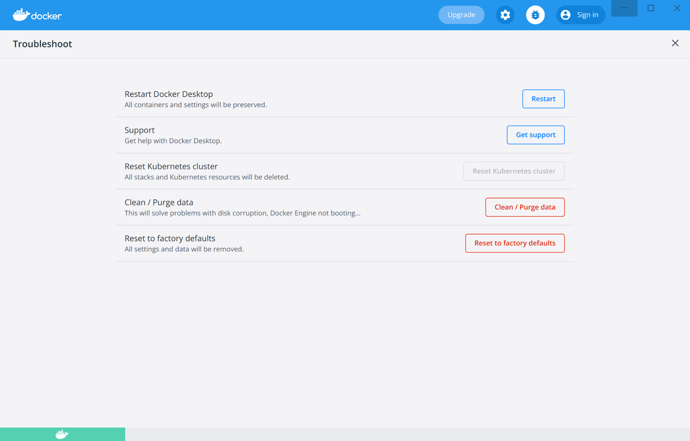
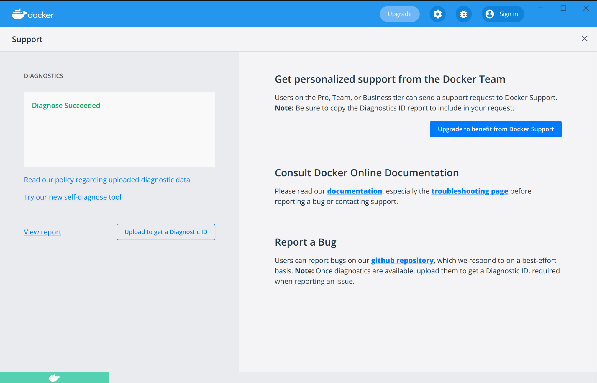



This page contains information on how to diagnose and troubleshoot Docker Desktop issues, request Docker Desktop support, send logs and communicate with the Docker Desktop team, use our forums and Success Center, browse and log issues on GitHub, and find workarounds for known problems.

## Troubleshoot

Choose {: .inline} > **Troubleshoot**
from the menu bar to see the troubleshoot options.

{:width="600px"}

The Troubleshoot page contains the following options:

* **Restart Docker Desktop**: Select to restart Docker Desktop.

* **Support**: Users with a paid Docker subscription can use this option to send a support request. Other users can use this option to diagnose any issues in Docker Desktop. For more information, see [Diagnose and feedback](#diagnose-and-feedback) and [Support](#support).

* **Reset Kubernetes cluster**: Select this option to delete all stacks and Kubernetes resources. For more information, see [Kubernetes](index.md#kubernetes).

* **Clean / Purge data**: This option resets all Docker data _without_ a
reset to factory defaults. Selecting this option results in the loss of existing settings.

* **Reset to factory defaults**: Choose this option to reset all options on
Docker Desktop to their initial state, the same as when Docker Desktop was first installed.


## Diagnose and feedback

### In-app diagnostics

If you encounter problems for which you do not find solutions in this
documentation, on [Docker Desktop issues on
GitHub](https://github.com/docker/desktop-linux/issues), we can help you troubleshoot
the log data. Before reporting an issue, we recommend that you read the information provided on this page to fix some common known issues.

> **Note**
>
> Docker Desktop offers support for users with a paid Docker subscription. If you are experiencing any issues with Docker Desktop, follow the instructions in this section to send a support request to Docker Support.

Before you get started, we recommend that you sign into your Docker Desktop application and your [Docker Hub](https://hub.docker.com/){:target="_blank" rel="noopener" class="_"} account.

1. Choose {: .inline} > **Troubleshoot**.
2. Optional: Sign into Docker Desktop. In addition, ensure you are signed into your [Docker account](https://hub.docker.com/){:target="_blank" rel="noopener" class="_"}.
3. Click **Get support**. This opens the in-app **Support** page and starts collecting the diagnostics.
    {:width="600px"}
4. When the diagnostics collection process is complete, click **Upload to get a Diagnostic ID**.
5. When the diagnostics have been uploaded, Docker Desktop prints a diagnostic ID. Copy this ID.
6. If you have a paid Docker subscription, click **Contact Support**. This opens the [Docker Desktop support](https://hub.docker.com/support/desktop/){:target="_blank" rel="noopener" class="_"} form. Fill in the information required and add the ID you copied earlier to the Diagnostics ID field. Click **Submit** to request Docker Desktop support.
   > **Note**
    >
    > You must be signed in to Docker Desktop using your Pro, Team, or Business tier credentials to access the support form. For information on what's covered as part of Docker Desktop support, see [Support](#support).
7. If you don't have a paid Docker subscription, you can click **Upgrade to benefit from Docker Support** to upgrade your existing account.
    Alternatively, click **Report a Bug** to open a new Docker Desktop issue on GitHub. This opens Docker Desktop [for Linux](https://github.com/docker/desktop-linux/issues/) on GitHub in your web browser in a 'New issue' template. Complete the information required and ensure you add the diagnostic ID you copied earlier. Click **submit new issue** to create a new issue.

### Diagnosing from the terminal

In some cases, it is useful to run the diagnostics yourself, for instance, if
Docker Desktop cannot start.

First, locate the `com.docker.diagnose` tool.  If you have installed Docker Desktop in the Applications directory, then it is located at
`/opt/docker-desktop/bin/com.docker.diagnose`.

To create *and upload* diagnostics, run:

```console
$ /opt/docker-desktop/bin/com.docker.diagnose gather -upload
```

After the diagnostics have finished, you should have the following output,
containing your diagnostics ID:

```sh
Diagnostics Bundle: /tmp/B8CF8400-47B3-4068-ADA4-3BBDCE3985D9/20190726143610.zip
Diagnostics ID:     B8CF8400-47B3-4068-ADA4-3BBDCE3985D9/20190726143610 (uploaded)
Diagnostics Bundle: /tmp/BE9AFAAF-F68B-41D0-9D12-84760E6B8740/20190905152051.zip
Diagnostics ID:     BE9AFAAF-F68B-41D0-9D12-84760E6B8740/20190905152051 (uploaded)
```

The diagnostics ID (here BE9AFAAF-F68B-41D0-9D12-84760E6B8740/20190905152051) is
composed of your user ID (BE9AFAAF-F68B-41D0-9D12-84760E6B8740) and a timestamp
(20190905152051). Ensure you provide the full diagnostics ID, and not just the user ID.

To view the contents of the diagnostic file, run:

```console
$ unzip –l /tmp/BE9AFAAF-F68B-41D0-9D12-84760E6B8740/20190905152051.zip
```

If you have a paid Docker subscription, open the [Docker Desktop support](https://hub.docker.com/support/desktop/){:target="_blank" rel="noopener" class="_"} form. Fill in the information required and add the ID to the Diagnostics ID field. Click **Submit** to request Docker Desktop support.

### Self-diagnose tool

Docker Desktop contains a self-diagnose tool which helps you to identify some common problems. Before you run the self-diagnose tool, locate `com.docker.diagnose`. If you have installed Docker Desktop
in the Applications directory, then the self-diagnose tool will be located at
`/opt/docker-desktop/bin/com.docker.diagnose`.

To run the self-diagnose tool, run:

```console
$ /opt/docker-desktop/bin/com.docker.diagnose check
```

The tool runs a suite of checks and displays **PASS** or **FAIL** next to each check. If there are any failures, it highlights the most relevant at the end of the report.

> **Feedback**
>
> Let us know your feedback on the self-diagnose tool by creating an issue in the [desktop-linux](https://github.com/docker/desktop-linux/issues) GitHub repository.

<a name="logs"></a>

## Check the logs

In addition to using the diagnose and feedback option to submit logs, you can
browse the logs yourself.

#### In a terminal

If you prefer to investigate issues yourself, you can access Docker Desktop logs by running the following command:

```console
$ journalctl --user --unit=docker-desktop
```

You can also find the logs for the internal components included in Docker
Desktop at `$HOME/.docker/desktop/log/`.

#### View the Docker Daemon logs

Refer to the [read the logs](../../config/daemon/index.md#read-the-logs) section
to learn how to view the Docker Daemon logs.

<a name="troubleshoot"></a>
## Troubleshooting

### Volume mounting requires file sharing for any project directories outside of `$HOME`

If you are using mounted volumes and get runtime errors indicating an
application file is not found, access to a volume mount is denied, or a service
cannot start, such as when using [Docker Compose](../../compose/gettingstarted.md),
you might need to enable [file sharing](index.md#file-sharing).

Volume mounting requires shared drives for projects that live outside of the
`/home/<user>` directory. Go to {: .inline} >
**Settings** > **Resources** > **File sharing** and share the drive that contains the Dockerfile and volume.

### Workarounds for common problems

* If `docker` commands aren't working properly or as expected, you may need to
  unset some environment variables, to make sure you are not using the deprecated Docker Machine environment in your shell or command window. Unset the
  `DOCKER_HOST` environment variable and related variables. If you use bash, use the following command: `unset ${!DOCKER_*}`

* For the `hello-world-nginx` example, Docker Desktop must be running to get to
  the web server on `http://localhost/`. Make sure that the Docker icon is
  displayed on the menu bar, and that you run the Docker commands in a shell that is connected to the Docker Desktop Engine.
  Otherwise, you might start the webserver container but get a "web page not
  available" error when you go to `localhost`.

* If you see errors like `Bind for 0.0.0.0:8080 failed: port is already
  allocated` or `listen tcp:0.0.0.0:8080: bind: address is already in use`:


  * Run `lsof -i tcp:8080` to discover the name and pid of the other process and
    decide whether to shut the other process down, or to use a different port in
    your docker app.

