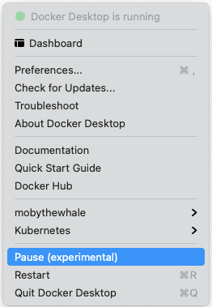

Welcome to Docker Desktop! The Docker Desktop for Mac user manual provides information on how to configure and manage your Docker Desktop settings.

For information about Docker Desktop download, system requirements, and installation instructions, see [Install Docker Desktop](install.md).

## Preferences

The Docker **Preferences** menu allows you to configure your Docker settings such as installation, updates, version channels, Docker Hub login,
and more.

Choose the Docker menu {: .inline} > **Preferences** from the
menu bar and configure the runtime options described below.

### General

{:width="750px"}

On the **General** tab, you can configure when to start Docker and specify other settings:

- **Start Docker Desktop when you log in**: Automatically starts Docker Desktop when you open your session.

- **Include VM in Time Machine backups**: Select this option to back up the Docker Desktop virtual machine. This option is disabled by default.

- **Use gRPC FUSE for file sharing**: Clear this check box to use the legacy osxfs file sharing instead.

- **Send usage statistics**: Docker Desktop sends diagnostics, crash reports, and usage data. This information helps Docker improve and troubleshoot the application. Clear the check box to opt out.

- **Show weekly tips**: Displays useful advice and suggestions about using Docker.

- **Open Docker Desktop dashboard at startup**: Automatically opens the dashboard when starting Docker Desktop.

- **Use Docker Compose V2**: Select this option to enable the `docker-compose` command to use Docker Compose V2. For more information, see [Docker Compose V2](../../compose/cli-command.md).

### Resources

The **Resources** tab allows you to configure CPU, memory, disk, proxies, network, and other resources.

#### Advanced

On the Advanced tab, you can limit resources available to Docker.

{:width="750px"}

Advanced settings are:

- **CPUs**: By default, Docker Desktop is set to use half the number of processors
available on the host machine. To increase processing power, set this to a
higher number; to decrease, lower the number.

- **Memory**: By default, Docker Desktop is set to use `2` GB runtime memory,
allocated from the total available memory on your Mac. To increase the RAM, set this to a higher number. To decrease it, lower the number.

- **Swap**: Configure swap file size as needed. The default is 1 GB.

- **Disk image size**: Specify the size of the disk image.

- **Disk image location**: Specify the location of the Linux volume where containers and images are stored.

You can also move the disk image to a different location. If you attempt to move a disk image to a location that already has one, you get a prompt asking if you want to use the existing image or replace it.

#### File sharing

Use File sharing to allow local directories on the Mac to be shared with Linux containers.
This is especially useful for
editing source code in an IDE on the host while running and testing the code in a container.
By default the `/Users`, `/Volume`, `/private`, `/tmp` and `/var/folders` directory are shared. If your project is outside this directory then it must be added
to the list. Otherwise you may get `Mounts denied` or `cannot start service` errors at runtime.

File share settings are:

- **Add a Directory**: Click `+` and navigate to the directory you want to add.

- **Apply & Restart** makes the directory available to containers using Docker's
  bind mount (`-v`) feature.

> Tips on shared folders, permissions, and volume mounts
>
 * Share only the directories that you need with the container. File sharing
 introduces overhead as any changes to the files on the host need to be notified
 to the Linux VM. Sharing too many files can lead to high CPU load and slow
 filesystem performance.
>
 * Shared folders are designed to allow application code to be edited 
 on the host while being executed in containers. For non-code items
 such as cache directories or databases, the performance will be much 
 better if they are stored in the Linux VM, using a [data volume](../../storage/volumes.md)
 (named volume) or [data container](../../storage/volumes.md).
>
 * If you share the whole of your home directory into a container, MacOS may
 prompt you to give Docker access to personal areas of your home directory such as
 your Reminders or Downloads.
>
 * By default, Mac file systems are case-insensitive while Linux is case-sensitive.
 On Linux, it is possible to create 2 separate files: `test` and `Test`, 
 while on Mac these filenames would actually refer to the same underlying file. 
 This can lead to problems where an app works correctly on a Mac 
 (where the file contents are shared) but fails when run in Linux in 
 production (where the file contents are distinct). To avoid this, Docker Desktop 
 insists that all shared files are accessed as their original case. Therefore, if a file 
 is created called `test`, it must be opened as `test`. Attempts to open `Test` will 
 fail with the error `No such file or directory`. Similarly, once a file called `test` 
 is created, attempts to create a second file called `Test` will fail. For more information, 
 see [Volume mounting requires file sharing for any project directories outside of `/Users`](troubleshoot.md#volume-mounting-requires-file-sharing-for-any-project-directories-outside-of-users).)

#### Proxies

Docker Desktop detects HTTP/HTTPS Proxy Settings from macOS and automatically
propagates these to Docker. For example, if you set your
proxy settings to `http://proxy.example.com`, Docker uses this proxy when
pulling containers.

Your proxy settings, however, will not be propagated into the containers you start.
If you wish to set the proxy settings for your containers, you need to define
environment variables for them, just like you would do on Linux, for example:

```console
$ docker run -e HTTP_PROXY=http://proxy.example.com:3128 alpine env

PATH=/usr/local/sbin:/usr/local/bin:/usr/sbin:/usr/bin:/sbin:/bin
HOSTNAME=b7edf988b2b5
TERM=xterm
HOME=/root
HTTP_PROXY=http://proxy.example.com:3128
```

For more information on setting environment variables for running containers,
see [Set environment variables](/engine/reference/commandline/run/#set-environment-variables--e---env---env-file).

#### Network

You can configure Docker Desktop networking to work on a virtual private network (VPN). Specify a network address translation (NAT) prefix and subnet mask to enable Internet connectivity.

### Docker Engine

The Docker Engine page allows you to configure the Docker daemon to determine how your containers run.

Type a JSON configuration file in the box to configure the daemon settings. For a full list of options, see the Docker Engine
[dockerd commandline reference](/engine/reference/commandline/dockerd/){:target="_blank" rel="noopener" class="_"}.

Click **Apply & Restart** to save your settings and restart Docker Desktop.

### Command Line

On the Command Line page, you can specify whether or not to enable experimental features.



You can toggle the experimental features on and off in Docker Desktop. If you toggle the experimental features off, Docker Desktop uses the current generally available release of Docker Engine.

You can see whether you are running experimental mode at the command line. If
`Experimental` is `true`, then Docker is running in experimental mode, as shown
here. (If `false`, Experimental mode is off.)

```console
$ docker version

Client: Docker Engine - Community
 Version:           19.03.1
 API version:       1.40
 Go version:        go1.12.5
 Git commit:        74b1e89
 Built:             Thu Jul 25 21:18:17 2019
 OS/Arch:           darwin/amd64
 Experimental:      true

Server: Docker Engine - Community
 Engine:
  Version:          19.03.1
  API version:      1.40 (minimum version 1.12)
  Go version:       go1.12.5
  Git commit:       74b1e89
  Built:            Thu Jul 25 21:17:52 2019
  OS/Arch:          linux/amd64
  Experimental:     true
 containerd:
  Version:          v1.2.6
  GitCommit:        894b81a4b802e4eb2a91d1ce216b8817763c29fb
 runc:
  Version:          1.0.0-rc8
  GitCommit:        425e105d5a03fabd737a126ad93d62a9eeede87f
 docker-init:
  Version:          0.18.0
  GitCommit:        fec3683
```

### Kubernetes

Docker Desktop includes a standalone Kubernetes server that runs on your Mac, so
that you can test deploying your Docker workloads on Kubernetes. To enable Kubernetes support and install a standalone instance of Kubernetes running as a Docker container, select **Enable Kubernetes**.

For more information about using the Kubernetes integration with Docker Desktop, see [Deploy on Kubernetes](../kubernetes.md){:target="_blank" rel="noopener" class="_"}.

### Reset

> Reset and Restart options
>
> On Docker Desktop Mac, the **Restart Docker Desktop**, **Reset to factory defaults**, and other reset options are available from the **Troubleshoot** menu.

For information about the reset options, see [Logs and Troubleshooting](troubleshoot.md).

### Software Updates

The **Software Updates** section notifies you of any updates available to Docker Desktop. When there's a new update, you can choose to download the update right away, or click the **Release Notes** option to learn what's included in the updated version.

> **Disable automatic check for updates**
>
> Starting with Docker Desktop 4.2.0, the option to turn off the automatic check for updates is available for users on all Docker subscriptions, including Docker Personal and Docker Pro. Update to [Docker Desktop 4.2.0](../mac/release-notes/index.md) to start using this feature.
{: .important}

Turn off the check for updates by clearing the **Automatically Check for Updates** check box. This disables notifications in the Docker menu and also the notification badge that appears on the Docker Dashboard. To check for updates manually, select the **Check for updates** option in the Docker menu.

To allow Docker Desktop to automatically download new updates in the background, select **Always download updates**. This downloads newer versions of Docker Desktop when an update becomes available. After downloading the update, click **Apply and Restart** to install the update. You can do this either through the Docker menu or in the **Updates** section in the Docker Dashboard.

## Dashboard

The Docker Dashboard enables you to interact with containers and applications and manage the lifecycle of your applications directly from your machine. The Dashboard UI shows all running, stopped, and started containers with their state. It provides an intuitive interface to perform common actions to inspect and manage containers and existing Docker Compose applications. For more information, see [Docker Dashboard](../dashboard.md).

## Add TLS certificates

You can add trusted Certificate Authorities (CAs) (used to verify registry
server certificates) and client certificates (used to authenticate to
registries) to your Docker daemon.

### Add custom CA certificates (server side)

All trusted CAs (root or intermediate) are supported. Docker Desktop creates a
certificate bundle of all user-trusted CAs based on the Mac Keychain, and
appends it to Moby trusted certificates. So if an enterprise SSL certificate is
trusted by the user on the host, it is trusted by Docker Desktop.

To manually add a custom, self-signed certificate, start by adding the
certificate to the macOS keychain, which is picked up by Docker Desktop. Here is
an example:

```console
$ sudo security add-trusted-cert -d -r trustRoot -k /Library/Keychains/System.keychain ca.crt
```

Or, if you prefer to add the certificate to your own local keychain only (rather
than for all users), run this command instead:

```console
$ security add-trusted-cert -d -r trustRoot -k ~/Library/Keychains/login.keychain ca.crt
```

See also, [Directory structures for
certificates](#directory-structures-for-certificates).

> **Note**: You need to restart Docker Desktop after making any changes to the
> keychain or to the `~/.docker/certs.d` directory in order for the changes to
> take effect.

For a complete explanation of how to do this, see the blog post [Adding
Self-signed Registry Certs to Docker & Docker Desktop for
Mac](https://blog.container-solutions.com/adding-self-signed-registry-certs-docker-mac){:target="_blank" rel="noopener" class="_"}.

### Add client certificates

You can put your client certificates in
`~/.docker/certs.d/<MyRegistry>:<Port>/client.cert` and
`~/.docker/certs.d/<MyRegistry>:<Port>/client.key`.

When the Docker Desktop application starts, it copies the `~/.docker/certs.d`
folder on your Mac to the `/etc/docker/certs.d` directory on Moby (the Docker
Desktop `xhyve` virtual machine).

> * You need to restart Docker Desktop after making any changes to the keychain
>   or to the `~/.docker/certs.d` directory in order for the changes to take
>   effect.
>
> * The registry cannot be listed as an _insecure registry_ (see [Docker
>   Engine](#docker-engine). Docker Desktop ignores certificates listed
>   under insecure registries, and does not send client certificates. Commands
>   like `docker run` that attempt to pull from the registry produce error
>   messages on the command line, as well as on the registry.

### Directory structures for certificates

If you have this directory structure, you do not need to manually add the CA
certificate to your Mac OS system login:

```
/Users/<user>/.docker/certs.d/
└── <MyRegistry>:<Port>
   ├── ca.crt
   ├── client.cert
   └── client.key
```

The following further illustrates and explains a configuration with custom
certificates:

```
/etc/docker/certs.d/        <-- Certificate directory
└── localhost:5000          <-- Hostname:port
   ├── client.cert          <-- Client certificate
   ├── client.key           <-- Client key
   └── ca.crt               <-- Certificate authority that signed
                                the registry certificate
```

You can also have this directory structure, as long as the CA certificate is
also in your keychain.

```
/Users/<user>/.docker/certs.d/
└── <MyRegistry>:<Port>
    ├── client.cert
    └── client.key
```

To learn more about how to install a CA root certificate for the registry and
how to set the client TLS certificate for verification, see
[Verify repository client with certificates](../../engine/security/certificates.md)
in the Docker Engine topics.

## Install shell completion

Docker Desktop comes with scripts to enable completion for the `docker` and `docker-compose` commands. The completion scripts may be
found inside `Docker.app`, in the `Contents/Resources/etc/` directory and can be
installed both in Bash and Zsh.

### Bash

Bash has [built-in support for
completion](https://www.debian-administration.org/article/316/An_introduction_to_bash_completion_part_1){:target="_blank"
class="_"} To activate completion for Docker commands, these files need to be
copied or symlinked to your `bash_completion.d/` directory. For example, if you
installed bash via [Homebrew](https://brew.sh):

```bash
etc=/Applications/Docker.app/Contents/Resources/etc
ln -s $etc/docker.bash-completion $(brew --prefix)/etc/bash_completion.d/docker
ln -s $etc/docker-compose.bash-completion $(brew --prefix)/etc/bash_completion.d/docker-compose
```

Add the following to your `~/.bash_profile`:

```bash
[ -f /usr/local/etc/bash_completion ] && . /usr/local/etc/bash_completion
```

OR

```bash
if [ -f $(brew --prefix)/etc/bash_completion ]; then
. $(brew --prefix)/etc/bash_completion
fi
```

### Zsh

In Zsh, the [completion
system](http://zsh.sourceforge.net/Doc/Release/Completion-System.html){:target="_blank" rel="nooopener" class="_"}
takes care of things. To activate completion for Docker commands,
these files need to be copied or symlinked to your Zsh `site-functions/`
directory. For example, if you installed Zsh via [Homebrew](https://brew.sh){:target="_blank" rel="nooopener" class="_"}:

```bash
etc=/Applications/Docker.app/Contents/Resources/etc
ln -s $etc/docker.zsh-completion /usr/local/share/zsh/site-functions/_docker
ln -s $etc/docker-compose.zsh-completion /usr/local/share/zsh/site-functions/_docker-compose
```

### Fish-Shell

Fish-shell also supports tab completion [completion
system](https://fishshell.com/docs/current/#tab-completion){:target="_blank"
class="_"}. To activate completion for Docker commands,
these files need to be copied or symlinked to your Fish-shell `completions/`
directory.

Create the `completions` directory:

```console
$ mkdir -p ~/.config/fish/completions
```

Now add fish completions from docker.

```console
$ ln -shi /Applications/Docker.app/Contents/Resources/etc/docker.fish-completion ~/.config/fish/completions/docker.fish
$ ln -shi /Applications/Docker.app/Contents/Resources/etc/docker-compose.fish-completion ~/.config/fish/completions/docker-compose.fish
```

## Docker Hub

Select **Sign in /Create Docker ID** from the Docker Desktop menu to access your [Docker Hub](https://hub.docker.com/){: target="_blank" rel="noopener" class="_" } account. Once logged in, you can access your Docker Hub repositories and organizations directly from the Docker Desktop menu.

For more information, refer to the following [Docker Hub topics](../../docker-hub/index.md){:target="_blank"
class="_"}:

* [Organizations and Teams in Docker Hub](../../docker-hub/orgs.md){:target="_blank" rel="noopener" class="_"}
* [Builds](../../docker-hub/builds/index.md){:target="_blank" rel="noopener" class="_"}

### Two-factor authentication

Docker Desktop enables you to sign into Docker Hub using two-factor authentication. Two-factor authentication provides an extra layer of security when accessing your Docker Hub account.

You must enable two-factor authentication in Docker Hub before signing into your Docker Hub account through Docker Desktop. For instructions, see [Enable two-factor authentication for Docker Hub](/docker-hub/2fa/).

After you have enabled two-factor authentication:

1. Go to the Docker Desktop menu and then select **Sign in / Create Docker ID**.

2. Enter your Docker ID and password and click **Sign in**.

3. After you have successfully signed in, Docker Desktop prompts you to enter the authentication code. Enter the six-digit code from your phone and then click **Verify**.

{:width="500px"}

After you have successfully authenticated, you can access your organizations and repositories directly from the Docker Desktop menu.

## Pause/Resume

Starting with the Docker Desktop 4.2 release, you can pause your Docker Desktop session when you are not actively using it and save CPU resources on your machine. When you pause Docker Desktop, the Linux VM running Docker Engine is paused, the current state of all your containers are saved in memory, and all processes are frozen. This reduces the CPU usage and helps you retain a longer battery life on your laptop. You can resume Docker Desktop when you want by clicking the Resume option.

From the Docker menu, select {: .inline} > **Pause** to pause Docker Desktop.

{:width="250px"}

Docker Desktop now displays the paused status on the Docker menu and on the  **Containers / Apps**, **Images**, **Volumes**, and **Dev Environment** screens on the Docker Dashboard. You can still access the **Preferences** and the **Troubleshoot** menu from the Dashboard when you've paused Docker Desktop.

Select {: .inline} > **Resume** to resume Docker Desktop.

> **Note**
>
> When Docker Desktop is paused, running any commands in the Docker CLI will automatically resume Docker Desktop.

## Give feedback and get help

To get help from the community, review current user topics, join or start a
discussion, log on to our [Docker Desktop for Mac
forum](https://forums.docker.com/c/docker-for-mac){:target="_blank" rel="noopener" class="_"}.

To report bugs or problems, log on to Docker Desktop [for Mac issues on
GitHub](https://github.com/docker/for-mac/issues){:target="_blank" rel="noopener" class="_"},
where you can review community reported issues, and file new ones.  See
[Logs and Troubleshooting](troubleshoot.md) for more details.

For information about providing feedback on the documentation or update it yourself, see [Contribute to documentation](/opensource/).

## Where to go next

* Try out the walkthrough at [Get Started](/get-started/){: target="_blank"
  class="_"}.

* Dig in deeper with [Docker Labs](https://github.com/docker/labs/) example
  walkthroughs and source code.

* For a summary of Docker command line interface (CLI) commands, see
  [Docker CLI Reference Guide](../../engine/api/index.md){: target="_blank" rel="noopener" class="_"}.

* Check out the blog post, [What’s New in Docker 17.06 Community Edition
  (CE)](https://blog.docker.com/2017/07/whats-new-docker-17-06-community-edition-ce/){: target="_blank" rel="noopener" class="_"}.
