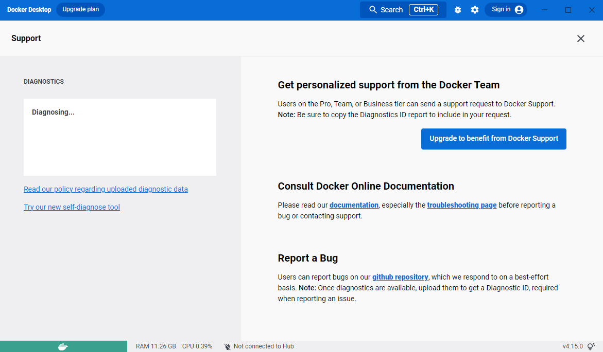



This page contains information on:
- How to diagnose and troubleshoot Docker Desktop issues
- Check the logs
- Find workarounds for common problems

## Troubleshoot menu

To navigate to **Troubleshoot** either:

- Select the Docker menu {: .inline} and then **Troubleshoot**
- Select the **Troubleshoot** icon from the Docker Dashboard

{:width="600px"}

The Troubleshoot page contains the following options:

- **Restart Docker Desktop**. Select to restart Docker Desktop.

- **Support**. Users with a paid Docker subscription can use this option to send a support request. Other users can use this option to diagnose any issues in Docker Desktop. For more information, see [Diagnose and feedback](#diagnose) and [Support](../../support/index.md).

- **Reset Kubernetes cluster**. Select to delete all stacks and Kubernetes resources. For more information, see [Kubernetes](../settings/linux.md#kubernetes).

- **Clean / Purge data**. This option resets all Docker data _without_ a
reset to factory defaults. Selecting this option results in the loss of existing settings.

- **Reset to factory defaults**: Choose this option to reset all options on
Docker Desktop to their initial state, the same as when Docker Desktop was first installed.

If you are a Mac user, you also have the option to **Uninstall** Docker Desktop from your system.

## Diagnose

### Diagnose from the app

Make sure you are signed in to Docker Desktop and your [Docker Hub](https://hub.docker.com/){:target="_blank" rel="noopener" class="_"} account.

1. From **Troubleshoot**, select **Get support**. 
This opens the in-app **Support** page and starts collecting the diagnostics.
    {:width="600px"}
2. When the diagnostics collection process is complete, click **Upload to get a Diagnostic ID**.
3. When the diagnostics have been uploaded, Docker Desktop prints a diagnostic ID. Copy this ID.
4. If you have a paid Docker subscription, click **Contact Support**. This opens the [Docker Desktop support](https://hub.docker.com/support/desktop/){:target="_blank" rel="noopener" class="_"} form. Fill in the information required and add the ID you copied in step four to the **Diagnostics ID** field. 
5. Click **Submit** to request Docker Desktop support.
   > **Note**
    >
    > You must be signed in to Docker Desktop using your Pro, Team, or Business tier credentials to access the support form. For information on what's covered as part of Docker Desktop support, see [Support](../../support/index.md).
6. If you don't have a paid Docker subscription, click **Upgrade to benefit from Docker Support** to upgrade your existing account.
    Alternatively, click **Report a Bug** to open a new Docker Desktop issue on GitHub. Complete the information required and ensure you add the diagnostic ID you copied earlier. 
7. Click **submit new issue** to create a new issue.

### Diagnose from the terminal

In some cases, it is useful to run the diagnostics yourself, for instance, if
Docker Desktop cannot start.

First, locate the `com.docker.diagnose` tool. It is located at:

<ul class="nav nav-tabs">
<li class="active"><a data-toggle="tab" data-target="#windows1">Windows</a></li>
<li><a data-toggle="tab" data-target="#mac1">Mac</a></li>
<li class="active"><a data-toggle="tab" data-target="#linux1">Linux</a></li>
</ul>
<div class="tab-content">
<div id="windows1" class="tab-pane fade in active" markdown="1">

```console
$ C:\Program Files\Docker\Docker\resources\com.docker.diagnose.exe
```

</div>
<div id="mac1" class="tab-pane fade" markdown="1">

```console
$ /Applications/Docker.app/Contents/MacOS/com.docker.diagnose
```

</div>
<div id="linux1" class="tab-pane fade" markdown="1">

```console
$ /opt/docker-desktop/bin/com.docker.diagnose
```

</div>
</div>


To create and upload diagnostics, run:

```console
$ <tool location> gather -upload
```

After the diagnostics have finished, the terminal displays your diagnostics ID. The diagnostics ID is
composed of your user ID and a timestamp. Ensure you provide the full diagnostics ID, and not just the user ID.

To view the contents of the diagnostic file, run:

<ul class="nav nav-tabs">
<li><a data-toggle="tab" data-target="#mac2">Mac</a></li>
<li class="active"><a data-toggle="tab" data-target="#linux2">Linux</a></li>
</ul>
<div class="tab-content">
<div id="mac2" class="tab-pane fade" markdown="1">

```console
$ open /tmp/BE9AFAAF-F68B-41D0-9D12-84760E6B8740/20190905152051.zip
``` 

</div>
<div id="linux2" class="tab-pane fade" markdown="1">

```console
$ unzip –l /tmp/BE9AFAAF-F68B-41D0-9D12-84760E6B8740/20190905152051.zip
``` 

</div>
</div>

If you have a paid Docker subscription, open the [Docker Desktop support](https://hub.docker.com/support/desktop/){:target="_blank" rel="noopener" class="_"} form. Fill in the information required and add the ID to the Diagnostics ID field. Click **Submit** to request Docker Desktop support.

### Self-diagnose tool

Docker Desktop contains a self-diagnose tool which helps you to identify some common problems. 

First, locate the `com.docker.diagnose` tool. It is located at:

<ul class="nav nav-tabs">
<li class="active"><a data-toggle="tab" data-target="#windows3">Windows</a></li>
<li><a data-toggle="tab" data-target="#mac3">Mac</a></li>
<li class="active"><a data-toggle="tab" data-target="#linux3">Linux</a></li>
</ul>
<div class="tab-content">
<div id="windows3" class="tab-pane fade in active" markdown="1">

```console
$ C:\Program Files\Docker\Docker\resources\com.docker.diagnose.exe
```

</div>
<div id="mac3" class="tab-pane fade" markdown="1">

```console
$ /Applications/Docker.app/Contents/MacOS/com.docker.diagnose
```

</div>
<div id="linux3" class="tab-pane fade" markdown="1">

```console
$ /opt/docker-desktop/bin/com.docker.diagnose
```

</div>
</div>

To run the self-diagnose tool, run:

```console
$ <tool location> check
```

The tool runs a suite of checks and displays **PASS** or **FAIL** next to each check. If there are any failures, it highlights the most relevant at the end of the report.

You can then create and issue on GitHub:
- [For Linux](https://github.com/docker/desktop-linux/issues)
- [For Mac](https://github.com/docker/for-mac/issues)
- [For Windows](https://github.com/docker/for-win/issues)

## Check the logs

In addition to using the diagnose option to submit logs, you can browse the logs yourself.

<ul class="nav nav-tabs">
<li><a data-toggle="tab" data-target="#mac4">Mac</a></li>
<li class="active"><a data-toggle="tab" data-target="#linux4">Linux</a></li>
</ul>
<div class="tab-content">
<div id="mac4" class="tab-pane fade" markdown="1">

### In a terminal

To watch the live flow of Docker Desktop logs in the command line, run the following script from your favorite shell.

```console
$ pred='process matches ".*(ocker|vpnkit).*" || (process in {"taskgated-helper", "launchservicesd", "kernel"} && eventMessage contains[c] "docker")'
$ /usr/bin/log stream --style syslog --level=debug --color=always --predicate "$pred"
```

Alternatively, to collect the last day of logs (`1d`) in a file, run:

```console
$ /usr/bin/log show --debug --info --style syslog --last 1d --predicate "$pred" >/tmp/logs.txt
```

### In the Console app

Mac provides a built-in log viewer, named "Console", which you can use to check
Docker logs.

The Console lives in `/Applications/Utilities`. You can search for it with
Spotlight Search.

To read the Docker app log messages, type `docker` in the Console window search bar and press Enter. Then select `ANY` to expand the drop-down list next to your `docker` search entry, and select `Process`.


You can use the Console Log Query to search logs, filter the results in various
ways, and create reports.

### View the Docker Daemon logs

Refer to the [read the logs](../../config/daemon/index.md#read-the-logs) section
to learn how to view the Docker Daemon logs.

</div>
<div id="linux4" class="tab-pane fade" markdown="1">

### In a terminal

You can access Docker Desktop logs by running the following command:

```console
$ journalctl --user --unit=docker-desktop
```

You can also find the logs for the internal components included in Docker
Desktop at `$HOME/.docker/desktop/log/`.

### View the Docker Daemon logs

Refer to the [read the logs](../../config/daemon/index.md#read-the-logs) section
to learn how to view the Docker Daemon logs.

</div></div>


