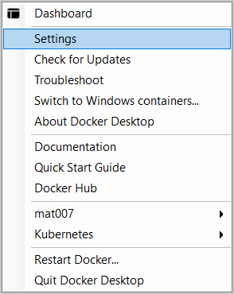
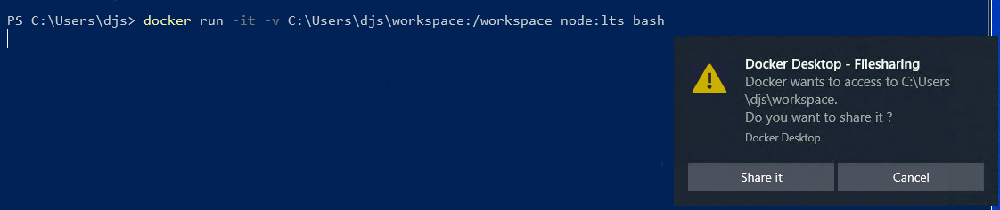
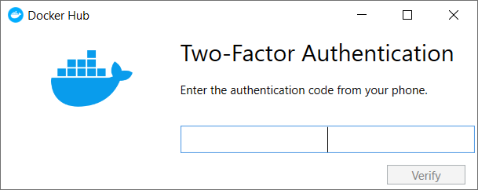

Welcome to Docker Desktop! The Docker Desktop for Windows user manual provides information on how to configure and manage your Docker Desktop settings.

For information about Docker Desktop download, system requirements, and installation instructions, see [Install Docker Desktop](install.md).

## Settings

The **Docker Desktop** menu allows you to open the Docker Dashboard, run the Quick Start Guide, configure your Docker settings such as installation, updates, version channels, Docker Hub login, and more.

This section explains the configuration options accessible from the **Settings** dialog.

1. To open the Docker Desktop menu, right-click the Docker icon in the Notifications area (or System tray):

    {:width="250px"}

2. Select **Settings** to open the Settings dialog:

    {:width="300px"}

### General

On the **General** tab, you can configure when to start Docker and specify other settings.

{:width="750px"}

- **Start Docker when you log in**: Select this option to automatically start Docker Desktop when you log into your Windows machine.

- **Expose daemon on tcp://localhost:2375 without TLS**: Click this option to enable legacy clients to connect to the Docker daemon. You must use this option with caution as exposing the daemon without TLS can result in remote code execution attacks.

- **Use the WSL 2 based engine**: WSL 2 provides better performance than the legacy Hyper-V backend. For more information, see [Docker Desktop WSL 2 backend](wsl.md).

- **Send usage statistics**: By default, Docker Desktop sends diagnostics,
crash reports, and usage data. This information helps Docker improve and
troubleshoot the application. Clear the check box to opt out. Docker may periodically prompt you for more information.

- **Show weekly tips**: Displays useful advice and suggestions about using Docker.

- **Open Docker Desktop dashboard at startup**: Automatically opens the dashboard when starting Docker Desktop.

- **Use Docker Compose V2**: Select this option to enable the `docker-compose` command to use Docker Compose V2. For more information, see [Docker Compose V2](../../compose/cli-command.md).

### Resources

The **Resources** tab allows you to configure CPU, memory, disk, proxies,
network, and other resources. Different settings are available for
configuration depending on whether you are using Linux containers in WSL 2
mode, Linux containers in Hyper-V mode, or Windows containers.

#### Advanced

> **Note**
>
> The Advanced tab is only available in Hyper-V mode, because Windows manages
> the resources in WSL 2 mode and Windows container mode. In WSL 2
> mode, you can configure limits on the memory, CPU, and swap size allocated
> to the [WSL 2 utility VM](https://docs.microsoft.com/en-us/windows/wsl/wsl-config#configure-global-options-with-wslconfig){:target="_blank"
class="_"}.

Use the **Advanced** tab to limit resources available to Docker.

- **CPUs**: By default, Docker Desktop is set to use half the number of processors
available on the host machine. To increase the processing power, set this to a
higher number. To decrease the processing power, set this to a lower number.

- **Memory**: By default, Docker Desktop is set to use `2` GB runtime memory,
allocated from the total available memory on your machine. To increase the RAM, set this to a higher number. To decrease the RAM, lower the number.

- **Swap**: Configure swap file size as needed. The default is 1 GB.

- **Disk image size**: Specify the size of the disk image.

- **Disk image location**: Specify the location of the Linux volume where containers and images are stored.

You can also move the disk image to a different location. If you attempt to move a disk image to a location that already has one, you get a prompt asking if you want to use the existing image or replace it.

#### File sharing

> **Note**
>
> The File sharing tab is only available in Hyper-V mode because the files
> are automatically shared in WSL 2 mode and Windows container mode.

Use File sharing to allow local directories on Windows to be shared with Linux containers.
This is especially useful for
editing source code in an IDE on the host while running and testing the code in a container.
Note that configuring file sharing is not necessary for Windows containers, only [Linux containers](#switch-between-windows-and-linux-containers).
 If a directory is not shared with a Linux container you may get `file not found` or `cannot start service` errors at runtime. See [Volume mounting requires shared folders for Linux containers](troubleshoot.md#volume-mounting-requires-shared-folders-for-linux-containers).

File share settings are:

- **Add a Directory**: Click `+` and navigate to the directory you want to add.

- **Apply & Restart** makes the directory available to containers using Docker's
  bind mount (`-v`) feature.

> Tips on shared folders, permissions, and volume mounts
>
 * Share only the directories that you need with the container. File sharing
 introduces overhead as any changes to the files on the host need to be notified
 to the Linux VM. Sharing too many files can lead to high CPU load and slow
 filesystem performance.
>
 * Shared folders are designed to allow application code to be edited on the host while being executed in containers. For non-code items
 such as cache directories or databases, the performance will be much better if they are stored in
 the Linux VM, using a [data volume](../../storage/volumes.md)
 (named volume) or [data container](../../storage/volumes.md).
>
 * Docker Desktop sets permissions to read/write/execute for users, groups and others [0777 or a+rwx](http://permissions-calculator.org/decode/0777/).
   This is not configurable. See [Permissions errors on data directories for shared volumes](troubleshoot.md#permissions-errors-on-data-directories-for-shared-volumes).
>
 * Windows presents a case-insensitive view of the filesystem to applications while Linux is case-sensitive. On Linux, it is possible to create two separate files: `test` and `Test`, while on Windows these filenames would actually refer to the same underlying file. This can lead to problems where an app works correctly on a developer Windows machine (where the file contents are shared) but fails when run in Linux in production (where the file contents are distinct). To avoid this, Docker Desktop insists that all shared files are accessed as their original case. Therefore if a file is created called `test`, it must be opened as `test`. Attempts to open `Test` will fail with "No such file or directory". Similarly once a file called `test` is created, attempts to create a second file called `Test` will fail.

#### Shared folders on demand

You can share a folder "on demand" the first time a particular folder is used by a container.

If you run a Docker command from a shell with a volume mount (as shown in the
example below) or kick off a Compose file that includes volume mounts, you get a
popup asking if you want to share the specified folder.

You can select to **Share it**, in which case it is added to your Docker Desktop Shared Folders list and available to
containers. Alternatively, you can opt not to share it by selecting **Cancel**.

{:width="600px"}

#### Proxies

Docker Desktop detects the HTTP/HTTPS proxy settings and
automatically propagates these to Docker. For example, if you set your proxy
settings to `http://proxy.example.com`, Docker uses this proxy when pulling containers.

Your proxy settings, however, will not be propagated into the containers you start.
If you wish to set the proxy settings for your containers, you need to define
environment variables for them, just like you would do on Linux, for example:

```ps
> docker run -e HTTP_PROXY=http://proxy.example.com:3128 alpine env

PATH=/usr/local/sbin:/usr/local/bin:/usr/sbin:/usr/bin:/sbin:/bin
HOSTNAME=b7edf988b2b5
TERM=xterm
HOME=/root
HTTP_PROXY=http://proxy.example.com:3128
```

For more information on setting environment variables for running containers,
see [Set environment variables](/engine/reference/commandline/run/#set-environment-variables--e---env---env-file).

#### Network

> **Note**
>
> The Network tab is not available in the Windows container mode because
> Windows manages networking.

You can configure Docker Desktop networking to work on a virtual private network (VPN). Specify a network address translation (NAT) prefix and subnet mask to enable Internet connectivity.

#### WSL Integration

In WSL 2 mode, you can configure which WSL 2 distributions will have the Docker 
WSL integration.

By default, the integration will be enabled on your default WSL distribution.
To change your default WSL distro, run `wsl --set-default <distro name>`. (For example, 
to set Ubuntu as your default WSL distro, run `wsl --set-default ubuntu`).

You can also select any additional distributions you would like to enable the WSL 2 integration on.

For more details on configuring Docker Desktop to use WSL 2, see 
[Docker Desktop WSL 2 backend](wsl.md).

### Docker Engine

The Docker Engine page allows you to configure the Docker daemon to determine how your containers run.

Type a JSON configuration file in the box to configure the daemon settings. For a full list of options, see the Docker Engine
[dockerd commandline reference](/engine/reference/commandline/dockerd/){:target="_blank"
class="_"}.

Click **Apply & Restart** to save your settings and restart Docker Desktop.

### Command Line

On the Command Line page, you can specify whether or not to enable experimental features.

You can toggle the experimental features on and off in Docker Desktop. If you toggle the experimental features off, Docker Desktop uses the current generally available release of Docker Engine.

#### Experimental features



Run `docker version` to verify whether you have enabled experimental features. Experimental mode
is listed under `Server` data. If `Experimental` is `true`, then Docker is
running in experimental mode, as shown here:

```console
> docker version

Client: Docker Engine - Community
 Version:           19.03.1
 API version:       1.40
 Go version:        go1.12.5
 Git commit:        74b1e89
 Built:             Thu Jul 25 21:17:08 2019
 OS/Arch:           windows/amd64
 Experimental:      true

Server: Docker Engine - Community
 Engine:
  Version:          19.03.1
  API version:      1.40 (minimum version 1.12)
  Go version:       go1.12.5
  Git commit:       74b1e89
  Built:            Thu Jul 25 21:17:52 2019
  OS/Arch:          linux/amd64
  Experimental:     true
 containerd:
  Version:          v1.2.6
  GitCommit:        894b81a4b802e4eb2a91d1ce216b8817763c29fb
 runc:
  Version:          1.0.0-rc8
  GitCommit:        425e105d5a03fabd737a126ad93d62a9eeede87f
 docker-init:
  Version:          0.18.0
  GitCommit:        fec3683
```

### Kubernetes

> **Note**
>
> The Kubernetes tab is not available in Windows container mode.

Docker Desktop includes a standalone Kubernetes server that runs on your Windows machine, so
that you can test deploying your Docker workloads on Kubernetes. To enable Kubernetes support and install a standalone instance of Kubernetes running as a Docker container, select **Enable Kubernetes**.

For more information about using the Kubernetes integration with Docker Desktop, see [Deploy on Kubernetes](../kubernetes.md){:target="_blank" rel="noopener" class="_"}.

### Software Updates

The **Software Updates** section notifies you of any updates available to Docker Desktop. When there's a new update, you can choose to download the update right away, or click the **Release Notes** option to learn what's included in the updated version.

> **Disable automatic check for updates**
>
> Starting with Docker Desktop 4.2.0, the option to turn off the automatic check for updates is available for users on all Docker subscriptions, including Docker Personal and Docker Pro. Update to [Docker Desktop 4.2.0](../windows/release-notes/index.md) to start using this feature.
{: .important}

Turn off the check for updates by clearing the **Automatically Check for Updates** check box. This disables notifications in the Docker menu and also the notification badge that appears on the Docker Dashboard. To check for updates manually, select the **Check for updates** option in the Docker menu.

To allow Docker Desktop to automatically download new updates in the background, select **Always download updates**. This downloads newer versions of Docker Desktop when an update becomes available. After downloading the update, click **Apply and Restart** to install the update. You can do this either through the Docker menu or in the **Updates** section in the Docker Dashboard.

## Dashboard

The Docker Dashboard enables you to interact with containers and applications and manage the lifecycle of your applications directly from your machine. The Dashboard UI shows all running, stopped, and started containers with their state. It provides an intuitive interface to perform common actions to inspect and manage containers and existing Docker Compose applications. For more information, see [Docker Dashboard](../dashboard.md).

## Add TLS certificates

You can add trusted Certificate Authorities (CAs) (used to verify registry
server certificates) and client certificates (used to authenticate to
registries) to your Docker daemon.

### Reset

The **Restart Docker Desktop** and **Reset to factory defaults** options are now available on the **Troubleshoot** menu. For information, see [Logs and Troubleshooting](troubleshoot.md).

### Troubleshoot

Visit our [Logs and Troubleshooting](troubleshoot.md) guide for more details.

Log on to our [Docker Desktop for Windows forum](https://forums.docker.com/c/docker-for-windows) to get help from the community, review current user topics, or join a discussion.

Log on to [Docker Desktop for Windows issues on GitHub](https://github.com/docker/for-win/issues) to report bugs or problems and review community reported issues.

For information about providing feedback on the documentation or update it yourself, see [Contribute to documentation](/opensource/).

## Switch between Windows and Linux containers

From the Docker Desktop menu, you can toggle which daemon (Linux or Windows)
the Docker CLI talks to. Select **Switch to Windows containers** to use Windows
containers, or select **Switch to Linux containers** to use Linux containers
(the default).

For more information on Windows containers, refer to the following documentation:

- Microsoft documentation on [Windows containers](https://docs.microsoft.com/en-us/virtualization/windowscontainers/about/index).

- [Build and Run Your First Windows Server Container (Blog Post)](https://blog.docker.com/2016/09/build-your-first-docker-windows-server-container/)
  gives a quick tour of how to build and run native Docker Windows containers on Windows 10 and Windows Server 2016 evaluation releases.

- [Getting Started with Windows Containers (Lab)](https://github.com/docker/labs/blob/master/windows/windows-containers/README.md)
  shows you how to use the [MusicStore](https://github.com/aspnet/MusicStore/blob/dev/README.md)
  application with Windows containers. The MusicStore is a standard .NET application and,
  [forked here to use containers](https://github.com/friism/MusicStore), is a good example of a multi-container application.

- To understand how to connect to Windows containers from the local host, see
  [I want to connect to a container from Windows](networking.md#i-want-to-connect-to-a-container-from-windows)

> Settings dialog changes with Windows containers
>
> When you switch to Windows containers, the Settings dialog only shows those tabs that are active and apply to your Windows containers:
>

  * [General](#general)
  * [Proxies](#proxies)
  * [Daemon](#docker-engine)
  * [Reset](#reset)

If you set proxies or daemon configuration in Windows containers mode, these
apply only on Windows containers. If you switch back to Linux containers,
proxies and daemon configurations return to what you had set for Linux
containers. Your Windows container settings are retained and become available
again when you switch back.

## Dashboard

The Docker Dashboard enables you to interact with containers and applications and manage the lifecycle of your applications directly from your machine. The Dashboard UI shows all running, stopped, and started containers with their state. It provides an intuitive interface to perform common actions to inspect and manage containers and Docker Compose applications. For more information, see [Docker Desktop Dashboard](../dashboard.md).

## Docker Hub

Select **Sign in /Create Docker ID** from the Docker Desktop menu to access your [Docker Hub](https://hub.docker.com/){: target="_blank" rel="noopener" class="_" } account. Once logged in, you can access your Docker Hub repositories directly from the Docker Desktop menu.

For more information, refer to the following [Docker Hub topics](../../docker-hub/index.md){: target="_blank" rel="noopener" class="_" }:

* [Organizations and Teams in Docker Hub](../../docker-hub/orgs.md){: target="_blank" rel="noopener" class="_" }
* [Builds and Images](../../docker-hub/builds/index.md){: target="_blank" rel="noopener" class="_" }

### Two-factor authentication

Docker Desktop enables you to sign into Docker Hub using two-factor authentication. Two-factor authentication provides an extra layer of security when accessing your Docker Hub account.

You must enable two-factor authentication in Docker Hub before signing into your Docker Hub account through Docker Desktop. For instructions, see [Enable two-factor authentication for Docker Hub](/docker-hub/2fa/).

After you have enabled two-factor authentication:

1. Go to the Docker Desktop menu and then select **Sign in / Create Docker ID**.

2. Enter your Docker ID and password and click **Sign in**.

3. After you have successfully signed in, Docker Desktop prompts you to enter the authentication code. Enter the six-digit code from your phone and then click **Verify**.

{:width="500px"}

After you have successfully authenticated, you can access your organizations and repositories directly from the Docker Desktop menu.

## Pause/Resume

Starting with the Docker Desktop 4.2 release, you can pause your Docker Desktop session when you are not actively using it and save CPU resources on your machine. When you pause Docker Desktop, the Linux VM running Docker Engine will be paused, the current state of all your containers are saved in memory, and all processes are frozen. This reduces the CPU usage and helps you retain a longer battery life on your laptop. You can resume Docker Desktop when you want by clicking the Resume option.

> **Note**
>
> The Pause/Resume feature is currently not available in the Windows containers mode.

To pause Docker Desktop, right-click the Docker icon in the notifications area (or System tray) and then click **Pause**.

{:width="300px"}

Docker Desktop now displays the paused status on the Docker menu and on all screens on the Docker Dashboard. You can still access the **Preferences** and the **Troubleshoot** menu from the Dashboard when you've paused Docker Desktop.

Select {: .inline} > **Resume** to resume Docker Desktop.

> **Note**
>
> When Docker Desktop is paused, running any commands in the Docker CLI will automatically resume Docker Desktop.

## Adding TLS certificates

You can add trusted **Certificate Authorities (CAs)** to your Docker daemon to verify registry server certificates, and **client certificates**, to authenticate to registries.

### How do I add custom CA certificates?

Docker Desktop supports all trusted Certificate Authorities (CAs) (root or
intermediate). Docker recognizes certs stored under Trust Root
Certification Authorities or Intermediate Certification Authorities.

Docker Desktop creates a certificate bundle of all user-trusted CAs based on
the Windows certificate store, and appends it to Moby trusted certificates. Therefore, if an enterprise SSL certificate is trusted by the user on the host, it is trusted by Docker Desktop.

To learn more about how to install a CA root certificate for the registry, see
[Verify repository client with certificates](../../engine/security/certificates.md)
in the Docker Engine topics.

### How do I add client certificates?

You can add your client certificates
in `~/.docker/certs.d/<MyRegistry><Port>/client.cert` and
`~/.docker/certs.d/<MyRegistry><Port>/client.key`. You do not need to push your certificates with `git` commands.

When the Docker Desktop application starts, it copies the
`~/.docker/certs.d` folder on your Windows system to the `/etc/docker/certs.d`
directory on Moby (the Docker Desktop virtual machine running on Hyper-V).

You need to restart Docker Desktop after making any changes to the keychain
or to the `~/.docker/certs.d` directory in order for the changes to take effect.

The registry cannot be listed as an _insecure registry_ (see
[Docker Daemon](#docker-engine)). Docker Desktop ignores
certificates listed under insecure registries, and does not send client
certificates. Commands like `docker run` that attempt to pull from the registry
produce error messages on the command line, as well as on the registry.

To learn more about how to set the client TLS certificate for verification, see
[Verify repository client with certificates](../../engine/security/certificates.md)
in the Docker Engine topics.

## Where to go next

* Try out the walkthrough at [Get Started](../../get-started/index.md){: target="_blank" rel="noopener" class="_"}.

* Dig in deeper with [Docker Labs](https://github.com/docker/labs/) example walkthroughs and source code.

* Refer to the [Docker CLI Reference Guide](/engine/reference/commandline/cli/){: target="_blank" rel="noopener" class="_"}.
