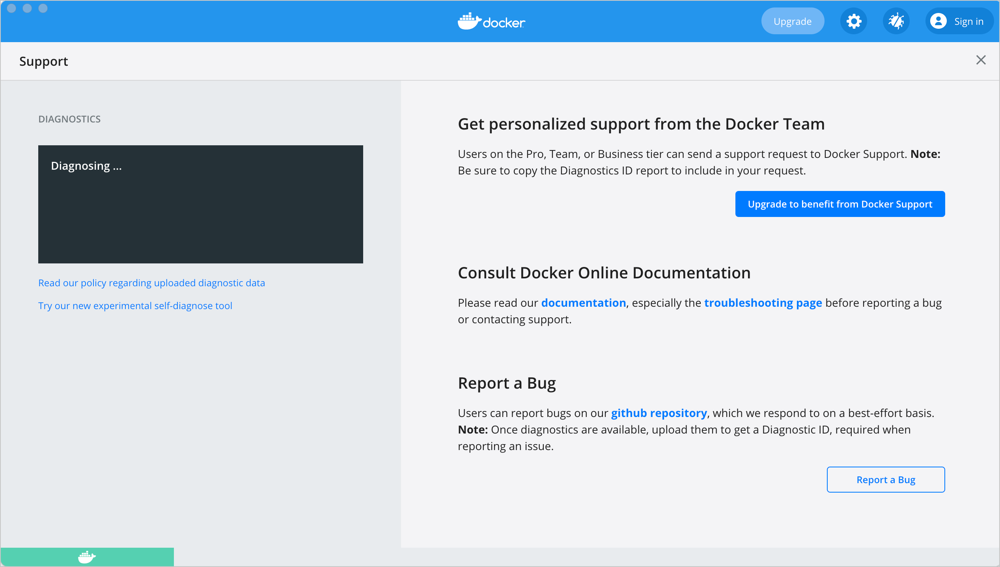
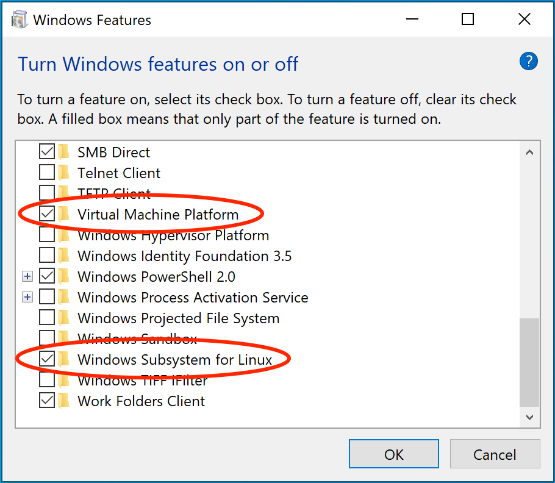



This page contains information on how to diagnose and troubleshoot Docker Desktop issues, request Docker Desktop support, send logs and communicate with the Docker Desktop team, use our forums and Success Center, browse and log issues on GitHub, and find workarounds for known problems.

## Troubleshoot

Choose {: .inline} > **Troubleshoot**
from the menu bar to see the troubleshoot options.

{:width="600px"}

The Troubleshoot page contains the following options:

* **Restart Docker Desktop**: Select to restart Docker Desktop.

* **Support**: Users with a paid Docker subscription can use this option to send a support request. Other users can use this option to diagnose any issues in Docker Desktop. For more information, see [Diagnose and feedback](#diagnose-and-feedback) and [Support](#support).

* **Reset Kubernetes cluster**: Select this option to delete all stacks and Kubernetes resources. For more information, see [Kubernetes](index.md#kubernetes).

* **Clean / Purge data**: Select this option to delete container and image data. Choose whether you'd like to delete data from Hyper-V, WSL 2, or Windows Containers and then click **Delete** to confirm.

* **Reset to factory defaults**: Choose this option to reset all options on
Docker Desktop to their initial state, the same as when Docker Desktop was first installed.

## Diagnose and feedback

### In-app diagnostics

If you experience issues for which you do not find solutions in this
documentation, on [Docker Desktop for Windows issues on
GitHub](https://github.com/docker/for-win/issues), or the [Docker Desktop for Windows
forum](https://forums.docker.com/c/docker-for-windows), we can help you
troubleshoot the log data. Before reporting an issue, we recommend that you read the information provided on this page to fix some common known issues.

1. Choose {: .inline} > **Troubleshoot**
from the menu.
2. Optional: Sign into Docker Desktop. In addition, ensure you are signed into your [Docker account](https://hub.docker.com/){:target="_blank" rel="noopener" class="_"}.
3. Click **Get support**. This opens the in-app **Support** page and starts collecting the diagnostics.
    {:width="600px"}
4. When the diagnostics collection process is complete, click **Upload to get a Diagnostic ID**.
5. When the diagnostics have been uploaded, Docker Desktop prints a Diagnostic ID. Copy this ID.
6. If you have a paid Docker subscription, click **Contact Support**. This opens the [Docker Desktop support](https://hub.docker.com/support/desktop/){:target="_blank" rel="noopener" class="_"} form. Fill in the information required and add the ID you copied earlier to the Diagnostics ID field. Click **Submit** to request Docker Desktop support.

   > **Note**
   >
   > You must be signed in to Docker Desktop using your Pro or Team plan credentials to access the support form. For information on what's covered as part of Docker Desktop support, see [Support](#support).
7. If you don't have a paid Docker subscription, click **Upgrade to benefit from Docker Support** to upgrade your existing account.
    Alternatively, click **Report a Bug** to open a new Docker Desktop issue on GitHub. This opens Docker Desktop [for Windows](https://github.com/docker/for-win/issues/) on GitHub in your web browser in a 'New issue' template. Complete the information required and ensure you add the diagnostic ID you copied earlier. Click **submit new issue** to create a new issue.

### Diagnosing from the terminal

On occasions it is useful to run the diagnostics yourself, for instance if
Docker Desktop for Windows cannot start.

First locate the `com.docker.diagnose`, that should be in `C:\Program
Files\Docker\Docker\resources\com.docker.diagnose.exe`.

To create *and upload*  diagnostics in Powershell, run:

```powershell
  PS C:\> & "C:\Program Files\Docker\Docker\resources\com.docker.diagnose.exe" gather -upload
```

After the diagnostics have finished, you should have the following output,
containing your diagnostic ID:

```sh
Diagnostics Bundle: C:\Users\User\AppData\Local\Temp\CD6CF862-9CBD-4007-9C2F-5FBE0572BBC2\20180720152545.zip
Diagnostics ID:     CD6CF862-9CBD-4007-9C2F-5FBE0572BBC2/20180720152545 (uploaded)
```

If you have a paid Docker subscription, open the [Docker Desktop support](https://hub.docker.com/support/desktop/){:target="_blank" rel="noopener" class="_"} form. Fill in the information required and add the ID to the Diagnostics ID field. Click **Submit** to request Docker Desktop support.

### Self-diagnose tool

Docker Desktop contains a self-diagnose tool which helps you to identify some common
problems. Before you run the self-diagnose tool, locate `com.docker.diagnose.exe`. This is usually installed in `C:\Program
Files\Docker\Docker\resources\com.docker.diagnose.exe`.

To run the self-diagnose tool in Powershell:

```powershell
PS C:\> & "C:\Program Files\Docker\Docker\resources\com.docker.diagnose.exe" check
```

The tool runs a suite of checks and displays **PASS** or **FAIL** next to each check. If there are any failures, it highlights the most relevant at the end.

> **Feedback**
>
> Let us know your feedback on the self-diagnose tool by creating an issue in the [for-win](https://github.com/docker/for-win/issues) GitHub repository.

## Troubleshooting topics

### Make sure certificates are set up correctly

Docker Desktop ignores certificates listed under insecure registries, and
does not send client certificates to them. Commands like `docker run` that
attempt to pull from the registry produces error messages on the command line,
like this:

```console
Error response from daemon: Get http://192.168.203.139:5858/v2/: malformed HTTP response "\x15\x03\x01\x00\x02\x02"
```

As well as on the registry. For example:

```console
2017/06/20 18:15:30 http: TLS handshake error from 192.168.203.139:52882: tls: client didn't provide a certificate
2017/06/20 18:15:30 http: TLS handshake error from 192.168.203.139:52883: tls: first record does not look like a TLS handshake
```

For more about using client and server side certificates, see
[How do I add custom CA certificates?](index.md#how-do-i-add-custom-ca-certificates)
and [How do I add client certificates?](index.md#how-do-i-add-client-certificates) in the
Getting Started topic.

### Volumes

#### Permissions errors on data directories for shared volumes

When sharing files from Windows, Docker Desktop sets permissions on [shared volumes](index.md#file-sharing)
to a default value of [0777](http://permissions-calculator.org/decode/0777/)
(`read`, `write`, `execute` permissions for `user` and for `group`).

The default permissions on shared volumes are not configurable. If you are
working with applications that require permissions different from the shared
volume defaults at container runtime, you need to either use non-host-mounted
volumes or find a way to make the applications work with the default file
permissions.

See also,
[Can I change permissions on shared volumes for container-specific deployment requirements?](../faqs.md#can-i-change-permissions-on-shared-volumes-for-container-specific-deployment-requirements)
in the FAQs.

#### Volume mounting requires shared folders for Linux containers

If you are using mounted volumes and get runtime errors indicating an
application file is not found, access is denied to a volume mount, or a service
cannot start, such as when using [Docker Compose](../../compose/gettingstarted.md),
you might need to enable [shared folders](index.md#file-sharing).

With the Hyper-V backend, mounting files from Windows requires shared folders for Linux containers. Click {: .inline}
 and then **Settings** > **Shared Folders** and share the folder that contains the
Dockerfile and volume.

#### Support for symlinks

Symlinks work within and across containers. To learn more, see [How do symlinks work on Windows?](../faqs.md#how-do-symlinks-work-on-windows) in the FAQs.

#### Avoid unexpected syntax errors, use Unix style line endings for files in containers

Any file destined to run inside a container must use Unix style `\n` line
endings. This includes files referenced at the command line for builds and in
RUN commands in Docker files.

Docker containers and `docker build` run in a Unix environment, so files in
containers must use Unix style line endings: `\n`, _not_ Windows style: `\r\n`.
Keep this in mind when authoring files such as shell scripts using Windows
tools, where the default is likely to be Windows style line endings. These
commands ultimately get passed to Unix commands inside a Unix based container
(for example, a shell script passed to `/bin/sh`). If Windows style line endings
are used, `docker run` fails with syntax errors.

For an example of this issue and the resolution, see this issue on GitHub:
[Docker RUN fails to execute shell
script](https://github.com/moby/moby/issues/24388).

#### Path conversion on Windows

On Linux, the system takes care of mounting a path to another path. For example, when you run the following command on Linux:

```console
$ docker run --rm -ti -v /home/user/work:/work alpine
```

It adds a `/work` directory to the target container to mirror the specified path.

However, on Windows, you must update the source path. For example, if you are using 
the legacy Windows shell (`cmd.exe`), you can use the following command:

```console
$ docker run --rm -ti -v C:\Users\user\work:/work alpine
```

This starts the container and ensures the volume becomes usable. This is possible because Docker Desktop detects
the Windows-style path and provides the appropriate conversion to mount the directory.

Docker Desktop also allows you to use Unix-style path to the appropriate format. For example:

```console
$ docker run --rm -ti -v /c/Users/user/work:/work alpine ls /work
```

#### Working with Git Bash

Git Bash (or MSYS) provides Unix-like environment on Windows. These tools apply their own
preprocessing on the command line. For example, if you run the following command in Git Bash, it gives an error:

```console
$ docker run --rm -ti -v C:\Users\user\work:/work alpine
docker: Error response from daemon: mkdir C:UsersUserwork: Access is denied.
```

This is because the `\` character has a special meaning in Git Bash. If you are using Git Bash, you must neutralize it using `\\`:

```console
$ docker run --rm -ti -v C:\\Users\\user\\work:/work alpine
```

Also, in scripts, the `pwd` command is used to avoid hardcoding file system locations. Its output is a Unix-style path.

```console
$ pwd
/c/Users/user/work
```

Combined with the `$()` syntax, the command below works on Linux, however, it fails on Git Bash.

```console
$ docker run --rm -ti -v $(pwd):/work alpine
docker: Error response from daemon: OCI runtime create failed: invalid mount {Destination:\Program Files\Git\work Type:bind Source:/run/desktop/mnt/host/c/Users/user/work;C Options:[rbind rprivate]}: mount destination \Program Files\Git\work not absolute: unknown.
```

You can work around this issue by using an extra `/`

```console
$ docker run --rm -ti -v /$(pwd):/work alpine
```

Portability of the scripts is not affected as Linux treats multiple `/` as a single entry.
Each occurence of paths on a single line must be neutralized.

```console
$ docker run --rm -ti -v /$(pwd):/work alpine ls /work
ls: C:/Program Files/Git/work: No such file or directory
```

In this example, The `$(pwd)` is not converted because of the preceding '/'. However, the second '/work' is transformed by the
POSIX layer before passing it to Docker Desktop. You can also work around this issue by using an extra `/`.

```console
$ docker run --rm -ti -v /$(pwd):/work alpine ls //work
```

To verify whether the errors are generated from your script, or from another source, you can use an environment variable. For example:

```console
$ MSYS_NO_PATHCONV=1 docker run --rm -ti -v $(pwd):/work alpine ls /work
```

It only expects the environment variable here. The value doesn't matter.

In some cases, MSYS also transforms colons to semicolon. Similar conversions can also occur
when using `~` because the POSIX layer translates it to a DOS path. `MSYS_NO_PATHCONV` also works in this case.

### Virtualization

Your machine must have the following features for Docker Desktop to function correctly.

#### WSL 2 and Windows Home

1. Virtual Machine Platform
2. [Windows Subsystem for Linux](https://docs.microsoft.com/en-us/windows/wsl/install-win10){:target="_blank" rel="noopener" class="_"}
3. Virtualization enabled in the BIOS
4. Hypervisor enabled at Windows startup

{:width="600px"}

#### Hyper-V

On Windows 10 Pro or Enterprise, you can also use Hyper-V with the following features enabled:

1. [Hyper-V](https://docs.microsoft.com/en-us/windows-server/virtualization/hyper-v/hyper-v-technology-overview){:target="_blank" rel="noopener" class="_"}
   installed and working
2. Virtualization enabled in the BIOS
3. Hypervisor enabled at Windows startup

{:width="600px"}

Docker Desktop requires Hyper-V as well as the Hyper-V Module for Windows
Powershell to be installed and enabled. The Docker Desktop installer enables
it for you.

Docker Desktop also needs two CPU hardware features to use Hyper-V: Virtualization and Second Level Address Translation (SLAT), which is also called Rapid Virtualization Indexing (RVI). On some systems, Virtualization must be enabled in the BIOS. The steps required are vendor-specific, but typically the BIOS option is called `Virtualization Technology (VTx)` or something similar. Run the command `systeminfo` to check all required Hyper-V features. See [Pre-requisites for Hyper-V on Windows 10](https://docs.microsoft.com/en-us/virtualization/hyper-v-on-windows/reference/hyper-v-requirements) for more details.

To install Hyper-V manually, see [Install Hyper-V on Windows 10](https://msdn.microsoft.com/en-us/virtualization/hyperv_on_windows/quick_start/walkthrough_install). A reboot is *required* after installation. If you install Hyper-V without rebooting, Docker Desktop does not work correctly.

From the start menu, type **Turn Windows features on or off** and press enter.
In the subsequent screen, verify that Hyper-V is enabled.

#### Virtualization must be enabled

In addition to [Hyper-V](#hyper-v) or [WSL 2](wsl.md), virtualization must be enabled. Check the
Performance tab on the Task Manager:

{:width="700px"}

If you manually uninstall Hyper-V, WSL 2 or disable virtualization,
Docker Desktop cannot start. See [Unable to run Docker for Windows on
Windows 10 Enterprise](https://github.com/docker/for-win/issues/74).

#### Hypervisor enabled at Windows startup

If you have completed the steps described above and are still experiencing
Docker Desktop startup issues, this could be because the Hypervisor is installed,
but not launched during Windows startup. Some tools (such as older versions of 
Virtual Box) and video game installers disable hypervisor on boot. To reenable it:

1. Open an administrative console prompt.
2. Run `bcdedit /set hypervisorlaunchtype auto`.
3. Restart Windows.

You can also refer to the [Microsoft TechNet article](https://social.technet.microsoft.com/Forums/en-US/ee5b1d6b-09e2-49f3-a52c-820aafc316f9/hyperv-doesnt-work-after-upgrade-to-windows-10-1809?forum=win10itprovirt){:target="_blank" rel="noopener" class="_"} on Code flow guard (CFG) settings.

### Windows containers and Windows Server

Docker Desktop is not supported on Windows Server. If you have questions about how to run Windows containers on Windows 10, see
[Switch between Windows and Linux containers](index.md#switch-between-windows-and-linux-containers).

A full tutorial is available in [docker/labs](https://github.com/docker/labs) on
[Getting Started with Windows Containers](https://github.com/docker/labs/blob/master/windows/windows-containers/README.md).

You can install a native Windows binary which allows you to develop and run
Windows containers without Docker Desktop. However, if you install Docker this way, you cannot develop or run Linux containers. If you try to run a Linux container on the native Docker daemon, an error occurs:

```none
C:\Program Files\Docker\docker.exe:
 image operating system "linux" cannot be used on this platform.
 See 'C:\Program Files\Docker\docker.exe run --help'.
```

### Running Docker Desktop in nested virtualization scenarios

Docker Desktop can run inside a Hyper-V VM, see
[Microsoft's nested virtualization user guide](https://docs.microsoft.com/en-us/virtualization/hyper-v-on-windows/user-guide/nested-virtualization).
Docker Desktop can also run inside a Windows 10 VM running on apps like Parallels or VMware Fusion on a Mac provided that the VM is properly configured.

However, problems and intermittent failures may still occur due to the way these apps virtualize the hardware. For these reasons, _**Docker Desktop is not supported in nested virtualization scenarios**_. It might work
in some cases, and not in others.

For best results, we recommend you run Docker Desktop natively on a Windows system (to work with Windows or Linux containers), or on Mac or Linux to work with Linux containers.

#### If you still want to use nested virtualization

* If using Hyper-V, make sure nested virtualization support is enabled for the
  Windows VM by running the following powershell as Administrator:

```none
Set-VMProcessor -VMName <Windows VM Name> -ExposeVirtualizationExtensions $true
```

* If using VMware or Parallels, make sure nested virtualization support is enabled.
  Check the settings in **Hardware > CPU & Memory > Advanced Options > Enable
  nested virtualization** (the exact menu sequence might vary slightly).

* Configure your Windows VM with at least 2 CPUs and sufficient memory to run your
  workloads.

* Make sure your system is more or less idle.

* Make sure your Windows OS is up-to-date. There have been several issues with
  some insider builds.

* The processor you have may also be relevant. For example, Westmere based Mac
  Pros have some additional hardware virtualization features over Nehalem based
  Mac Pros and so do newer generations of Intel processors. For Hyper-V, check
  [Microsoft's nested virtualization user guide](https://docs.microsoft.com/en-us/virtualization/hyper-v-on-windows/user-guide/nested-virtualization)
  to verify the host OS version is supported on your hardware.

#### Typical failures we see with nested virtualization

* Sometimes the VM fails to boot when Linux tries to calibrate the time stamp
  counter (TSC). This process is quite timing sensitive and may fail when
  executed inside a VM which itself runs inside a VM. CPU utilization is also
  likely to be higher.

* Ensure "PMU Virtualization" is turned off in Parallels on Macs. Check the
  settings in **Hardware > CPU & Memory > Advanced Settings > PMU
  Virtualization**.

### Networking issues

IPv6 is not (yet) supported on Docker Desktop.

## Workarounds

### Reboot

Restart your PC to stop / discard any vestige of the daemon running from the
previously installed version.

### Unset `DOCKER_HOST`

The `DOCKER_HOST` environmental variable does not need to be set.  If you use
bash, use the command `unset ${!DOCKER_*}` to unset it.  For other shells,
consult the shell's documentation.

### Make sure Docker is running for webserver examples

For the `hello-world-nginx` example and others, Docker Desktop must be
running to get to the webserver on `http://localhost/`. Make sure that the
Docker whale is showing in the menu bar, and that you run the Docker commands in
a shell that is connected to the Docker Desktop Engine. Otherwise, you might start the webserver container but get a "web page
not available" error when you go to `docker`.

### How to solve `port already allocated` errors

If you see errors like `Bind for 0.0.0.0:8080 failed: port is already allocated`
or `listen tcp:0.0.0.0:8080: bind: address is already in use` ...

These errors are often caused by some other software on Windows using those
ports. To discover the identity of this software, either use the `resmon.exe`
GUI and click "Network" and then "Listening Ports" or in a Powershell use
`netstat -aon | find /i "listening "` to discover the PID of the process
currently using the port (the PID is the number in the rightmost column). Decide
whether to shut the other process down, or to use a different port in your
docker app.

### Docker Desktop fails to start when anti-virus software is installed

Some anti-virus software may be incompatible with Hyper-V and Microsoft
Windows 10 builds. The conflict
typically occurs after a Windows update and
manifests as an error response from the Docker daemon and a Docker Desktop start failure.

For a temporary workaround, uninstall the anti-virus software, or
explore other workarounds suggested on Docker Desktop forums.

## Support

This section contains instructions on how to get support, and covers the scope of Docker Desktop support.



### How do I get Docker Desktop support?

If you have a paid Docker subscription, please raise a ticket through [Docker Desktop support](https://hub.docker.com/support/desktop/){:target="_blank" rel="noopener" class="_"}.

Docker Community users can get support through our Github repos for-win and for-mac, where we respond on a best-effort basis.

### What support can I get?

If you have a paid Docker subscription, you can request for support on the following types of issues:

* Desktop upgrade issues
* Desktop installation issues
  * Enabling virtualization in BIOS
  * Enabling Windows features
  * Installation crashes
  * Failure to launch Docker Desktop on first run
* Usage issues
  * Crash closing software
  * Docker Desktop not behaving as expected
* Configuration issues
* Basic product ‘how to’ questions such as ‘how to work efficiently on WSL 2’

### What is not supported?

Docker Desktop excludes support for the following types of issues:

* Use on or in conjunction with hardware or software other than that specified in the applicable documentation
* Running on unsupported operating systems, including beta/preview versions of operating systems
* Running containers of a different architecture using emulation
* Support for the Docker engine, Docker CLI, or other bundled Linux components
* Support for Kubernetes
* Features labeled as experimental
* System/Server administration activities
* Supporting Desktop as a production runtime
* Scale deployment/multi-machine installation of Desktop
* Routine product maintenance (data backup, cleaning disk space and configuring log rotation)
* Third-party applications not provided by Docker
* Altered or modified Docker software
* Defects in the Docker software due to hardware malfunction, abuse, or improper use
* Any version of the Docker software other than the latest version
* Reimbursing and expenses spent for third-party services not provided by Docker
* Docker Support excludes training, customization, and integration

### What versions are supported?

We currently only offer support for the latest version of Docker Desktop. If you are running an older version, you may be asked to upgrade before we investigate your support request.

### How many machines can I get support for Docker Desktop on?

As a Pro user you can get support for Docker Desktop on a single machine.
As a Team, you can get support for Docker Desktop for the number of machines equal to the number of seats as part of your plan.

### What OS’s are supported?

Docker Desktop is available for Mac and Windows. The supported version information can be found on the following pages:

* [Windows system requirements](install.md#system-requirements)
* [Mac system requirements](../mac/install.md#system-requirements)

### Can I run Docker Desktop on Virtualized hardware?

No, currently this is unsupported and against the terms of use.
