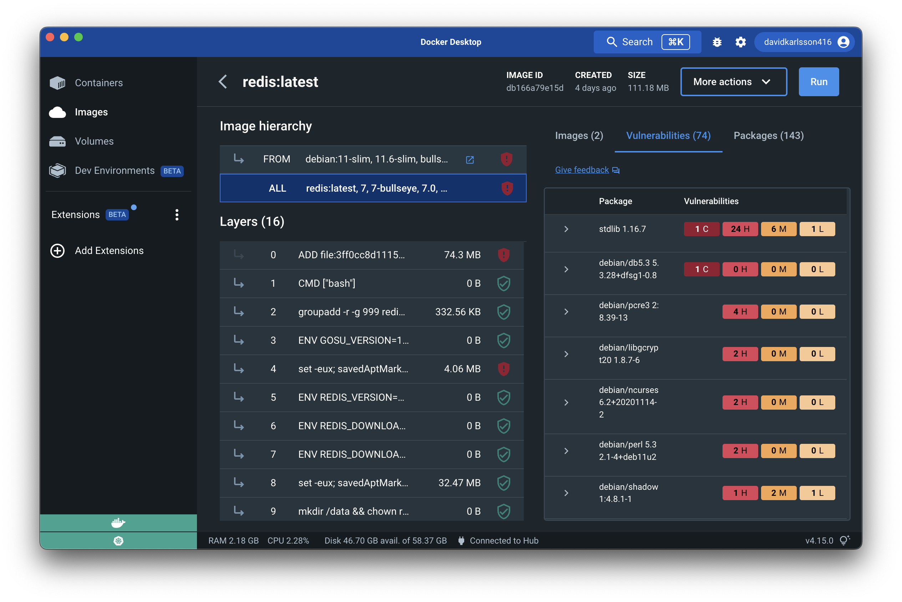

> **Note**
>
> Image analysis in Docker Hub is available for developers subscribed to a
> Docker Pro, Team, or a Business tier. For more information about the pricing
> plans, see
> [Docker Pricing](https://www.docker.com/pricing?utm_source=docker&utm_medium=webreferral&utm_campaign=docs_driven_upgrade){:target="blank" rel="noopener" class="_"}.

This page contains recommendations and best practices for analyzing image
security and building secure images.

Container security spans multiple teams: developers, security, and operations.
That's because there are multiple layers of security that apply to containers:

- The container image and the software running inside
- The interaction between a container, the host operating system, and other
  containers on the same host
- The host operating system
- Container networking and storage

## Analyzing images

With Docker, you can bring supply chain security into the development workflow.
The Docker platform offers an image analysis service that extends the existing,
familiar process of vulnerability detection. Image analysis not only helps you
detect vulnerabilities, but also reveals where each vulnerability comes from,
and provides suggestions on how you can remediate them. The process builds on
continuously indexing the contents of your images, and evaluating that against
Docker's image vulnerability database.

You can trigger image analysis, view, and inspect vulnerabilities through Docker
Hub and Docker Desktop. For detailed information, see
[Image analysis](../../docker-hub/image-analysis.md).

### View the image report in Docker Desktop

> **Note**
>
> This is an experimental feature.

Docker Desktop provides you a vulnerability status of your images.
Pull the image and select it from the **Images** tab in the Docker Dashboard.
The image details view opens, where you can find the image analysis results.

{:width="700px"}

## Best practices

As a developer, you can take a few simple steps to improve the security of your
container. This includes:

1. Choosing the right base image from a trusted source and keeping it small
2. Using multi-stage builds
3. Rebuilding images
4. Analyzing images during development
5. Analyzing images during production

Now, let’s take a detailed look at each of these best practices:

### Choose the right base image

When choosing an image, ensure it's built from a trusted source and keep it small.

Docker Hub has more than 8.3 million repositories. Some of these images are
[Official Images](../../docker-hub/official_images.md), which are published by
Docker as a curated set of Docker open source and drop-in solution repositories.
Docker also offers images that are published by
[Verified Publishers](../../docker-hub/publish/index.md). These high-quality
images are published and maintained by the organizations partnering with Docker,
with Docker verifying the authenticity of the content in their repositories.
When you pick your base image, look out for the **Official Image** and
**Verified Publisher** badges.

{:width="700px"}

When building your own image from a Dockerfile, ensure you choose a minimal base
image that matches your requirements. A smaller base image offers
portability and fast downloads, and also shrinks the size of your image and
minimizes the number of vulnerabilities introduced through the dependencies.

We also recommend that you use two types of base images. The first image for
development and unit testing and the second one for testing during the latest
stages of development and production. In the later stages of development, your
image may not even require some build tools such as compilers, build systems, or
any debugging tools. A small image with minimal dependencies can considerably
lower the attack surface.

### Use multi-stage builds

Multi-stage builds are designed to create an optimized Dockerfile that is easy
to read and maintain. With a multi-stage build, you can use multiple images and
selectively copy only the artifacts needed from a particular image.

You can use multiple `FROM` statements in your Dockerfile, and you can use a
different base image for each `FROM`. You can also selectively copy artifacts
from one stage to another, leaving behind things you don’t need in the final
image. This can result in a concise final image.

This method of creating a tiny image does not only significantly reduce
complexity, but also the change of implementing vulnerable artifacts in your
image. Therefore, instead of images that are built on images, that again are
built on other images, multi-stage builds allow you to 'cherry pick' your
artifacts without inheriting the vulnerabilities from the base images on which
they rely on.

For detailed information on how to configure multi-stage builds, see
[multi-stage builds](../../build/building/multi-stage.md).

### Rebuild images

A Docker image is built from a Dockerfile. A Dockerfile contains a set of
instructions which allows you to automate the steps you would normally
(manually) take to create an image. Additionally, it can include some imported
libraries and install custom software. These appear as instructions in the
Dockerfile.

Building your image is a snapshot of that image, at that moment in time. When
you depend on a base image without a tag, you’ll get a different base image
every time you rebuild. Also, when you install packages using a package
installer, rebuilding can change the image drastically. For example, a
Dockerfile containing the following entries can potentially have a different
binary with every rebuild.

```dockerfile
# syntax=docker/dockerfile:1
FROM ubuntu:latest
RUN apt-get -y update && apt-get install -y python
```

We recommend that you rebuild your Docker image regularly to prevent known
vulnerabilities that have been addressed. When rebuilding, use the option
`--no-cache` to avoid cache hits and to ensure a fresh download.

For example:

```console
$ docker build --no-cache -t myImage:myTag myPath/
```

Consider the following best practices when rebuilding an image:

- Each container should have only one responsibility.
- Containers should be immutable, lightweight, and fast.
- Don’t store data in your container. Use a shared data store instead.
- Containers should be easy to destroy and rebuild.
- Use a small base image (such as Linux Alpine). Smaller images are easier to
  distribute.
- Avoid installing unnecessary packages. This keeps the image clean and safe.
- Avoid cache hits when building.
- Automatically analyze your image before deploying to avoid pushing vulnerable
  containers to production.
- Analyze your images daily both during development and production for
  vulnerabilities. Automatically rebuild images if necessary.

For detailed best practices and methods for building efficient images, see
[Dockerfile best practices](../develop-images/dockerfile_best-practices.md).

### Analyze images during development

Creating an image from a Dockerfile and even rebuilding an image can introduce
new vulnerabilities in your system. Analyzing your Docker images during
development should be part of your workflow to catch vulnerabilities earlier in
your development. You should analyze images at all stages of the development
cycle, and ideally consider automating analysis. For example, consider
configuring automated analysis during the build process, before pushing the
image to Docker Hub or any other registry, and finally before pushing it to a
production environment.

### Analyze images during production

Actively checking your container can save you a lot of hassle when a new
vulnerability is discovered, which otherwise can put your production system at
risk.

Periodically analyzing your Docker image is possible by using
[Image analysis](../../docker-hub/image-analysis.md). The vulnerability
database is continuously updated as new vulnerabilities are found. Additionally,
you should also activate runtime monitoring. Analyzing for unused modules and
packages inside your runtime gives insight into how to shrink images. Removing
unused components prevents unnecessary vulnerabilities from entering both system
and application libraries. This also makes an image more easily maintainable.

## Conclusion

Building secure images is a continuous process. Consider the recommendations and
best practices highlighted in this guide to plan and build efficient, scalable,
and secure images.

Let’s recap what we’ve learnt in this guide:

- Start with a base image that you trust. Remember the Official image and
  Verified Publisher badges when you choose your base images.
- Secure your code and its dependencies.
- Select a minimal base image which contains only the required packages.
- Use multi-stage builds to optimize your image.
- Ensure you monitor and manage the tools and dependencies you add to your
  image.
- Ensure you analyze the composition and vulnerability report of your image at
  multiple stages during your development lifecycle.
